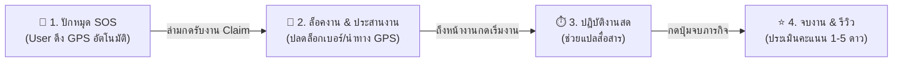

# 📍 KHVI Helper (แพลตฟอร์มล่ามจิตอาสาเชิงพื้นที่และแจ้งเหตุฉุกเฉิน)
### *Map-based SOS Volunteer Interpreter Platform*

[](https://nextjs.org/)
[](https://www.typescriptlang.org/)
[](https://tailwindcss.com/)
[](https://supabase.com/)
[](https://leafletjs.com/)

---

> 🌐 **Language / ภาษา:**  
> [🇹🇭 ภาษาไทย](#-ภาษาไทย) | [🇬🇧 English](#-english)

---

## 🇹🇭 ภาษาไทย

### 💡 1. เกี่ยวกับโครงการ (Overview)
**KHVI Helper** คือ แพลตฟอร์มเว็บแอปพลิเคชันสำหรับเชื่อมโยง **"ผู้ที่ต้องการความช่วยเหลือทางภาษาอย่างเร่งด่วน"** (เช่น ผู้ป่วยต่างชาติตามห้องฉุกเฉินในโรงพยาบาล, ผู้ประสบอุบัติเหตุ หรือผู้ติดต่อสถานีตำรวจ) เข้ากับ **"ล่ามจิตอาสาที่อยู่ใกล้เคียง"** ผ่านระบบปักหมุดบนแผนที่แบบ Real-time โดยล่ามที่พร้อมสามารถกดรับงานได้ทันที (First-Claim Matching) พร้อมระบบคัดกรองประวัติล่ามโดยผู้จัดการ (Manager) เพื่อความปลอดภัยสูงสุด

---

### 🌟 2. ฟีเจอร์หลัก (Key Features)
* 🚨 **Instant SOS Pin Request:** ผู้ใช้กดปุ่มเดียว ดึงพิกัด GPS อัตโนมัติ เลือกภาษาที่ต้องการ (พม่า, จีน, ภาษามือ ฯลฯ) แล้วกระจายหมุดขึ้นแผนที่ทันที
* 🗺️ **Interactive Real-time SOS Map:** แผนที่สดแสดงหมุดความช่วยเหลือด้วย Leaflet Map พร้อมระบบตัวกรองภาษาและระยะทาง
* ⚡ **Decoupled Claim Matching:** ล่ามจิตอาสาสามารถดูหมุดรอบตัวและกดรับงาน (Claim) ได้ทันทีด้วยตนเอง ไม่เกิดปัญหาคอขวด
* 🤝 **Shared Mission Tracking Room:** ห้องประสานงานสด ปลดล็อกเบอร์โทรศัพท์และแผนที่นำทาง GPS (Google Maps) พร้อมปุ่มกดเริ่มงาน $\rightarrow$ จบงาน
* 🛡️ **Volunteer Verification Portal:** ระบบตรวจสอบและอนุมัติใบสมัครล่ามจิตอาสาโดย Manager (Approve/Reject)
* ⭐ **Review & Rating System:** ระบบประเมินความพึงพอใจ 1–5 ดาว พร้อมคำนวณคะแนนเฉลี่ยสะสมลงโปรไฟล์ล่ามอัตโนมัติ

---

### 👥 3. บทบาทของผู้ใช้งาน (User Roles)
1. **👤 User (ผู้ขอรับบริการ):** ปักหมุดขอความช่วยเหลือด่วน, ติดตามสถานะใน Shared Room, ให้คะแนนรีวิว
2. **🧑‍💼 Volunteer Interpreter (ล่ามจิตอาสา):** ยื่นใบสมัครล่าม, สลับสถานะพร้อมรับงาน (`is_available`), ดูแผนที่สด และกดรับงาน
3. **🛡️ Manager (ผู้ประสานงาน/ตรวจสอบ):** ตรวจสอบประวัติและอนุมัติ/ปฏิเสธใบสมัครล่าม, ตอบคำร้องขอความช่วยเหลือ (Help Request)
4. **⚙️ Admin (ผู้ดูแลระบบ):** จัดการสิทธิ์ของระบบ และสั่งระงับ/ปลดล็อกบัญชีผู้ใช้ (`is_locked`)

---

### 🔄 4. ขั้นตอนการทำงานหลัก (How It Works)



---

### 💻 5. สถาปัตยกรรมทางเทคนิค (Tech Stack)
* **Frontend:** Next.js (App Router), React, Tailwind CSS, Lucide Icons, Leaflet (`react-leaflet`)
* **Backend Logic:** Next.js Server Actions, Next.js Middleware (RBAC)
* **Database & Auth:** Supabase Cloud (PostgreSQL, Supabase Auth, Supabase Realtime, PostgreSQL RPC Functions)

---

### 🚀 6. การติดตั้งและเริ่มต้นใช้งาน (Getting Started)

#### ข้อกำหนดเบื้องต้น (Prerequisites)
* [Node.js](https://nodejs.org/) (Version 18.17 หรือสูงกว่า)
* บัญชี [Supabase](https://supabase.com/)

#### ขั้นตอนการติดตั้ง (Installation Steps)
```bash
# 1. Clone repository
git clone https://github.com/OnisawanO/khvi-helper.git
cd khvi

# 2. ติดตั้ง Dependencies
npm install

# 3. ตั้งค่า Environment Variables (.env.local)
cp .env.example .env.local
# ใส่ NEXT_PUBLIC_SUPABASE_URL และ NEXT_PUBLIC_SUPABASE_ANON_KEY

# 4. รัน Development Server
npm run dev
```
เปิดเบราว์เซอร์ไปที่ [http://localhost:3000](http://localhost:3000)

---

## 🇬🇧 English

### 💡 1. About The Project (Overview)
**KHVI Helper** is a web-based platform designed to bridge the gap between **people in urgent need of language assistance** (such as foreign patients in hospital emergency rooms, accident victims, or individuals at police stations) and **nearby volunteer interpreters** in real-time. Through an interactive SOS map, volunteers can instantly claim requests, while Managers ensure safety by verifying volunteer credentials.

---

### 🌟 2. Key Features
* 🚨 **Instant SOS Pin Request:** One-click SOS broadcasting with auto-detected GPS coordinates, target language selection (Burmese, Chinese, Sign Language, etc.), and countdown timers.
* 🗺️ **Interactive Real-time SOS Map:** Live Leaflet-powered map displaying emergency pins with color-coded categories and language filters.
* ⚡ **Decoupled Claim Matching:** Fast first-come, first-served job claiming by approved and available volunteers without single-point-of-failure bottlenecks.
* 🤝 **Shared Mission Tracking Room:** Real-time collaboration hub unlocking direct contact info, GPS routing (Google Maps), and session tracking buttons (Start $\rightarrow$ Finish).
* 🛡️ **Volunteer Verification Portal:** Manager dashboard for vetting and approving/rejecting volunteer interpreter applications.
* ⭐ **Review & Rating System:** Post-mission 1–5 star rating and feedback system with trigger-based average rating computation.

---

### 👥 3. User Roles
1. **👤 User (Requester):** Broadcasts SOS pins, communicates in the shared room, and submits reviews.
2. **🧑‍💼 Volunteer Interpreter:** Registers language skills, toggles availability (`is_available`), browses live pins, and claims tasks.
3. **🛡️ Manager (Coordinator):** Verifies volunteer profiles (Approve/Reject) and manages support tickets/reports.
4. **⚙️ Admin (System Administrator):** Manages user roles and handles account suspensions (`is_locked`).

---

### 🔄 4. System Workflow

```
[1. SOS Pin Broadcast] ──► [2. Volunteer Claimed] ──► [3. In-Progress Mission] ──► [4. Completed & Review]
   (Auto GPS + Language)       (Shared Room & GPS)         (Start Session Timer)       (1-5 Star Rating)
```

---

### 💻 5. Tech Stack
* **Framework:** [Next.js](https://nextjs.org/) (App Router, Server Actions, Middleware)
* **Language & Styling:** TypeScript, Tailwind CSS, Lucide React
* **Mapping Engine:** Leaflet & React-Leaflet (OpenStreetMap)
* **Backend & Database:** [Supabase](https://supabase.com/) (PostgreSQL, Realtime WebSockets, Supabase Auth, Row-Level Security)

---

### 🚀 6. Getting Started

```bash
# 1. Clone the repository
git clone https://github.com/OnisawanO/khvi-helper.git
cd khvi

# 2. Install dependencies
npm install

# 3. Configure environment variables (.env.local)
# Add your Supabase credentials:
# NEXT_PUBLIC_SUPABASE_URL=your_supabase_url
# NEXT_PUBLIC_SUPABASE_ANON_KEY=your_supabase_anon_key

# 4. Run the local development server
npm run dev
```

Open [http://localhost:3000](http://localhost:3000) with your browser to see the result.

---

### 📑 Detailed Documentation
สำหรับเอกสารข้อกำหนดเชิงเทคนิค, Business Rules, Use-case Diagram, และ ER Diagram ฉบับเต็ม กรุณาอ่านเพิ่มเติมได้ที่ 👉 **[detail.md](detail.md)**
