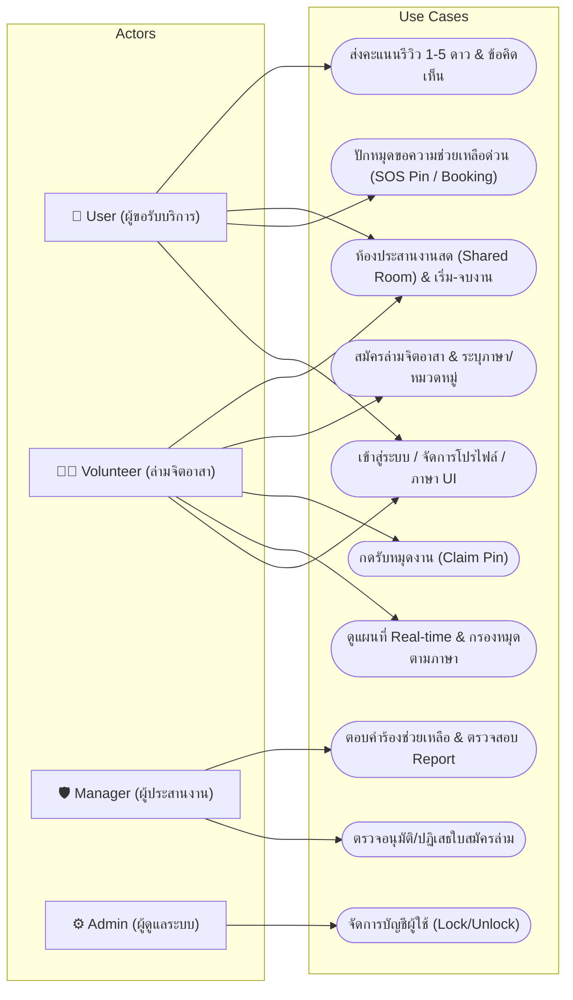
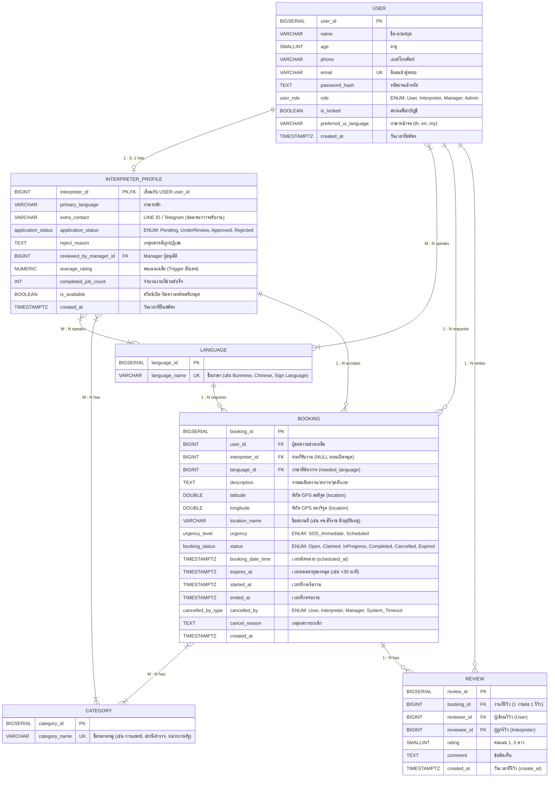
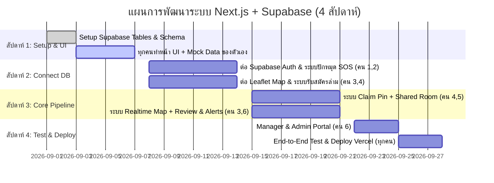

# 📑 รายงานสรุปโครงการ: ระบบแพลตฟอร์มล่ามจิตอาสาเชิงพื้นที่และแจ้งเหตุฉุกเฉิน (Map-based SOS Volunteer Interpreter Platform)

---

## 🎯 ส่วนที่ 1: การวิเคราะห์และตีความโจทย์ (Problem Analysis & Objectives)

### 1.1 ที่มาและปัญหา (Pain Points)
* **อุปสรรคการสื่อสารในสถานการณ์สำคัญและฉุกเฉิน:** ผู้รับบริการ (เช่น ผู้ป่วยต่างชาติตามห้องฉุกเฉินในโรงพยาบาล, ผู้ประสบอุบัติเหตุ, ผู้ติดต่อสถานีตำรวจ หรือหน่วยงานราชการ) ประสบปัญหาการสื่อสารทางภาษาอย่างรุนแรงและต้องการความช่วยเหลือทันที
* **ความล่าช้าของระบบจองแบบเดิม (Bottleneck of 1-to-1 Booking):** การค้นหาและส่งคำขอจองล่ามทีละคนต้องรอการตอบรับ หากล่ามไม่เปิดอ่านคำขอจะทำให้ผู้เดือดร้อนต้องรอนานอย่างไร้จุดหมาย
* **ขาดระบบประสานงานเชิงพื้นที่ (Lack of Location Context):** ขาดแพลตฟอร์มที่แสดงพิกัดความต้องการความช่วยเหลือบนแผนที่แบบ Real-time ทำให้ล่ามจิตอาสาที่อยู่ใกล้เคียงไม่ทราบว่ามีผู้ต้องการความช่วยเหลืออยู่รอบตัว
* **ค่าบริการล่ามมืออาชีพสูง & ขาดระบบคัดกรอง:** ผู้เดือดร้อนส่วนใหญ่ไม่สามารถแบกรับค่าจ้างล่ามเอกชนได้ ขณะเดียวกันการขอความช่วยเหลือทั่วไปก็ขาดระบบตรวจสอบตัวตนและประวัติความปลอดภัยของล่าม

### 1.2 วัตถุประสงค์ของระบบ (Objectives)
1. **ศูนย์กลางปักหมุดขอความช่วยเหลือบนแผนที่ (Interactive SOS Map Hub):** ให้ผู้ใช้งานสามารถปักหมุดแจ้งเหตุขอความช่วยเหลือด้านภาษาด่วน (SOS) โดยดึงพิกัด GPS อัตโนมัติ เพื่อกระจายเรื่องไปยังล่ามจิตอาสาที่อยู่ใกล้เคียง
2. **ระบบจับคู่แบบระดมความช่วยเหลือ (Decoupled Job Pool / First-Claim Matching):** ล่ามจิตอาสาที่ตรงกับภาษาและเปิดสถานะพร้อมปฏิบัติงานสามารถกดรับหมุดงาน (Claim Pin) ได้ทันทีด้วยตนเอง ลดระยะเวลาการรอคอย
3. **ระบบคัดกรองและตรวจสอบคุณสมบัติ (Manager Verification & Safety):** ให้ผู้ประสานงาน (Manager) ตรวจสอบประวัติและความสามารถของล่ามจิตอาสาก่อนเปิดสิทธิ์รับงาน เพื่อความปลอดภัยและความน่าเชื่อถือ
4. **ศูนย์ประสานงานและติดตามภารกิจ (Shared Tracking Room):** มีห้องประสานงานสดระหว่างผู้ใช้และล่าม (พิกัดนำทาง GPS, โทรติดต่อ, ปุ่มเริ่ม-จบงาน และระบบรีวิว)

---

## ⚖️ ส่วนที่ 2: กฎทางธุรกิจและข้อกำหนดระบบ (Business Rules, FR & NFR)

### 2.1 กฎทางธุรกิจ (Business Rules)
* **BR-01 (No Self-Claim):** ล่ามจิตอาสาไม่สามารถกดรับ (Claim) หมุดขอความช่วยเหลือที่ตนเองเป็นผู้สร้างในฐานะ User ได้ (`CHECK: user_id <> interpreter_id`)
* **BR-02 (Interpreter Approval Required):** ล่ามต้องได้รับการอนุมัติสถานะเป็น `Approved` จากผู้ประสานงาน (Manager) ก่อน จึงจะสามารถเปิดสถานะรับงานและมองเห็นหมุดขอความช่วยเหลือได้
* **BR-03 (Availability & Language Match):** หมุดขอความช่วยเหลือจะแสดงและแจ้งเตือนเฉพาะล่ามที่เปิดสวิตช์ความพร้อม (`is_available = TRUE`) และมีทักษะภาษาตรงกับที่ผู้ใช้ร้องขอ
* **BR-04 (Location & Contact Privacy):** ก่อนการรับงาน ข้อมูลบนแผนที่จะแสดงเฉพาะ **"ภาษา + หมวดหมู่งาน + ชื่อสถานที่กว้างๆ"** เท่านั้น เมื่อล่ามกดรับงาน (`Claimed`) ระบบจึงจะปลดล็อกพิกัดแม่นยำและข้อมูลติดต่อส่วนตัว (`phone`, `extra_contact`)
* **BR-05 (Execution Lifecycle):** การบันทึกเวลาต้องเป็นไปตามลำดับสถานะ:
  * กด **"เริ่มงาน"** (`started_at`) ได้เฉพาะสถานะ `Claimed/Accepted` $\rightarrow$ เปลี่ยนเป็น `InProgress`
  * กด **"จบงาน"** (`ended_at`) ได้เฉพาะสถานะ `InProgress` $\rightarrow$ เปลี่ยนเป็น `Completed`
* **BR-06 (Review Eligibility):** การประเมินคะแนน (1–5 ดาว) ทำได้เฉพาะภารกิจที่สถานะเป็น `Completed` โดยเชื่อมโยงทั้ง `booking_id`, `reviewer_id` และ `reviewee_id` พร้อมคำนวณคะแนนเฉลี่ย (`average_rating`) อัปเดตลงโปรไฟล์ล่าม
* **BR-07 (Pin Timeout & Auto-Expire):** หมุดขอความช่วยเหลือประเภทฉุกเฉิน (SOS) ที่ไม่มีล่ามกดรับภายในเวลาที่กำหนด (เช่น 30 นาที) จะถูกเปลี่ยนสถานะเป็น `Expired` อัตโนมัติเพื่อแจ้งเตือนให้ผู้ใช้ทราบ
* **BR-08 (Cancellation & Re-pooling):** การยกเลิกหมุดต้องระบุฝ่ายที่ยกเลิก (`cancelled_by`) และเหตุผล (`cancel_reason`) หากล่ามเกิดเหตุฉุกเฉินขอยกเลิก หมุดสามารถถูกเปิดกลับเข้าสู่แผนที่ (`Re-open`) ให้ล่ามคนอื่นเห็นใหม่ได้
* **BR-09 (Support & Reporting):** ผู้ใช้และล่ามสามารถส่งรายงานปัญหา (Report) หรือส่งคำร้องขอความช่วยเหลือ (Help Request) ไปยัง Manager ได้

---

### 2.2 ข้อกำหนดเชิงฟังก์ชัน (Functional Requirements - FR)

| รหัส FR | กลุ่มฟังก์ชัน | รายละเอียดความต้องการ | ผู้ใช้งาน (Actor) |
| :--- | :--- | :--- | :--- |
| **FR-01 – 07** | **Account & Auth** | สมัครสมาชิก, เข้าสู่ระบบ/ออกจากระบบ, จัดการโปรไฟล์, กำหนด Role (User, Interpreter, Manager, Admin) และเปลี่ยนภาษาหน้าจอ UI | All Roles / Admin |
| **FR-08 – 16** | **Interactive SOS Map** | แสดงหมุดขอความช่วยเหลือบนแผนที่ Real-time (Leaflet Map), Custom Marker ตามสีภาษา/หมวดหมู่, ตัวกรองรัศมีระยะทาง/ภาษา, ป๊อปอัปพรีวิวรายละเอียดงาน | All Roles / Interpreter |
| **FR-17 – 24** | **Booking / SOS Request**| สร้างหมุดขอความช่วยเหลือ, ดึงพิกัด GPS อัตโนมัติหรือปักหมุดเอง, เลือกภาษา (`language_id`), หมวดหมู่งาน (`category_id`), ระบุความเร่งด่วน และคำนวณเวลาหมดอายุ | User / System |
| **FR-25 – 30** | **Matching & Claiming** | แจ้งเตือน Broadcast ไปยังล่ามที่ตรงเงื่อนไข, ปุ่มกดรับงาน (Claim Pin) พร้อม Concurrency Lock ป้องกันการแย่งงานซ้ำ, สวิตช์เปิด-ปิดความพร้อมรับงาน (`is_available`) | Interpreter / System |
| **FR-31 – 36** | **Mission Hub & Tracking** | ห้องประสานงานสด (Shared Tracking Room), ปลดล็อกเบอร์โทร/ช่องทางติดต่อ, เปิดแผนที่นำทาง GPS, ปุ่มกดเริ่มงาน (`started_at`) และปุ่มกดจบงาน (`ended_at`) | User / Interpreter |
| **FR-37 – 44** | **Volunteer Onboarding** | สมัครเป็นล่ามจิตอาสา, ระบุภาษาหลัก/ภาษาที่สื่อสารได้ ($M:N$), หมวดหมู่ความเชี่ยวชาญ ($M:N$), ประวัติการทำงาน และติดตามสถานะใบสมัคร | Interpreter / System |
| **FR-45 – 50** | **Manager Verification** | หน้าตรวจอนุมัติ/ปฏิเสธใบสมัครล่ามจิตอาสา (Approve/Reject + เหตุผล), ตอบคำร้องขอความช่วยเหลือ (Help Request) และตรวจสอบ Report | Manager |
| **FR-51 – 56** | **Review & Rating** | ประเมินความพึงพอใจ 1–5 ดาว พร้อมข้อคิดเห็นหลังจบภารกิจ (ระบุผู้รีวิวและผู้ถูกรีวิว), คำนวณคะแนนเรตติ้งเฉลี่ยสะสมลงโปรไฟล์ล่ามอัตโนมัติ | User / System |
| **FR-57 – 62** | **Cancellation & Timeout** | กดยกเลิกหมุดพร้อมระบุเหตุผล, ระบบนับถอยหลังหมดอายุ (Timeout Auto-Expire) และระบบส่งหมุดกลับเข้า Pool กรณีล่ามสละสิทธิ์ | User / Interpreter / System |
| **FR-63 – 68** | **Realtime Notifications** | แจ้งเตือนล่ามเมื่อมีหมุดใหม่อยู่ใกล้เคียง, แจ้งเตือนผู้ใช้เมื่อมีคนกดรับหมุด, แจ้งเตือนการเปลี่ยนสถานะงาน และแจ้งเตือนผลการสมัครล่าม | System |
| **FR-69 – 74** | **Admin Control** | จัดการบัญชีผู้ใช้ (ระงับ/ปลดล็อก `is_locked`) และจัดการสิทธิ์ Role | Admin |

---

### 2.3 ข้อกำหนดที่ไม่ใช่เชิงฟังก์ชัน (Non-Functional Requirements - NFR)

* **NFR-01 (Role-Based Access Control):** ควบคุมสิทธิ์การเข้าถึงหน้าจอและ API อย่างเข้มงวดตาม Role ทั้ง 4 ระดับ (`User`, `Interpreter`, `Manager`, `Admin`)
* **NFR-02 (Data Privacy & Location Protection):** ปกป้องข้อมูลส่วนบุคคล และไม่เปิดเผยพิกัดที่แม่นยำ/เบอร์ติดต่อจนกว่าล่ามจะกดรับงานจริง
* **NFR-03 (Real-time Responsiveness):** หมุดที่ถูกสร้างใหม่หรืออัปเดตสถานะต้องแสดงผลบนแผนที่ของล่ามภายใน 3 วินาที (ผ่าน Supabase Realtime)
* **NFR-04 (Concurrency & Data Integrity):** ป้องกัน Race Condition กรณีล่ามหลายคนกดรับงานพร้อมกันด้วย Database Transaction / Atomic RPC
* **NFR-05 (Mobile-First & Usability):** ออกแบบหน้าจอปักหมุดด่วนและแผนที่ให้ใช้งานง่ายบนสมาร์ตโฟน แม้ผู้ใช้จะกำลังอยู่ในสถานการณ์ฉุกเฉิน
* **NFR-06 (Responsive Design & Compatibility):** รองรับการแสดงผลทุกขนาดหน้าจอ (Desktop, Tablet, Mobile) บนเบราว์เซอร์มาตรฐาน (Chrome, Edge, Safari, Firefox)

---

## 👥 ส่วนที่ 3: การวิเคราะห์ User Stories (User Roles & Stories)

```
┌─────────────────┐      ┌──────────────────────────┐      ┌─────────────────────────┐      ┌─────────────────────┐
│ 1. User         │      │ 2. Volunteer Interpreter │      │ 3. Manager              │      │ 4. Admin            │
│ (ผู้ขอรับบริการ) │      │ (ล่ามจิตอาสา)            │      │ (ผู้ประสานงาน/ตรวจสอบ)   │      │ (ผู้ดูแลระบบส่วนกลาง) │
└─────────────────┘      └──────────────────────────┘      └─────────────────────────┘      └─────────────────────┘
```

* **👤 User (ผู้ขอความช่วยเหลือ):**
  * *ปักหมุดด่วน (SOS):* ต้องการกดปุ่มเดียวเพื่อดึง GPS ปักหมุด ระบุภาษาที่ต้องการ และหมวดหมู่งาน เพื่อกระจายเรื่องขอความช่วยเหลือทันที
  * *ติดตามงาน & ติดต่อ:* ต้องการเห็นการแจ้งเตือนทันทีเมื่อมีคนรับงาน ดูข้อมูลติดต่อล่าม และติดตามสถานะแบบเรียลไทม์
  * *ประเมินรีวิว:* ต้องการเขียนรีวิวให้คะแนนดาวและข้อคิดเห็นหลังจบการช่วยเหลือ
* **🧑‍💼 Volunteer Interpreter (ล่ามจิตอาสา):**
  * *สมัครล่าม:* ต้องการกรอกภาษาที่สื่อสารได้ หมวดหมู่งาน และประวัติเพื่อรอ Manager อนุมัติ
  * *ค้นหาและรับงานบนแผนที่:* ต้องการเปิด-ปิดความพร้อม (`is_available`) ดูหมุดความช่วยเหลือรอบตัว และกดรับงานที่ตนเองสะดวก
  * *ปฏิบัติงาน:* ต้องการดูแผนที่นำทาง ติดต่อผู้ใช้ และกดเริ่มงาน-จบงานเพื่อบันทึกประวัติความดี
* **🛡️ Manager (ผู้ประสานงาน/ตรวจสอบ):**
  * *คัดกรองล่าม:* ต้องการตรวจสอบประวัติและอนุมัติ/ปฏิเสธใบสมัครล่าม เพื่อรักษามาตรฐานและความปลอดภัย
  * *ดูแลเรื่องร้องเรียน:* ต้องการตอบคำร้องขอความช่วยเหลือ (Help Request) และตรวจสอบรายงานพฤติกรรมไม่เหมาะสม (Report)
* **⚙️ Admin (ผู้ดูแลระบบ):**
  * *บริหารจัดการ:* ต้องการจัดการระงับบัญชีผู้ใช้งานที่ทำผิดกฎ (`is_locked`) และจัดการกำหนด Role ให้กับผู้ใช้

---

## 🔄 ส่วนที่ 4: Use-case Diagram & กระบวนการทำงานหลัก (Core Workflow)

### 4.1 แผนภาพ Use-case Diagram



### 4.2 วงจรสถานะงาน (Booking Lifecycle)
```
[1. Open] ───(ล่ามกด Claim)───► [2. Claimed/Accepted] ───(กดเริ่มงาน)───► [3. InProgress] ───(กดจบงาน)───► [4. Completed]
    │                                    │                                                                   │
    ├──(หมดเวลา Timeout)──► [Expired]    └──(ล่าม/ผู้ใช้ขอยกเลิก)──► [Cancelled / Re-open]                  └─► ส่งรีวิว (1-5 ดาว)
    │
    └──(ผู้ใช้กดยกเลิก)───► [Cancelled] (ระบุ cancel_reason & cancelled_by)
```

---

## 🗄️ ส่วนที่ 5: สถาปัตยกรรมข้อมูล & ER Diagram (Database Architecture)

### 5.1 แผนภาพ Conceptual ER Diagram (พร้อม Attributes ครบถ้วน)



### 5.2 พจนานุกรมข้อมูล (Data Dictionary & Attributes Detail)

| Entity / Table | Attributes | Data Type | Key / Constraint | คำอธิบาย |
| :--- | :--- | :--- | :---: | :--- |
| **`USER`** | `user_id`<br>`name`<br>`age`<br>`phone`<br>`email`<br>`password_hash`<br>`role`<br>`is_locked`<br>`preferred_ui_language`<br>`created_at` | BIGSERIAL<br>VARCHAR<br>SMALLINT<br>VARCHAR<br>VARCHAR<br>TEXT<br>ENUM<br>BOOLEAN<br>VARCHAR<br>TIMESTAMPTZ | **PK**<br>-<br>CHECK >= 0<br>-<br>**UK**<br>-<br>User, Interpreter, Manager, Admin<br>DEFAULT FALSE<br>DEFAULT 'th'<br>DEFAULT NOW() | รหัสผู้ใช้<br>ชื่อ-นามสกุล<br>อายุ<br>เบอร์โทรศัพท์ติดต่อ<br>อีเมลใช้เข้าสู่ระบบ<br>รหัสผ่านเข้ารหัส<br>บทบาทและสิทธิ์การใช้งาน<br>สถานะระงับการใช้งาน<br>ภาษาหน้าจอที่ต้องการ<br>วันเวลาที่สร้างบัญชี |
| **`INTERPRETER_PROFILE`** | `interpreter_id`<br>`primary_language`<br>`extra_contact`<br>`application_status`<br>`reject_reason`<br>`reviewed_by_manager_id`<br>`average_rating`<br>`completed_job_count`<br>`is_available`<br>`created_at` | BIGINT<br>VARCHAR<br>VARCHAR<br>ENUM<br>TEXT<br>BIGINT<br>NUMERIC(3,2)<br>INT<br>BOOLEAN<br>TIMESTAMPTZ | **PK, FK** $\rightarrow$ `USER`<br>-<br>-<br>Pending, UnderReview, Approved, Rejected<br>-<br>**FK** $\rightarrow$ `USER`<br>DEFAULT 0.00<br>DEFAULT 0<br>DEFAULT FALSE<br>DEFAULT NOW() | รหัสล่าม (ผูกกับ User ID)<br>ภาษาแม่/ภาษาหลัก<br>ช่องทางติดต่อเสริม (LINE/Telegram)<br>สถานะการตรวจสอบใบสมัคร<br>เหตุผลที่ไม่อนุมัติ (ถ้ามี)<br>ผู้จัดการที่กดอนุมัติ<br>คะแนนรีวิวเฉลี่ยสะสม<br>จำนวนงานที่ช่วยเหลือสำเร็จ<br>สวิตช์เปิด-ปิดความพร้อมรับงาน<br>วันเวลาที่ยื่นสมัคร |
| **`LANGUAGE`** | `language_id`<br>`language_name` | BIGSERIAL<br>VARCHAR | **PK**<br>**UK** | รหัสภาษา<br>ชื่อภาษา (เช่น Burmese, Chinese, Sign) |
| **`CATEGORY`** | `category_id`<br>`category_name` | BIGSERIAL<br>VARCHAR | **PK**<br>**UK** | รหัสหมวดหมู่<br>ชื่อหมวดหมู่ (เช่น การแพทย์, สถานีตำรวจ) |
| **`BOOKING`** | `booking_id`<br>`user_id`<br>`interpreter_id`<br>`language_id`<br>`description`<br>`latitude`<br>`longitude`<br>`location_name`<br>`urgency`<br>`status`<br>`booking_date_time`<br>`expires_at`<br>`started_at`<br>`ended_at`<br>`cancelled_by`<br>`cancel_reason`<br>`created_at` | BIGSERIAL<br>BIGINT<br>BIGINT<br>BIGINT<br>TEXT<br>DOUBLE PRECISION<br>DOUBLE PRECISION<br>VARCHAR<br>ENUM<br>ENUM<br>TIMESTAMPTZ<br>TIMESTAMPTZ<br>TIMESTAMPTZ<br>TIMESTAMPTZ<br>ENUM<br>TEXT<br>TIMESTAMPTZ | **PK**<br>**FK** $\rightarrow$ `USER`<br>**FK** $\rightarrow$ `INTERPRETER_PROFILE` (NULLable)<br>**FK** $\rightarrow$ `LANGUAGE`<br>-<br>-<br>-<br>-<br>SOS_Immediate, Scheduled<br>Open, Claimed, InProgress, Completed, Cancelled, Expired<br>-<br>-<br>-<br>-<br>User, Interpreter, Manager, System<br>-<br>DEFAULT NOW() | รหัสการขอความช่วยเหลือ/การจอง<br>ผู้ขอความช่วยเหลือ<br>ล่ามที่กดรับงาน<br>ภาษาที่ต้องการความช่วยเหลือ<br>รายละเอียดอาการ/ปัญหา/จุดสังเกต<br>พิกัด GPS ละติจูด (location)<br>พิกัด GPS ลองจิจูด (location)<br>ชื่อสถานที่/จุดนัดพบ<br>ระดับความเร่งด่วน<br>สถานะของภารกิจ<br>วันเวลานัดหมาย (scheduled_at)<br>เวลาหมดอายุของหมุด<br>เวลาที่เริ่มงาน<br>เวลาที่จบงาน<br>ฝ่ายที่กดยกเลิก<br>เหตุผลการยกเลิก<br>วันเวลาที่สร้างหมุด |
| **`REVIEW`** | `review_id`<br>`booking_id`<br>`reviewer_id`<br>`reviewee_id`<br>`rating`<br>`comment`<br>`created_at` | BIGSERIAL<br>BIGINT<br>BIGINT<br>BIGINT<br>SMALLINT<br>TEXT<br>TIMESTAMPTZ | **PK**<br>**FK** $\rightarrow$ `BOOKING`<br>**FK** $\rightarrow$ `USER`<br>**FK** $\rightarrow$ `USER`<br>CHECK 1..5<br>-<br>DEFAULT NOW() | รหัสการประเมิน<br>รหัสภารกิจที่ถูกรีวิว<br>ผู้ประเมิน (User)<br>ผู้ถูกประเมิน (Interpreter)<br>คะแนนดาว (1 ถึง 5)<br>ข้อคิดเห็น/คำชม<br>วันเวลาที่ส่งรีวิว (create_at) |

### 5.3 ตารางเชื่อมความสัมพันธ์ Many-to-Many (Junction Tables)
* **`user_languages`:** (`user_id` FK, `language_id` FK) — ภาษาที่ผู้ใช้สื่อสารได้
* **`interpreter_languages`:** (`interpreter_id` FK, `language_id` FK) — ภาษาที่ล่ามให้บริการได้
* **`interpreter_categories`:** (`interpreter_id` FK, `category_id` FK) — หมวดหมู่งานที่ล่ามมีความเชี่ยวชาญ
* **`booking_categories`:** (`booking_id` FK, `category_id` FK) — หมวดหมู่งานที่เกี่ยวข้องกับคำขอจอง

---

## 💻 ส่วนที่ 6: สถาปัตยกรรมเชิงเทคนิค Next.js + Supabase (Technical Stack & Folder Structure)

### 6.1 ภาพรวมสถาปัตยกรรม Full-Stack (Serverless BaaS)
ระบบถูกออกแบบให้ทำงานบน **Next.js (App Router)** ร่วมกับ **Supabase (Backend-as-a-Service)** โดยไม่ต้องสร้าง Backend Server แยก:
* **Frontend:** Next.js Server & Client Components, Tailwind CSS, Lucide React, Leaflet (`react-leaflet`)
* **Backend Logic:** Next.js **Server Actions** (`actions/*.ts`) และ Next.js **Middleware** (`middleware.ts`) สำหรับ RBAC
* **Data Layer:** **Supabase Cloud (PostgreSQL)** พร้อมระบบ Supabase Auth, Supabase Realtime (WebSockets) และ PostgreSQL Stored Functions (RPC)

```text
khvi/
├── app/                              <── หน้าจอแยกตาม Route
│   ├── (auth)/                       <── [คนที่ 1] หน้า Login, Register
│   ├── profile/                      <── [คนที่ 1] หน้าจัดการโปรไฟล์ผู้ใช้
│   ├── request-help/                 <── [คนที่ 2] หน้าฟอร์มปักหมุด SOS & หน้ารอคิว
│   ├── my-requests/                  <── [คนที่ 2] หน้าประวัติคำขอของผู้ใช้
│   ├── map/                          <── [คนที่ 3] หน้าแผนที่หลัก Interactive SOS Map
│   ├── volunteer/                    <── [คนที่ 4] Dashboard ล่าม & หน้ากดรับงาน
│   ├── mission/[id]/                 <── [คนที่ 5] หน้าห้องประสานงานสด (Shared Room)
│   ├── manager/                      <── [คนที่ 6] หน้าตรวจอนุมัติล่าม & ตอบ Help Request
│   └── admin/                        <── [คนที่ 6] หน้าจัดการระบบ (Lock/Unlock)
│
├── components/                       <── UI Components แยกตามฟีเจอร์
│   ├── auth/                         <── [คนที่ 1] LoginForm, RegisterForm, LanguageSwitcher
│   ├── pin-request/                  <── [คนที่ 2] SOSButton, PinForm, RadarWaiting
│   ├── map/                          <── [คนที่ 3] LeafletMap, CustomMarkers, MapFilterBar
│   ├── volunteer/                    <── [คนที่ 4] ApplicationForm, AvailabilityToggle, ClaimButton
│   ├── mission/                      <── [คนที่ 5] ContactCard, GPSNavButton, ExecutionControls
│   ├── manager/                      <── [คนที่ 6] VolunteerVerifyCard, HelpRequestList
│   ├── review/                       <── [คนที่ 6] ReviewModal, StarRating
│   └── admin/                        <── [คนที่ 6] UserTable
│
├── lib/                              <── ตัวช่วยส่วนกลาง
│   ├── supabase/                     <── Supabase Client/Server helpers (@supabase/ssr)
│   └── mock-data.ts                  <── ข้อมูลจำลองสำหรับช่วงเริ่มต้นพัฒนา (Mock Mode)
│
├── types/                            <── TypeScript Interfaces
│   └── database.types.ts             <── Database Type Definitions
│
└── actions/                          <── Server Actions (Logic หลังบ้านใน Next.js)
    ├── auth-actions.ts               <── [คนที่ 1] เข้าสู่ระบบ, อัปเดตโปรไฟล์
    ├── pin-actions.ts                <── [คนที่ 2] สร้างหมุด SOS, ยกเลิกหมุด
    ├── volunteer-actions.ts          <── [คนที่ 4] ยื่นใบสมัคร, สลับสถานะว่าง, Atomic Claim
    ├── mission-actions.ts            <── [คนที่ 5] เริ่มงาน, จบงาน, ยกเลิกภารกิจ
    ├── manager-actions.ts            <── [คนที่ 6] ตรวจอนุมัติล่าม, ตอบ Help Request
    ├── admin-actions.ts              <── [คนที่ 6] ล็อก/ปลดล็อกผู้ใช้
    └── review-actions.ts             <── [คนที่ 6] ส่งคะแนนรีวิว
```

---

## 🚀 ส่วนที่ 7: แผนการพัฒนาและการแบ่งงานภายในทีม 6 คน (Roadmap & Team Division)

### 7.1 แผนพัฒนา 4 สัปดาห์ (4-Week Agile Roadmap)



---

### 7.2 ตารางแบ่งหน้าที่รับผิดชอบสำหรับ 6 คน (Next.js + Supabase Vertical Slice Matrix)

| สมาชิก | ฟีเจอร์ที่รับผิดชอบ (Feature Domain) | ไฟล์ Routes & UI Components | Supabase Tables & Server Actions |
| :---: | :--- | :--- | :--- |
| **คนที่ 1** | **Identity, Auth & Localization**<br>*(ระบบสมาชิก, สิทธิ์ Roles & ภาษาหน้าจอ)* | • `app/(auth)/login/page.tsx`<br>• `app/(auth)/register/page.tsx`<br>• `app/profile/page.tsx`<br>• `components/auth/LoginForm.tsx`<br>• `components/layout/LanguageSwitcher.tsx` | • **Supabase Auth** & ตาราง `users`, `user_languages`<br>• Next.js `middleware.ts` (RBAC 4 Roles)<br>• `actions/auth-actions.ts` |
| **คนที่ 2** | **SOS Pin Creation & Requester Hub**<br>*(ระบบปักหมุดฉุกเฉิน & จัดการคำขอ)* | • `app/request-help/page.tsx`<br>• `app/request-help/waiting/[id]/page.tsx`<br>• `app/my-requests/page.tsx`<br>• `components/pin-request/SOSButton.tsx`<br>• `components/pin-request/PinForm.tsx`<br>• `components/pin-request/RadarWaiting.tsx` | • ตาราง `bookings`, `booking_categories` (Insert `status = 'Open'`)<br>• Geolocation API (ดึง GPS)<br>• Supabase Realtime (ดักฟังสถานะหมุดตัวเอง)<br>• `actions/pin-actions.ts` |
| **คนที่ 3** | **Interactive SOS Map & Visual Discovery**<br>*(ระบบแผนที่อัจฉริยะ & ตัวกรอง Realtime)* | • `app/map/page.tsx`<br>• `components/map/LeafletMap.tsx`<br>• `components/map/CustomMarkers.tsx`<br>• `components/map/MapFilterBar.tsx`<br>• `components/map/PinSummaryModal.tsx` | • Query `bookings` (`status = 'Open'`)<br>• **Supabase Realtime Channel** (ดักฟัง Insert/Update เพื่อพล็อตหมุดสด)<br>• `hooks/useLivePins.ts` |
| **คนที่ 4** | **Volunteer Portal & Matching Engine**<br>*(ระบบรับสมัครล่าม & กลไกแย่งรับงาน)* | • `app/volunteer/apply/page.tsx`<br>• `app/volunteer/dashboard/page.tsx`<br>• `app/volunteer/status/page.tsx`<br>• `components/volunteer/ApplicationForm.tsx`<br>• `components/volunteer/AvailabilityToggle.tsx`<br>• `components/volunteer/ClaimButton.tsx` | • ตาราง `interpreter_profiles`, `languages`, `categories`, `interpreter_languages`, `interpreter_categories`<br>• **Postgres RPC `claim_booking`** (Atomic Concurrency Lock)<br>• `actions/volunteer-actions.ts` |
| **คนที่ 5** | **Shared Mission Hub & Job Execution**<br>*(ห้องประสานงานสด & ระบบเริ่ม-จบงาน)* | • `app/mission/[id]/page.tsx`<br>• `components/mission/MissionHeader.tsx`<br>• `components/mission/ContactCard.tsx`<br>• `components/mission/GPSNavButton.tsx`<br>• `components/mission/ExecutionControls.tsx`<br>• `components/mission/MissionTimer.tsx` | • อัปเดต `bookings` (`started_at`, `ended_at`, `status: InProgress -> Completed`)<br>• Supabase Realtime (Sync สองฝั่งสด)<br>• `actions/mission-actions.ts` |
| **คนที่ 6** | **Manager & Admin Backoffice**<br>*(ตรวจอนุมัติล่าม, จัดการระบบ & รีวิว)* | • `app/manager/verify-volunteers/page.tsx`<br>• `app/admin/users/page.tsx`<br>• `components/manager/VolunteerVerifyCard.tsx`<br>• `components/admin/UserTable.tsx`<br>• `components/review/ReviewModal.tsx` | • ตาราง `reviews`, `notifications`, `reports`, `help_requests`<br>• Postgres Trigger คำนวณ `average_rating`<br>• `actions/manager-actions.ts`<br>• `actions/admin-actions.ts`<br>• `actions/review-actions.ts` |
