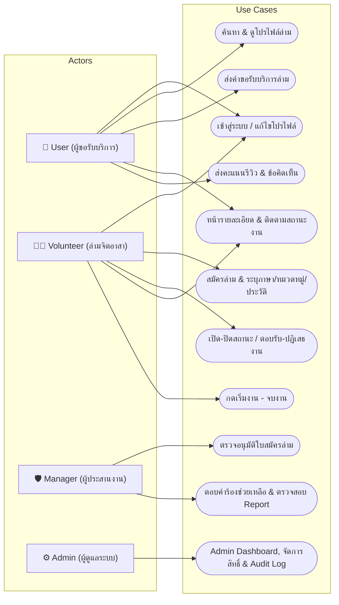
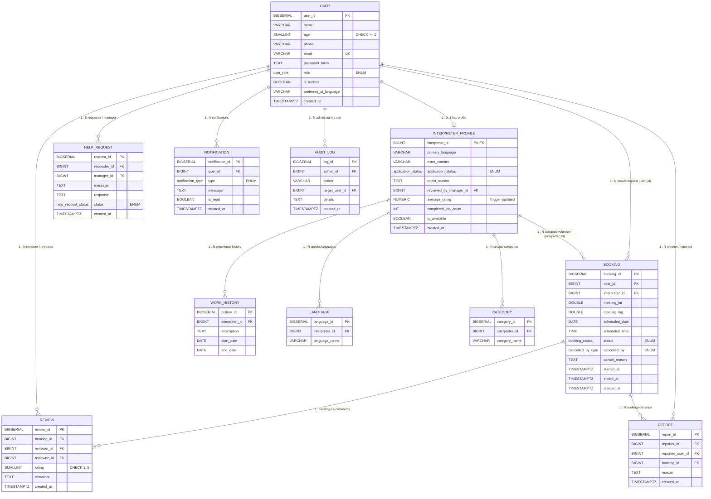

# 📑 รายงานสรุปโครงการ: ระบบแพลตฟอร์มล่ามจิตอาสา (Volunteer Interpreter Platform)

---

## 🎯 ส่วนที่ 1: การวิเคราะห์และตีความโจทย์ (Problem Analysis & Objectives)

### 1.1 ที่มาและปัญหา (Pain Points)
* **อุปสรรคการสื่อสารในสถานการณ์สำคัญ:** ผู้รับบริการ (เช่น ผู้ป่วยต่างชาติในโรงพยาบาล, ผู้ติดต่อหน่วยงานรัฐ, นักศึกษา) ประสบปัญหาการสื่อสารทางภาษาอย่างมาก
* **ค่าบริการล่ามมืออาชีพสูง:** ผู้เดือดร้อนส่วนใหญ่ไม่สามารถแบกรับค่าจ้างล่ามมืออาชีพได้ ขณะที่ผู้มีทักษะทางภาษาและจิตสาธารณะไม่มีช่องทางที่เป็นระบบในการเข้าช่วยเหลือ
* **ขาดระบบคัดกรองและความปลอดภัย:** การติดต่อล่ามทั่วไปขาดการยืนยันตัวตน ไม่มีระบบตรวจสอบประวัติ และไม่มีศูนย์กลางในการติดตามสถานะงาน

### 1.2 วัตถุประสงค์ของระบบ (Objectives)
1. **สร้างแพลตฟอร์มกลาง (Central Platform):** จับคู่ผู้ต้องการความช่วยเหลือกับล่ามจิตอาสาตามภาษาและหมวดหมู่งานที่ตรงกัน
2. **ระบบคัดกรองและตรวจสอบคุณสมบัติ (Verification System):** ให้ผู้ประสานงาน (Manager) ตรวจสอบประวัติและความสามารถของล่ามจิตอาสาก่อนเปิดให้รับงาน เพื่อความน่าเชื่อถือและความปลอดภัย
3. **ศูนย์กลางติดตามการนัดหมาย (Booking & Status Tracking Hub):** ติดตามสถานะงานอย่างเป็นระบบ แสดงวัน-เวลานัดหมาย พิกัดสถานที่ ข้อมูลติดต่อ พร้อมปุ่มบันทึกเวลาเริ่มงานและจบงาน

---

## ⚖️ ส่วนที่ 2: กฎทางธุรกิจและข้อกำหนดระบบ (Business Rules, FR & NFR)

### 2.1 กฎทางธุรกิจ (Business Rules)
* **BR-01 (No Self-Booking):** ผู้ใช้งานไม่สามารถส่งคำขอจองตัวเองในฐานะล่ามได้ (`CHECK: user_id <> interpreter_id`)
* **BR-02 (Interpreter Approval):** ล่ามจิตอาสาต้องได้รับการอนุมัติสถานะเป็น `Approved` จาก Manager ก่อน จึงจะสามารถเปิดสิทธิ์รับงานได้
* **BR-03 (Availability Control):** ล่ามสามารถเปิด-ปิดสวิตช์ความพร้อมรับงาน (`is_available`) ได้ตลอดเวลาจาก Dashboard
* **BR-04 (Contact Privacy):** ระบบจะไม่เปิดเผยข้อมูลติดต่อส่วนตัวของล่าม (`extra_contact`, `phone`) จนกว่าล่ามจะกด "รับงาน (Accepted)" แล้วเท่านั้น
* **BR-05 (Execution Lifecycle):** การกดปุ่ม "เริ่มงาน" (`started_at`) และ "จบงาน" (`ended_at`) ทำได้เฉพาะในภารกิจที่อยู่ในสถานะ `Accepted` และ `InProgress` ตามลำดับ
* **BR-06 (Review Eligibility):** การให้คะแนนรีวิว (1–5 ดาว) ทำได้เฉพาะภารกิจที่สถานะเป็น `Completed` และจำกัดให้รีวิวได้ 1 ครั้งต่องาน (`UNIQUE: booking_id, reviewer_id`)
* **BR-07 (Cancellation Transparency):** การยกเลิกงานต้องระบุฝ่ายที่ยกเลิก (`cancelled_by: User/Interpreter`) พร้อมบันทึกเหตุผล (`cancel_reason`)
* **BR-08 (Support & Reporting):** ผู้ใช้และล่ามสามารถส่งคำร้องขอความช่วยเหลือ (Help Request) หรือรายงานปัญหาพฤติกรรมไม่เหมาะสม (Report) ไปยัง Manager ได้

---

### 2.2 ข้อกำหนดเชิงฟังก์ชัน (Functional Requirements - FR)

| รหัส FR | กลุ่มฟังก์ชัน | รายละเอียดความต้องการ | ผู้ใช้งาน (Actor) |
| :--- | :--- | :--- | :--- |
| **FR-01 – 07** | **Account & Auth** | สมัครสมาชิก, กรอกข้อมูลส่วนตัว, ล็อกอิน/ล็อกเอาต์, แก้ไขโปรไฟล์, กำหนด Role และสิทธิ์การใช้งาน | All Roles / Admin |
| **FR-08 – 16** | **Discovery & Search** | ค้นหาล่ามตามภาษา, หมวดหมู่งาน, คะแนนรีวิว, สถานะความพร้อม และดูโปรไฟล์สาธารณะของล่าม | User |
| **FR-17 – 20** | **Booking Request** | สร้างคำขอจองล่าม, ปักหมุดพิกัดนัดพบ (`lat/lng`), กำหนดวัน-เวลา และติดตามสถานะการจอง | User / System |
| **FR-21 – 26** | **Interpreter Ops** | ดูรายการงานที่ขอเข้ามา, กดรับ/ปฏิเสธงาน, ดูข้อมูลนัดหมาย, สวิตช์เปิด-ปิดความพร้อมรับงาน | Interpreter |
| **FR-27 – 30** | **Job Execution** | กดบันทึกเวลาเริ่มงาน (`started_at`), กดจบงาน (`ended_at`), บันทึกประวัติงานและยอดงานสำเร็จ | User / Interpreter |
| **FR-31 – 39** | **Volunteer Onboard**| สมัครเป็นล่าม, ระบุภาษาหลัก/ภาษาที่สื่อสารได้, หมวดหมู่งาน, ประวัติการทำงาน, รอสถานะอนุมัติ | Interpreter / System |
| **FR-40 – 46** | **Manager Review** | ผู้จัดการดูรายชื่อผู้สมัคร, ตรวจสอบประวัติ, กดอนุมัติ (Approve) หรือปฏิเสธ (Reject พร้อมระบุเหตุผล) | Manager / System |
| **FR-47 – 53** | **Contact & Support**| แสดงข้อมูลติดต่อหลังรับงาน, ส่งคำร้องขอความช่วยเหลือ (Help Request), ตอบกลับคำร้อง, ส่งรายงานปัญหา (Report) | All Roles / Manager |
| **FR-54 – 60** | **Review & Rating** | ให้คะแนน 1–5 ดาว พร้อมข้อคิดเห็นหลังจบงาน, คำนวณคะแนนเฉลี่ยอัตโนมัติลงโปรไฟล์ล่าม | User / System |
| **FR-65 – 69** | **Cancellation** | ยกเลิกการจอง, ระบุเหตุผลการยกเลิก, เปลี่ยนสถานะเป็น Cancelled และบันทึกประวัติ | User / Interpreter |
| **FR-70 – 75** | **Notification** | แจ้งเตือนเมื่อมีคำขอจองใหม่, เมื่อล่ามรับงาน, สถานะงานเปลี่ยน, ผลการสมัครล่าม และการตอบกลับคำร้อง | System |
| **FR-76 – 83** | **Admin Control** | ค้นหา/แก้ไขข้อมูลบัญชี, ระงับ/ล็อกบัญชี (`is_locked`), จัดการ Role, ดูประวัติการกระทำ (Audit Log) | Admin |
| **FR-84 – 87** | **Multilingual UI** | รองรับการเปลี่ยนภาษาแสดงผลของหน้าจอ (UI Language) แยกอิสระจากภาษาที่ล่ามให้บริการ | All Roles / System |

---

### 2.3 ข้อกำหนดที่ไม่ใช่เชิงฟังก์ชัน (Non-Functional Requirements - NFR)

* **NFR-01 (Role-Based Authorization):** ควบคุมสิทธิ์การเข้าถึงหน้าจอและ API อย่างเข้มงวดตาม Role (`User`, `Interpreter`, `Manager`, `Admin`)
* **NFR-02 (Data Privacy & Contact Security):** ปกป้องข้อมูลส่วนบุคคล และซ่อนช่องทางติดต่อส่วนตัวของล่ามจนกว่าจะมีการตอบรับงาน
* **NFR-03 (Performance):** ระบบตอบสนองการโหลดข้อมูลและค้นหาภายใน 3 วินาทีภายใต้โหลดการใช้งานปกติ
* **NFR-04 (Data Integrity & Reliability):** ฐานข้อมูลมี Integrity Constraints ป้องกันข้อมูลขัดแย้ง (เช่น จองซ้ำ, จองตัวเอง, รีวิวซ้ำ)
* **NFR-05 (Usability & Accessibility):** หน้าจอออกแบบเรียบง่าย ชัดเจน ใช้งานสะดวกแม้ผู้ใช้จะไม่เชี่ยวชาญเทคโนโลยี
* **NFR-06 (Responsive Design & Compatibility):** รองรับการแสดงผลทุกขนาดหน้าจอ (Desktop, Tablet, Mobile) บนเบราว์เซอร์มาตรฐาน (Chrome, Edge, Safari, Firefox)
* **NFR-07 (Auditability):** บันทึกประวัติกิจกรรมสำคัญของ Admin ลงตาราง `audit_log` เพื่อความโปร่งใสและตรวจสอบย้อนหลังได้

---

## 👥 ส่วนที่ 3: การวิเคราะห์ User Stories (User Roles & Stories)

```
┌─────────────────┐      ┌──────────────────────────┐      ┌─────────────────────────┐      ┌─────────────────────┐
│ 1. User         │      │ 2. Volunteer Interpreter │      │ 3. Manager              │      │ 4. Admin            │
│ (ผู้ขอรับบริการ) │      │ (ล่ามจิตอาสา)            │      │ (ผู้ประสานงาน/ตรวจสอบ)   │      │ (ผู้ดูแลระบบส่วนกลาง) │
└─────────────────┘      └──────────────────────────┘      └─────────────────────────┘      └─────────────────────┘
```

* **👤 User:**
  * *ค้นหาล่าม:* ต้องการค้นหาล่ามตามภาษาและหมวดหมู่ความช่วยเหลือ เพื่อให้ได้ล่ามที่ตรงกับบริบทงาน
  * *จองนัดหมาย:* ต้องการระบุวัน เวลา พิกัดสถานที่ และรายละเอียดงาน เพื่อให้ล่ามทราบข้อมูลนัดหมายชัดเจน
  * *ติดตามงาน & รีวิว:* ต้องการดูสถานะงาน ข้อมูลติดต่อ และให้คะแนนรีวิว 1–5 ดาวหลังจบงาน
* **🧑‍💼 Volunteer Interpreter:**
  * *สมัครล่าม:* ต้องการกรอกภาษา หมวดหมู่ และประวัติการทำงาน เพื่อรอการตรวจสอบและอนุมัติ
  * *จัดการงาน:* ต้องการเปิด-ปิดความพร้อมรับงาน และกดตอบรับ/ปฏิเสธงานที่ร้องขอเข้ามา
  * *ปฏิบัติงาน:* ต้องการกดเริ่มงานและจบงานเพื่ออัปเดตสถานะงานให้เป็นปัจจุบัน
* **🛡️ Manager:**
  * *ตรวจสอบล่าม:* ต้องการดูประวัติผู้สมัครและอนุมัติ/ปฏิเสธใบสมัคร เพื่อรักษามาตรฐานและความปลอดภัย
  * *ประสานงานช่วยเหลือ:* ต้องการตอบกลับคำร้องขอความช่วยเหลือและตรวจสอบเรื่องร้องเรียน (Report)
* **⚙️ Admin:**
  * *ควบคุมภาพรวม:* ต้องการดู Dashboard สถิติระบบ จัดการระงับบัญชีผู้ทำผิดกฎ และตรวจสอบ Audit Log

---

## 🔄 ส่วนที่ 4: Use-case Diagram & กระบวนการทำงานหลัก (Core Workflow)

### 4.1 แผนภาพ Use-case Diagram



### 4.2 วงจรสถานะงาน (Booking Lifecycle)
```
[1. Requested] ──(ล่ามกดรับ)──► [2. Accepted] ──(กดเริ่มงาน)──► [3. InProgress] ──(กดจบงาน)──► [4. Completed]
      │                                                                                             │
      ├──(ล่ามกดปฏิเสธ)──► [Rejected]                                                          └─► ส่งรีวิว (1-5 ดาว)
      │
      └──(ฝ่ายใดยกเลิก)──► [Cancelled] (ระบุ cancel_reason & cancelled_by)
```

---

## 🗄️ ส่วนที่ 5: สถาปัตยกรรมข้อมูล & ER Diagram (Database Architecture)



---

## 🚀 ส่วนที่ 6: แผนการพัฒนาและการแบ่งงานภายในทีม 6 คน (Roadmap & Team Division)

### 6.1 แผนพัฒนา 4 ระยะ (Development Sprints)
* **Sprint 1 (ฐานราก & Auth):** ติดตั้ง Database Schema บน Supabase, Next.js Setup, Authentication, จัดการสิทธิ์ 4 Roles (FR-01 – FR-07, FR-84 – FR-87)
* **Sprint 2 (โปรไฟล์ล่าม & การค้นหา):** ใบสมัครล่ามจิตอาสา (ภาษา/หมวดหมู่/ประวัติ), อนุมัติล่าม, หน้าค้นหาและกรองล่าม, ฟอร์มจองล่าม (FR-08 – FR-20, FR-31 – FR-46)
* **Sprint 3 (การติดตามงาน & รีวิว):** หน้าติดตามสถานะงาน (ปุ่มเริ่ม-จบงาน/ยกเลิก/พิกัดนัดหมาย), ระบบรีวิวและคำนวณคะแนนเฉลี่ย, กล่องแจ้งเตือน (FR-21 – FR-30, FR-54 – FR-75)
* **Sprint 4 (ระบบหลังบ้าน & สรุปผล):** Manager Portal (ตรวจใบสมัคร/ตอบ Help Request), Admin Dashboard & Audit Log, ทดสอบ End-to-End, Deployment (FR-76 – FR-83, NFR-01 – NFR-15)

---

### 6.2 ตารางแบ่งหน้าที่รับผิดชอบสำหรับ 6 คน (Responsibility Matrix)

| สมาชิก | บทบาทหลัก | หน้าจอและฟีเจอร์ที่รับผิดชอบ | รหัส FR/NFR ที่ดูแล |
| :---: | :--- | :--- | :--- |
| **คนที่ 1** | **User Discovery & Auth** | • ระบบ Auth & User Profile (Login, Register, ภาษา UI)<br>• หน้าค้นหาและกรองรายชื่อล่าม (ตามภาษา, หมวดหมู่งาน, เรตติ้ง)<br>• หน้าโปรไฟล์สาธารณะของล่าม (Public Profile + ภาษา + หมวดหมู่ + ประวัติ) | FR-01 – 16, FR-84 – 87<br>NFR-05, NFR-08 |
| **คนที่ 2** | **Booking Request & History** | • หน้าแบบฟอร์มส่งคำขอจองล่าม (วัน-เวลานัดหมาย, ปักหมุดแผนที่พิกัด `lat/lng`)<br>• ระบบตรวจสอบเงื่อนไขการจอง (Validation Rules เช่น ห้ามจองตัวเอง)<br>• หน้าประวัติการจองทั้งหมดของ User (กรองตามสถานะงาน) | FR-17 – 20, FR-65 – 69<br>BR-01, NFR-04 |
| **คนที่ 3** | **Booking Status & Tracking Hub** | • **Component กลาง "หน้ารายละเอียดและติดตามสถานะงาน" (Shared Room)**<br>• ระบบควบคุมสถานะงาน (ปุ่มกดเริ่มงาน `started_at`, จบงาน `ended_at`, ยกเลิกงาน)<br>• แสดงข้อมูลนัดหมาย แผนที่พิกัดจุดนัดพบ และข้อมูลติดต่อระหว่างทั้งสองฝ่าย | FR-27 – 30, FR-47 – 48<br>BR-04, BR-05, NFR-02 |
| **คนที่ 4** | **Volunteer Portal & Operations** | • หน้าใบสมัครล่ามจิตอาสา (กรอกภาษา `language`, หมวดหมู่ `category`, ประวัติ `work_history`)<br>• หน้าติดตามสถานะใบสมัคร (Pending / Under Review / Approved / Rejected)<br>• Dashboard ล่ามจิตอาสา (Toggle สวิตช์ `is_available` พร้อมรับงาน, หน้ารับ/ปฏิเสธงาน) | FR-21 – 26, FR-31 – 39<br>BR-02, BR-03, NFR-01 |
| **คนที่ 5** | **Review, Notification & Support** | • **หน้าระบบประเมินรีวิว (Review & Rating 1-5 ดาว + ข้อคิดเห็น)**<br>• ศูนย์การแจ้งเตือนผู้ใช้ (Notification Center กรอง `is_read = FALSE`)<br>• หน้าส่งคำร้องขอความช่วยเหลือ (Help Request) และหน้าแจ้งรายงานปัญหา (Report) | FR-49 – 60, FR-70 – 75<br>BR-06, BR-08, NFR-04 |
| **คนที่ 6** | **Manager & Admin Backoffice** | • **Manager Portal:** ตรวจสอบและอนุมัติ/ปฏิเสธใบสมัครล่าม + ตอบคำร้องขอความช่วยเหลือ<br>• **Admin Portal:** Dashboard สถิติภาพรวมระบบ, จัดการสิทธิ์/ล็อกบัญชีผู้ใช้, บันทึก Audit Log | FR-40 – 46, FR-76 – 83<br>NFR-01, NFR-07 |
