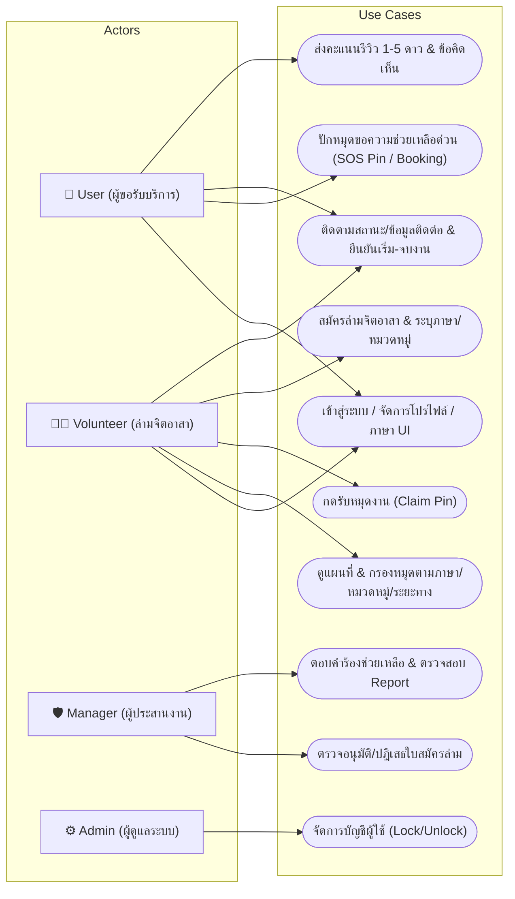
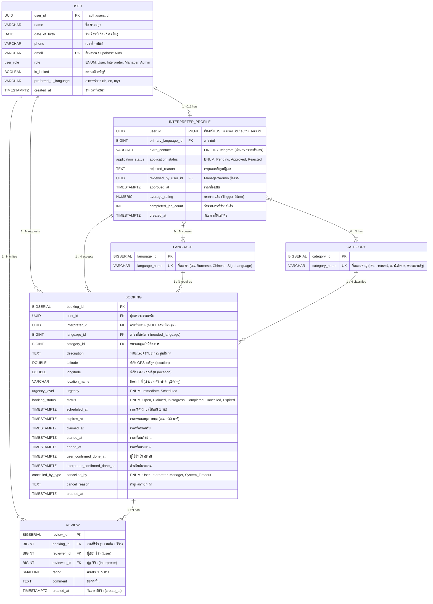
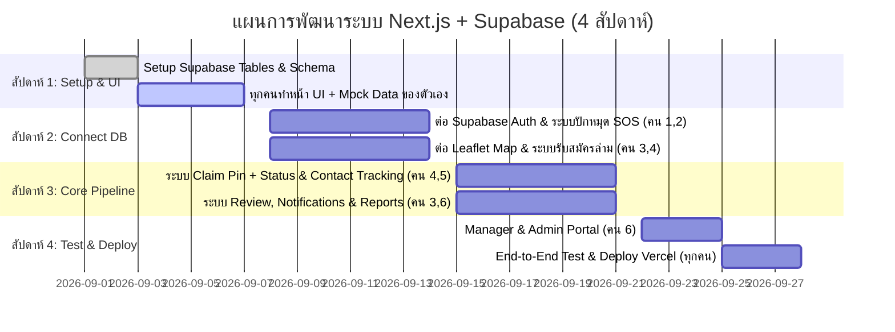

# 📑 รายงานสรุปโครงการ: ระบบแพลตฟอร์มล่ามจิตอาสาเชิงพื้นที่และแจ้งเหตุฉุกเฉิน (Map-based SOS Volunteer Interpreter Platform)

---

## ✅ ข้อสรุป Requirement ล่าสุด (Source of Truth)

ส่วนนี้เป็นข้อสรุปจากการทบทวน requirement ล่าสุด และให้ถือว่าอยู่เหนือข้อความเก่าที่ขัดแย้งกันในเอกสารฉบับนี้

### ภาพรวมผลิตภัณฑ์

ระบบเป็นแพลตฟอร์มขอความช่วยเหลือด้านภาษาบนแผนที่ ผู้ขอความช่วยเหลือปักหมุดคำขอ และล่ามจิตอาสาที่มีภาษาและความถนัดตรงกันเลือกกดรับงานจากหมุดใกล้เคียง ลักษณะงานเป็นการขอความช่วยเหลือแบบกึ่งเร่งด่วน จึงรองรับทั้งงานที่ต้องการความช่วยเหลือภายในเวลาอันสั้นและงานที่นัดหมายล่วงหน้าไม่นาน

### บทบาทและสิทธิ์

| บทบาท | ขอบเขตหลัก |
| :--- | :--- |
| `User` | บทบาทเริ่มต้นของผู้สมัครทุกคน เข้าสู่หน้าต้อนรับ สร้างคำขอ ปักหมุด ติดตามสถานะ และดูข้อมูลติดต่อล่ามหลังมีการรับงาน |
| `Interpreter` | ผู้ใช้ที่สมัครเป็นล่ามและได้รับการอนุมัติแล้ว เห็นเฉพาะหมุดที่ตรงกับภาษาและหมวดหมู่ความถนัดของตนเอง และกดรับงานได้ |
| `Manager` | บทบาทย่อยของฝ่ายดูแลระบบ ใช้ตรวจสอบและอนุมัติ/ปฏิเสธใบสมัครล่าม รวมถึงดูสิทธิ์พื้นฐานที่ได้รับมอบหมาย โดยความสามารถเป็นสับเซตของ `Admin` |
| `Admin` | จัดการผู้ใช้และสิทธิ์โดยรวม รวมถึงดู/เปลี่ยน role และจัดการ lock/unlock เมื่อเปิดใช้ฟีเจอร์นี้ |

- ใช้ Supabase Auth จริงสำหรับสมัครสมาชิกและเข้าสู่ระบบ
- หลัง login ระบบต้องพาไปยัง UI ตาม role
- ผู้ใช้ใหม่มี role เป็น `User` เสมอ
- การสมัครล่ามใช้สถานะ `Pending`, `Approved`, `Rejected`; เมื่อได้รับการอนุมัติ ระบบจึงเปลี่ยน role เป็น `Interpreter` อัตโนมัติ
- ระหว่าง `Pending` ผู้สมัครยังคงเป็น `User` และต้องรอผลอนุมัติก่อนจึงจะเห็น dashboard ล่ามหรือรับงานได้
- Manager และ Admin สามารถอนุมัติใบสมัครได้ตามสิทธิ์ที่กำหนด

### เส้นทางการใช้งานหลัก

1. ผู้ใช้ login แล้วเห็นหน้าต้อนรับที่อธิบายบริการและข้อมูลสำคัญ พร้อมปุ่มไปหน้าปักหมุดขอความช่วยเหลือ
2. ผู้ใช้สร้างคำขอโดยเลือกภาษาหลัก 1 ภาษา เลือกหมวดหมู่หลัก 1 หมวด ระบุรายละเอียดเพิ่มเติม และระบุตำแหน่ง
3. คำขอมีสองรูปแบบที่ต้องแสดงแตกต่างกันบนแผนที่: งานเร่งด่วน และงานนัดหมายล่วงหน้าไม่เกิน 1 วัน
4. งานเร่งด่วน เช่น ต้องการความช่วยเหลือภายใน 15 นาที และหมดอายุภายใน 30 นาทีหากไม่มีล่ามรับ
5. ล่ามที่ได้รับอนุมัติเห็น dashboard แผนที่งานใกล้เคียง เฉพาะคำขอที่ตรงกับภาษาและหมวดหมู่ความถนัดของตนเอง โดยสามารถเลือกตัวกรองระยะทางได้
6. ก่อนกดรับงาน แผนที่แสดงตำแหน่งแบบคร่าว ๆ; เมื่อมีล่ามกดรับแล้ว หมุดจะหายจากรายการของล่ามคนอื่น และผู้ขอสามารถดูโปรไฟล์ล่ามพร้อมข้อมูลติดต่อได้
7. ไม่รับงานที่เห็นได้โดยการปล่อยผ่าน ไม่ต้องมีสถานะปฏิเสธสำหรับล่าม
8. หากล่ามยกเลิกหลังรับงาน และยังไม่พ้นเวลาหมดอายุเดิม คำขอจะกลับเป็น `Open`; หากผู้ใช้ยกเลิกให้เป็น `Cancelled`
9. งานจะเป็น `Completed` ได้เมื่อทั้งผู้ขอและล่ามยืนยันจบงาน

### ขอบเขตขั้นต่ำและสิ่งที่ไม่รวมใน MVP

MVP ต้อง login ได้ด้วย Supabase Auth, ปักหมุดส่งคำขอได้, สมัครเป็นล่ามได้, มี Manager/Admin อนุมัติใบสมัครและจัดการ role ได้, ล่ามเห็นงานที่ตรงความสามารถและกดรับได้, ผู้ขอติดตามสถานะและดูข้อมูลติดต่อได้

ยังไม่รวมระบบแชท, availability toggle, ระบบ lock/unlock บัญชีในช่วงแรก และการบังคับใช้ RLS อย่างเต็มรูปแบบ เพื่อให้พัฒนาและแก้ไขได้ง่ายก่อน โดย RLS และความปลอดภัยเชิงลึกจะต้องวางก่อนนำไปใช้งานจริงในวงกว้าง

ฟีเจอร์รีวิว/คะแนน, การแจ้งเตือน, การรายงานปัญหา และคำร้องขอความช่วยเหลือยังถือว่าจำเป็นต่อระบบ แต่สามารถแยกเป็น feature/domain ให้สมาชิกทีมรับผิดชอบได้ ไม่จำเป็นต้องทำให้เสร็จในหน้าหลักชุดเดียวกัน

### หลักการเชื่อมต่อ Supabase และ ER

- ใช้ Supabase Auth เป็นแหล่งจัดการอีเมลและรหัสผ่าน ไม่สร้างหรือเก็บ `password_hash` ในตารางธุรกิจ
- `auth.users.id` คือ UUID ที่ Supabase สร้างให้ผู้ใช้แต่ละคนหลังสมัครสมาชิก ควรใช้เป็น `user_id` ในตาราง profile/user เพื่อเชื่อมข้อมูลผู้ใช้กับ Auth แบบ 1:1
- ข้อมูล role, profile, ใบสมัครล่าม และข้อมูลธุรกิจเก็บในตารางของแอป โดยอ้างอิง `auth.users.id`
- คำขอหนึ่งรายการมีภาษาหลักหนึ่งภาษาและหมวดหมู่หลักหนึ่งหมวด ส่วนความสามารถของล่ามยังรองรับหลายภาษาและหลายหมวดหมู่ผ่าน junction tables
- ไม่ให้ `CATEGORY` เป็นลูกของ `LANGUAGE`; ภาษาและหมวดหมู่เป็นข้อมูลอ้างอิงคนละชุด
- ตำแหน่งจริงและข้อมูลติดต่อควรถูกเปิดเผยหลัง claim เท่านั้น ส่วนก่อน claim ใช้ข้อมูลตำแหน่งแบบคร่าว ๆ
- ควรใช้การ claim แบบ atomic ในฐานข้อมูล เพื่อป้องกันล่ามหลายคนรับหมุดเดียวกันพร้อมกัน

### ข้อเสนอปรับ ER จากแบบวาดเดิม

ควรเก็บเป็นการปรับจาก ER เดิม ไม่ต้องรื้อแนวคิดทั้งหมด:

- เอา `password_hash` ออกจาก `USER` และเปลี่ยน `user_id` เป็น UUID ที่อ้างอิง `auth.users.id`
- เปลี่ยน `INTERPRETER_PROFILE.interpreter_id` ให้เป็น `user_id` ที่เป็นทั้ง PK และ FK ไปยัง profile/user
- ใช้ `language_id` เป็น FK ใน `INTERPRETER_PROFILE.primary_language` แทนการเก็บชื่อภาษาโดยตรง และใช้ `interpreter_languages` กับ `interpreter_categories` สำหรับความสามารถหลายรายการ
- เพิ่ม `category_id` ใน `BOOKING` โดยตรง เพราะคำขอหนึ่งรายการเลือกเพียงหนึ่งหมวดหลัก และถอด `booking_categories` ออกจาก MVP
- เพิ่ม/คงไว้ซึ่ง `description`, `latitude`, `longitude`, `location_name`, `scheduled_at`, `expires_at`, `claimed_at`, `started_at`, `ended_at`, `cancelled_by`, `cancel_reason` และสถานะงาน
- เพิ่มเวลา/ธงยืนยันจบงานของทั้งสองฝ่าย เช่น `user_confirmed_done_at` และ `interpreter_confirmed_done_at`
- แยก `REVIEW` เป็นตารางของตัวเอง ไม่เก็บ review เป็นคอลัมน์เดียวในคำขอ
- ตัดสถานะ `UnderReview` และ `is_available` ออกจาก MVP; ใช้ `application_status` เพียง `Pending`, `Approved`, `Rejected`
- `reviewed_by_manager_id` ควรอ้างถึงผู้ใช้ที่เป็น Manager/Admin และควรมี `approved_at` กับ `rejected_reason`
- `user_languages` ไม่จำเป็นต่อการ matching ใน MVP หากผู้ขอเลือกภาษาที่ต้องการในคำขอโดยตรง
- `NOTIFICATION`, `REPORT` และ `HELP_REQUEST` เป็นตารางที่ควรเพิ่มเมื่อทีมเริ่มทำฟีเจอร์ส่วนนั้น ส่วน `AUDIT_LOG` คือประวัติการกระทำสำคัญของผู้ดูแล เช่น เปลี่ยน role หรืออนุมัติใบสมัคร และเลื่อนไปหลัง MVP ได้

---

## 🎯 ส่วนที่ 1: การวิเคราะห์และตีความโจทย์ (Problem Analysis & Objectives)

### 1.1 ที่มาและปัญหา (Pain Points)
* **อุปสรรคการสื่อสารในสถานการณ์สำคัญและฉุกเฉิน:** ผู้รับบริการ (เช่น ผู้ป่วยต่างชาติตามห้องฉุกเฉินในโรงพยาบาล, ผู้ประสบอุบัติเหตุ, ผู้ติดต่อสถานีตำรวจ หรือหน่วยงานราชการ) ประสบปัญหาการสื่อสารทางภาษาอย่างรุนแรงและต้องการความช่วยเหลือทันที
* **ความล่าช้าของระบบจองแบบเดิม (Bottleneck of 1-to-1 Booking):** การค้นหาและส่งคำขอจองล่ามทีละคนต้องรอการตอบรับ หากล่ามไม่เปิดอ่านคำขอจะทำให้ผู้เดือดร้อนต้องรอนานอย่างไร้จุดหมาย
* **ขาดระบบประสานงานเชิงพื้นที่ (Lack of Location Context):** ขาดแพลตฟอร์มที่แสดงพิกัดความต้องการความช่วยเหลือบนแผนที่แบบ Real-time ทำให้ล่ามจิตอาสาที่อยู่ใกล้เคียงไม่ทราบว่ามีผู้ต้องการความช่วยเหลืออยู่รอบตัว
* **ค่าบริการล่ามมืออาชีพสูง & ขาดระบบคัดกรอง:** ผู้เดือดร้อนส่วนใหญ่ไม่สามารถแบกรับค่าจ้างล่ามเอกชนได้ ขณะเดียวกันการขอความช่วยเหลือทั่วไปก็ขาดระบบตรวจสอบตัวตนและประวัติความปลอดภัยของล่าม

### 1.2 วัตถุประสงค์ของระบบ (Objectives)
1. **ศูนย์กลางปักหมุดขอความช่วยเหลือบนแผนที่ (Interactive SOS Map Hub):** ให้ผู้ใช้งานสามารถปักหมุดแจ้งเหตุขอความช่วยเหลือด้านภาษาด่วน (SOS) โดยดึงพิกัด GPS อัตโนมัติ เพื่อกระจายเรื่องไปยังล่ามจิตอาสาที่อยู่ใกล้เคียง
2. **ระบบจับคู่แบบระดมความช่วยเหลือ (Decoupled Job Pool / First-Claim Matching):** ล่ามจิตอาสาที่ได้รับอนุมัติและตรงกับภาษา/หมวดหมู่สามารถกดรับหมุดงาน (Claim Pin) ได้ทันทีด้วยตนเอง ลดระยะเวลาการรอคอย
3. **ระบบคัดกรองและตรวจสอบคุณสมบัติ (Manager Verification & Safety):** ให้ผู้ประสานงาน (Manager) ตรวจสอบประวัติและความสามารถของล่ามจิตอาสาก่อนเปิดสิทธิ์รับงาน เพื่อความปลอดภัยและความน่าเชื่อถือ
4. **หน้าติดตามการช่วยเหลือ:** ผู้ขอและล่ามเห็นสถานะงาน ข้อมูลติดต่อหลังรับงาน และปุ่มยืนยันเริ่ม/จบงาน โดยไม่รวมระบบแชท

---

## ⚖️ ส่วนที่ 2: กฎทางธุรกิจและข้อกำหนดระบบ (Business Rules, FR & NFR)

### 2.1 กฎทางธุรกิจ (Business Rules)
* **BR-01 (No Self-Claim):** ล่ามจิตอาสาไม่สามารถกดรับ (Claim) หมุดขอความช่วยเหลือที่ตนเองเป็นผู้สร้างในฐานะ User ได้ (`CHECK: user_id <> interpreter_id`)
* **BR-02 (Interpreter Approval Required):** ล่ามต้องได้รับการอนุมัติสถานะเป็น `Approved` จาก Manager/Admin ก่อน จึงจะมองเห็นหมุดและรับงานได้ โดยไม่ต้องมีสวิตช์ availability ใน MVP
* **BR-03 (Language & Category Match):** หมุดจะแสดงเฉพาะล่ามที่มีทั้งภาษาที่ตรงกับคำขอและหมวดหมู่ความถนัดที่ตรงกับคำขอ
* **BR-04 (Location & Contact Privacy):** ก่อนการรับงาน ข้อมูลบนแผนที่จะแสดงเฉพาะ **"ภาษา + หมวดหมู่งาน + ชื่อสถานที่กว้างๆ"** เท่านั้น เมื่อล่ามกดรับงาน (`Claimed`) ระบบจึงจะปลดล็อกพิกัดแม่นยำและข้อมูลติดต่อส่วนตัว (`phone`, `extra_contact`)
* **BR-05 (Execution Lifecycle):** การบันทึกเวลาต้องเป็นไปตามลำดับสถานะ และงานจะจบสมบูรณ์เมื่อทั้งสองฝ่ายยืนยัน:
  * กด **"เริ่มงาน"** (`started_at`) ได้เฉพาะสถานะ `Claimed` $\rightarrow$ เปลี่ยนเป็น `InProgress`
  * เมื่อผู้ใช้และล่ามยืนยันจบงานทั้งคู่ จึงเปลี่ยนเป็น `Completed`
* **BR-06 (Review Eligibility):** การประเมินคะแนน (1–5 ดาว) ทำได้เฉพาะภารกิจที่สถานะเป็น `Completed` โดยเชื่อมโยงทั้ง `booking_id`, `reviewer_id` และ `reviewee_id` พร้อมคำนวณคะแนนเฉลี่ย (`average_rating`) อัปเดตลงโปรไฟล์ล่าม
* **BR-07 (Pin Timeout & Auto-Expire):** หมุดเร่งด่วนที่ไม่มีล่ามกดรับภายใน 30 นาทีจะถูกเปลี่ยนสถานะเป็น `Expired` อัตโนมัติ ส่วนงานนัดหมายต้องสร้างล่วงหน้าไม่เกิน 1 วันและแสดงรูปแบบแตกต่างจากหมุดเร่งด่วน
* **BR-08 (Cancellation & Re-pooling):** การยกเลิกหมุดต้องระบุฝ่ายที่ยกเลิก (`cancelled_by`) และเหตุผล (`cancel_reason`) หากล่ามเกิดเหตุฉุกเฉินขอยกเลิก หมุดสามารถถูกเปิดกลับเข้าสู่แผนที่ (`Re-open`) ให้ล่ามคนอื่นเห็นใหม่ได้
* **BR-09 (Support & Reporting):** ผู้ใช้และล่ามสามารถส่งรายงานปัญหา (Report) หรือส่งคำร้องขอความช่วยเหลือ (Help Request) ไปยัง Manager ได้

---

### 2.2 ข้อกำหนดเชิงฟังก์ชัน (Functional Requirements - FR)

| รหัส FR | กลุ่มฟังก์ชัน | รายละเอียดความต้องการ | ผู้ใช้งาน (Actor) |
| :--- | :--- | :--- | :--- |
| **FR-01 – 07** | **Account & Auth** | สมัครสมาชิก, เข้าสู่ระบบ/ออกจากระบบ, จัดการโปรไฟล์, กำหนด Role (User, Interpreter, Manager, Admin) และเปลี่ยนภาษาหน้าจอ UI | All Roles / Admin |
| **FR-08 – 16** | **Interactive SOS Map** | แสดงหมุดที่ตรงกับภาษาและหมวดหมู่ของล่าม แสดงตำแหน่งโดยประมาณก่อน claim แยกการแสดงผลระหว่างงานเร่งด่วนกับงานนัดหมาย และมีตัวกรองระยะทาง | Interpreter |
| **FR-17 – 24** | **Help Request / SOS Request**| สร้างคำขอและปักหมุด ดึงพิกัด GPS อัตโนมัติหรือปักหมุดเอง เลือกภาษา 1 ภาษา หมวดหมู่ 1 หมวด ระบุรายละเอียด รูปแบบความเร่งด่วน และเวลานัดหมาย | User / System |
| **FR-25 – 30** | **Matching & Claiming** | แสดงงานให้ล่ามที่ได้รับอนุมัติและมีภาษา/หมวดหมู่ตรงกัน ปุ่มกดรับงานพร้อม Concurrency Lock และนำหมุดออกจากรายการของล่ามคนอื่นหลัง claim | Interpreter / System |
| **FR-31 – 36** | **Status & Contact Tracking** | ผู้ใช้ดูโปรไฟล์ล่ามหลังรับงาน ดูข้อมูลติดต่อและติดตามสถานะงาน ทั้งสองฝ่ายยืนยันจบงานได้ โดยไม่รวมระบบแชท | User / Interpreter |
| **FR-37 – 44** | **Volunteer Onboarding** | สมัครเป็นล่ามจิตอาสา, ระบุภาษาหลัก/ภาษาที่สื่อสารได้ ($M:N$), หมวดหมู่ความเชี่ยวชาญ ($M:N$), ประวัติการทำงาน และติดตามสถานะใบสมัคร | Interpreter / System |
| **FR-45 – 50** | **Manager Verification** | หน้าตรวจอนุมัติ/ปฏิเสธใบสมัครล่ามจิตอาสา (Approve/Reject + เหตุผล) และดูสิทธิ์พื้นฐานที่รับผิดชอบ โดยฟีเจอร์ Help Request/Report แยกพัฒนาตาม domain | Manager |
| **FR-51 – 56** | **Review & Rating** | ประเมินความพึงพอใจ 1–5 ดาว พร้อมข้อคิดเห็นหลังจบภารกิจ (ระบุผู้รีวิวและผู้ถูกรีวิว), คำนวณคะแนนเรตติ้งเฉลี่ยสะสมลงโปรไฟล์ล่ามอัตโนมัติ | User / System |
| **FR-57 – 62** | **Cancellation & Timeout** | กดยกเลิกหมุดพร้อมระบุเหตุผล, ระบบนับถอยหลังหมดอายุ (Timeout Auto-Expire) และระบบส่งหมุดกลับเข้า Pool กรณีล่ามสละสิทธิ์ | User / Interpreter / System |
| **FR-63 – 68** | **Realtime Notifications** | แจ้งเตือนล่ามเมื่อมีหมุดใหม่อยู่ใกล้เคียง, แจ้งเตือนผู้ใช้เมื่อมีคนกดรับหมุด, แจ้งเตือนการเปลี่ยนสถานะงาน และแจ้งเตือนผลการสมัครล่าม | System |
| **FR-69 – 74** | **Admin Control** | ดูผู้ใช้และจัดการ role โดยมี Manager เป็นสิทธิ์ย่อยของ Admin; การ lock/unlock จัดเตรียมไว้เป็นฟีเจอร์ถัดไป | Admin |

---

### 2.3 ข้อกำหนดที่ไม่ใช่เชิงฟังก์ชัน (Non-Functional Requirements - NFR)

* **NFR-01 (Role-Based Access Control):** ควบคุมสิทธิ์การเข้าถึงหน้าจอและ API อย่างเข้มงวดตาม Role ทั้ง 4 ระดับ (`User`, `Interpreter`, `Manager`, `Admin`)
* **NFR-02 (Data Privacy & Location Protection):** ปกป้องข้อมูลส่วนบุคคล และไม่เปิดเผยพิกัดที่แม่นยำ/เบอร์ติดต่อจนกว่าล่ามจะกดรับงานจริง
* **NFR-03 (Data Refresh):** ช่วงแรกสามารถดึงข้อมูลหมุดและสถานะจากฐานข้อมูลตามจังหวะการเปิด/รีเฟรชหน้าได้ โดยยังไม่กำหนด SLA แบบ Real-time 3 วินาที
* **NFR-04 (Concurrency & Data Integrity):** ป้องกัน Race Condition กรณีล่ามหลายคนกดรับงานพร้อมกันด้วย Database Transaction / Atomic RPC
* **NFR-05 (Mobile-First & Usability):** ออกแบบหน้าจอปักหมุดด่วนและแผนที่ให้ใช้งานง่ายบนสมาร์ตโฟน แม้ผู้ใช้จะกำลังอยู่ในสถานการณ์ฉุกเฉิน
* **NFR-06 (Responsive Design & Compatibility):** รองรับการแสดงผลทุกขนาดหน้าจอ (Desktop, Tablet, Mobile) บนเบราว์เซอร์มาตรฐาน (Chrome, Edge, Safari, Firefox)

---

## 👥 ส่วนที่ 3: การวิเคราะห์ User Stories (User Roles & Stories)

```
┌─────────────────┐      ┌──────────────────────────┐      ┌─────────────────────────┐      ┌─────────────────────┐
│ 1. User         │      │ 2. Volunteer Interpreter │      │ 3. Manager              │      │ 4. Admin            │
│ (ผู้ขอรับบริการ) │      │ (ล่ามจิตอาสา)            │      │ (ผู้ประสานงาน/ตรวจสอบ)   │      │ (ผู้ดูแลระบบส่วนกลาง) │
└─────────────────┘      └──────────────────────────┘      └─────────────────────────┘      └─────────────────────┘
```

* **👤 User (ผู้ขอความช่วยเหลือ):**
  * *ปักหมุดด่วน (SOS):* ต้องการกดปุ่มเดียวเพื่อดึง GPS ปักหมุด ระบุภาษาที่ต้องการ และหมวดหมู่งาน เพื่อกระจายเรื่องขอความช่วยเหลือทันที
  * *ติดตามงาน & ติดต่อ:* ต้องการเห็นการแจ้งเตือนทันทีเมื่อมีคนรับงาน ดูข้อมูลติดต่อล่าม และติดตามสถานะแบบเรียลไทม์
  * *ประเมินรีวิว:* ต้องการเขียนรีวิวให้คะแนนดาวและข้อคิดเห็นหลังจบการช่วยเหลือ
* **🧑‍💼 Volunteer Interpreter (ล่ามจิตอาสา):**
  * *สมัครล่าม:* ต้องการกรอกภาษาที่สื่อสารได้ หมวดหมู่งาน และประวัติเพื่อรอ Manager อนุมัติ
  * *ค้นหาและรับงานบนแผนที่:* ต้องการดูเฉพาะหมุดรอบตัวที่ตรงกับภาษา/หมวดหมู่ และกดรับงานที่ตนเองสะดวก
  * *ปฏิบัติงาน:* ต้องการดูข้อมูลติดต่อ ติดตามสถานะ และยืนยันเริ่ม/จบงาน โดยไม่ใช้แชทในระบบ
* **🛡️ Manager (ผู้ประสานงาน/ตรวจสอบ):**
  * *คัดกรองล่าม:* ต้องการตรวจสอบประวัติและอนุมัติ/ปฏิเสธใบสมัครล่าม เพื่อรักษามาตรฐานและความปลอดภัย
  * *ดูแลเรื่องร้องเรียน:* ต้องการตอบคำร้องขอความช่วยเหลือ (Help Request) และตรวจสอบรายงานพฤติกรรมไม่เหมาะสม (Report)
* **⚙️ Admin (ผู้ดูแลระบบ):**
  * *บริหารจัดการ:* ต้องการจัดการระงับบัญชีผู้ใช้งานที่ทำผิดกฎ (`is_locked`) และจัดการกำหนด Role ให้กับผู้ใช้

---

## 🔄 ส่วนที่ 4: Use-case Diagram & กระบวนการทำงานหลัก (Core Workflow)

### 4.1 แผนภาพ Use-case Diagram



### 4.2 วงจรสถานะงาน (Booking Lifecycle)
```
[1. Open] ───(ล่ามกด Claim)───► [2. Claimed] ───(เริ่มงาน)───► [3. InProgress] ───(ทั้งสองฝ่ายยืนยันจบ)───► [4. Completed]
    │                                    │                                                                   │
    ├──(หมดเวลา Timeout)──► [Expired]    └──(ล่ามยกเลิกก่อนหมดอายุ)──► [Open อีกครั้ง]                     └─► ส่งรีวิว (1-5 ดาว)
    │
    └──(ผู้ใช้กดยกเลิก)───► [Cancelled] (ระบุ cancel_reason & cancelled_by)
```

---

## 🗄️ ส่วนที่ 5: สถาปัตยกรรมข้อมูล & ER Diagram (Database Architecture)

### 5.1 แผนภาพ Conceptual ER Diagram (พร้อม Attributes ครบถ้วน)



### 5.2 พจนานุกรมข้อมูล (Data Dictionary & Attributes Detail)

| Entity / Table | Attributes | Data Type | Key / Constraint | คำอธิบาย |
| :--- | :--- | :--- | :---: | :--- |
| **`USER`** | `user_id`<br>`name`<br>`date_of_birth`<br>`phone`<br>`email`<br>`role`<br>`is_locked`<br>`preferred_ui_language`<br>`created_at` | UUID<br>VARCHAR<br>DATE<br>VARCHAR<br>VARCHAR<br>ENUM<br>BOOLEAN<br>VARCHAR<br>TIMESTAMPTZ | **PK, FK** $\rightarrow$ `auth.users.id`<br>-<br>-<br>-<br>**UK / Auth**<br>User, Interpreter, Manager, Admin<br>DEFAULT FALSE (ฟีเจอร์ถัดไป)<br>DEFAULT 'th'<br>DEFAULT NOW() | รหัสผู้ใช้จาก Supabase Auth<br>ชื่อ-นามสกุล<br>วันเดือนปีเกิด (ถ้าจำเป็น)<br>เบอร์โทรศัพท์ติดต่อ<br>อีเมลจาก Supabase Auth<br>บทบาทและสิทธิ์การใช้งาน<br>สถานะล็อกบัญชีในอนาคต<br>ภาษาหน้าจอที่ต้องการ<br>วันเวลาที่สร้างบัญชี |
| **`INTERPRETER_PROFILE`** | `user_id`<br>`primary_language_id`<br>`extra_contact`<br>`application_status`<br>`rejected_reason`<br>`reviewed_by_user_id`<br>`approved_at`<br>`average_rating`<br>`completed_job_count`<br>`created_at` | UUID<br>BIGINT<br>VARCHAR<br>ENUM<br>TEXT<br>UUID<br>TIMESTAMPTZ<br>NUMERIC(3,2)<br>INT<br>TIMESTAMPTZ | **PK, FK** $\rightarrow$ `USER`<br>**FK** $\rightarrow$ `LANGUAGE`<br>-<br>Pending, Approved, Rejected<br>-<br>**FK** $\rightarrow$ `USER` (Manager/Admin)<br>-<br>DEFAULT 0.00<br>DEFAULT 0<br>DEFAULT NOW() | รหัสผู้ใช้ที่สมัครล่าม<br>ภาษาหลัก<br>ช่องทางติดต่อเสริม (ซ่อนจนกว่าจะรับงาน)<br>สถานะใบสมัคร<br>เหตุผลที่ไม่อนุมัติ<br>ผู้ตรวจใบสมัคร<br>เวลาที่อนุมัติ<br>คะแนนรีวิวเฉลี่ยสะสม<br>จำนวนงานที่ช่วยเหลือสำเร็จ<br>วันเวลาที่ยื่นสมัคร |
| **`LANGUAGE`** | `language_id`<br>`language_name` | BIGSERIAL<br>VARCHAR | **PK**<br>**UK** | รหัสภาษา<br>ชื่อภาษา (เช่น Burmese, Chinese, Sign) |
| **`CATEGORY`** | `category_id`<br>`category_name` | BIGSERIAL<br>VARCHAR | **PK**<br>**UK** | รหัสหมวดหมู่<br>ชื่อหมวดหมู่ (เช่น การแพทย์, สถานีตำรวจ) |
| **`BOOKING`** | `booking_id`<br>`user_id`<br>`interpreter_id`<br>`language_id`<br>`category_id`<br>`description`<br>`latitude`<br>`longitude`<br>`location_name`<br>`urgency`<br>`status`<br>`scheduled_at`<br>`expires_at`<br>`claimed_at`<br>`started_at`<br>`ended_at`<br>`user_confirmed_done_at`<br>`interpreter_confirmed_done_at`<br>`cancelled_by`<br>`cancel_reason`<br>`created_at` | BIGSERIAL<br>UUID<br>UUID<br>BIGINT<br>BIGINT<br>TEXT<br>DOUBLE PRECISION<br>DOUBLE PRECISION<br>VARCHAR<br>ENUM<br>ENUM<br>TIMESTAMPTZ<br>TIMESTAMPTZ<br>TIMESTAMPTZ<br>TIMESTAMPTZ<br>TIMESTAMPTZ<br>TIMESTAMPTZ<br>TIMESTAMPTZ<br>ENUM<br>TEXT<br>TIMESTAMPTZ | **PK**<br>**FK** $\rightarrow$ `USER`<br>**FK** $\rightarrow$ `INTERPRETER_PROFILE` (NULLable)<br>**FK** $\rightarrow$ `LANGUAGE`<br>**FK** $\rightarrow$ `CATEGORY`<br>-<br>-<br>-<br>-<br>Immediate, Scheduled<br>Open, Claimed, InProgress, Completed, Cancelled, Expired<br>-<br>-<br>-<br>-<br>-<br>-<br>User, Interpreter, Manager, System<br>-<br>DEFAULT NOW() | รหัสคำขอความช่วยเหลือ<br>ผู้ขอความช่วยเหลือ<br>ล่ามที่รับงาน (ว่างเมื่อยังเป็น Open)<br>ภาษาที่ต้องการ 1 ภาษา<br>หมวดหมู่หลัก 1 หมวด<br>รายละเอียดเพิ่มเติม<br>พิกัด GPS ละติจูด<br>พิกัด GPS ลองจิจูด<br>ชื่อสถานที่/จุดนัดพบ<br>รูปแบบงานเร่งด่วนหรือนัดหมาย<br>สถานะของคำขอ<br>เวลานัดหมาย (ไม่เกิน 1 วัน)<br>เวลาหมดอายุ เช่น 30 นาทีสำหรับงานเร่งด่วน<br>เวลาที่ล่ามกดรับ<br>เวลาที่เริ่มงาน<br>เวลาที่จบงาน<br>เวลาผู้ใช้ยืนยันจบ<br>เวลาล่ามยืนยันจบ<br>ฝ่ายที่ยกเลิก<br>เหตุผลการยกเลิก<br>วันเวลาที่สร้างคำขอ |
| **`REVIEW`** | `review_id`<br>`booking_id`<br>`reviewer_id`<br>`reviewee_id`<br>`rating`<br>`comment`<br>`created_at` | BIGSERIAL<br>BIGINT<br>BIGINT<br>BIGINT<br>SMALLINT<br>TEXT<br>TIMESTAMPTZ | **PK**<br>**FK** $\rightarrow$ `BOOKING`<br>**FK** $\rightarrow$ `USER`<br>**FK** $\rightarrow$ `USER`<br>CHECK 1..5<br>-<br>DEFAULT NOW() | รหัสการประเมิน<br>รหัสภารกิจที่ถูกรีวิว<br>ผู้ประเมิน (User)<br>ผู้ถูกประเมิน (Interpreter)<br>คะแนนดาว (1 ถึง 5)<br>ข้อคิดเห็น/คำชม<br>วันเวลาที่ส่งรีวิว (create_at) |

### 5.3 ตารางเชื่อมความสัมพันธ์ Many-to-Many (Junction Tables)
* **`interpreter_languages`:** (`interpreter_id`/`user_id` FK, `language_id` FK) — ภาษาที่ล่ามให้บริการได้หลายภาษา
* **`interpreter_categories`:** (`interpreter_id`/`user_id` FK, `category_id` FK) — หมวดหมู่งานที่ล่ามมีความเชี่ยวชาญหลายหมวด
* ไม่ต้องมี `booking_categories` ใน MVP เพราะ `BOOKING` มี `category_id` หลักเพียงหนึ่งค่า
* ไม่ต้องมี `user_languages` ใน MVP เว้นแต่ภายหลังต้องการเก็บภาษาที่ผู้ขอสื่อสารได้หลายภาษา

---

## 💻 ส่วนที่ 6: สถาปัตยกรรมเชิงเทคนิค Next.js + Supabase (Technical Stack & Folder Structure)

### 6.1 ภาพรวมสถาปัตยกรรม Full-Stack (Serverless BaaS)
ระบบถูกออกแบบให้ทำงานบน **Next.js (App Router)** ร่วมกับ **Supabase (Backend-as-a-Service)** โดยไม่ต้องสร้าง Backend Server แยก:
* **Frontend:** Next.js Server & Client Components, Tailwind CSS, Lucide React, Leaflet (`react-leaflet`)
* **Backend Logic:** Next.js **Server Actions** (`actions/*.ts`) และ Next.js **Middleware** (`middleware.ts`) สำหรับ RBAC
* **Data Layer:** **Supabase Cloud (PostgreSQL)** พร้อม Supabase Auth และ PostgreSQL Stored Functions (RPC) สำหรับ claim งานแบบ atomic; Realtime เป็นส่วนเสริมภายหลังได้

```text
khvi/
├── app/                              <── หน้าจอแยกตาม Route
│   ├── (auth)/                       <── [คนที่ 1] หน้า Login, Register
│   ├── profile/                      <── [คนที่ 1] หน้าจัดการโปรไฟล์ผู้ใช้
│   ├── request-help/                 <── [คนที่ 2] หน้าฟอร์มปักหมุด SOS & หน้ารอคิว
│   ├── my-requests/                  <── [คนที่ 2] หน้าประวัติคำขอของผู้ใช้
│   ├── map/                          <── [คนที่ 3] หน้าแผนที่หลัก Interactive SOS Map
│   ├── volunteer/                    <── [คนที่ 4] Dashboard ล่าม & หน้ากดรับงาน
│   ├── mission/[id]/                 <── [คนที่ 5] หน้ารายละเอียดคำขอ/ติดตามการช่วยเหลือ
│   ├── manager/                      <── [คนที่ 6] หน้าตรวจอนุมัติล่าม & ตอบ Help Request
│   └── admin/                        <── [คนที่ 6] หน้าจัดการผู้ใช้และ role
│
├── components/                       <── UI Components แยกตามฟีเจอร์
│   ├── auth/                         <── [คนที่ 1] LoginForm, RegisterForm, LanguageSwitcher
│   ├── pin-request/                  <── [คนที่ 2] SOSButton, PinForm, RadarWaiting
│   ├── map/                          <── [คนที่ 3] LeafletMap, CustomMarkers, MapFilterBar
│   ├── volunteer/                    <── [คนที่ 4] ApplicationForm, ClaimButton
│   ├── mission/                      <── [คนที่ 5] ContactCard, ExecutionControls, CompletionConfirm
│   ├── manager/                      <── [คนที่ 6] VolunteerVerifyCard, HelpRequestList
│   ├── review/                       <── [คนที่ 6] ReviewModal, StarRating
│   └── admin/                        <── [คนที่ 6] UserTable
│
├── lib/                              <── ตัวช่วยส่วนกลาง
│   ├── supabase/                     <── Supabase Client/Server helpers (@supabase/ssr)
│   └── mock-data.ts                  <── ข้อมูลจำลองสำหรับช่วงเริ่มต้นพัฒนา (Mock Mode)
│
├── types/                            <── TypeScript Interfaces
│   └── database.types.ts             <── Database Type Definitions
│
└── actions/                          <── Server Actions (Logic หลังบ้านใน Next.js)
    ├── auth-actions.ts               <── [คนที่ 1] เข้าสู่ระบบ, อัปเดตโปรไฟล์
    ├── pin-actions.ts                <── [คนที่ 2] สร้างหมุด SOS, ยกเลิกหมุด
    ├── volunteer-actions.ts          <── [คนที่ 4] ยื่นใบสมัคร, Atomic Claim
    ├── mission-actions.ts            <── [คนที่ 5] เริ่มงาน, ยืนยันจบงานสองฝ่าย, ยกเลิก/เปิดหมุดใหม่
    ├── manager-actions.ts            <── [คนที่ 6] ตรวจอนุมัติล่าม, ตอบ Help Request
    ├── admin-actions.ts              <── [คนที่ 6] จัดการผู้ใช้และ role
    └── review-actions.ts             <── [คนที่ 6] ส่งคะแนนรีวิว
```

---

## 🚀 ส่วนที่ 7: แผนการพัฒนาและการแบ่งงานภายในทีม 6 คน (Roadmap & Team Division)

### 7.1 แผนพัฒนา 4 สัปดาห์ (4-Week Agile Roadmap)



---

### 7.2 ตารางแบ่งหน้าที่รับผิดชอบสำหรับ 6 คน (Next.js + Supabase Vertical Slice Matrix)

| สมาชิก | ฟีเจอร์ที่รับผิดชอบ (Feature Domain) | ไฟล์ Routes & UI Components | Supabase Tables & Server Actions |
| :---: | :--- | :--- | :--- |
| **คนที่ 1** | **Identity, Auth & Localization**<br>*(ระบบสมาชิก, สิทธิ์ Roles & ภาษาหน้าจอ)* | • `app/(auth)/login/page.tsx`<br>• `app/(auth)/register/page.tsx`<br>• `app/profile/page.tsx`<br>• `components/auth/LoginForm.tsx`<br>• `components/layout/LanguageSwitcher.tsx` | • **Supabase Auth** และตาราง `users/profiles` ที่อ้าง `auth.users.id`<br>• Next.js `middleware.ts` (RBAC 4 Roles)<br>• `actions/auth-actions.ts` |
| **คนที่ 2** | **SOS Pin Creation & Requester Hub**<br>*(ระบบปักหมุดและจัดการคำขอ)* | • `app/welcome/page.tsx`<br>• `app/request-help/page.tsx`<br>• `app/my-requests/page.tsx`<br>• `components/pin-request/PinForm.tsx`<br>• `components/pin-request/RequestStatus.tsx` | • ตาราง `bookings` (Insert `status = 'Open'`)<br>• Geolocation API (ดึง GPS)<br>• `actions/pin-actions.ts` |
| **คนที่ 3** | **Interactive SOS Map & Visual Discovery**<br>*(ระบบแผนที่และตัวกรองตามความสามารถ)* | • `app/map/page.tsx`<br>• `components/map/LeafletMap.tsx`<br>• `components/map/CustomMarkers.tsx`<br>• `components/map/MapFilterBar.tsx`<br>• `components/map/PinSummaryModal.tsx` | • Query `bookings` (`status = 'Open'`) โดย match `language_id`, `category_id`<br>• แสดงตำแหน่งคร่าว ๆ ก่อน claim และแยกประเภทงานเร่งด่วน/นัดหมาย |
| **คนที่ 4** | **Volunteer Portal & Matching Engine**<br>*(ระบบรับสมัครล่ามและรับงาน)* | • `app/volunteer/apply/page.tsx`<br>• `app/volunteer/dashboard/page.tsx`<br>• `app/volunteer/status/page.tsx`<br>• `components/volunteer/ApplicationForm.tsx`<br>• `components/volunteer/ClaimButton.tsx` | • ตาราง `interpreter_profiles`, `languages`, `categories`, `interpreter_languages`, `interpreter_categories`<br>• **Postgres RPC `claim_booking`** (Atomic Concurrency Lock)<br>• `actions/volunteer-actions.ts` |
| **คนที่ 5** | **Status & Contact Tracking**<br>*(ติดตามสถานะ ข้อมูลติดต่อ และการยืนยันจบงาน)* | • `app/mission/[id]/page.tsx`<br>• `components/mission/MissionHeader.tsx`<br>• `components/mission/ContactCard.tsx`<br>• `components/mission/ExecutionControls.tsx`<br>• `components/mission/CompletionConfirm.tsx` | • อัปเดต `bookings` (`claimed_at`, `started_at`, `ended_at`, `user_confirmed_done_at`, `interpreter_confirmed_done_at`)<br>• `actions/mission-actions.ts` |
| **คนที่ 6** | **Manager & Admin Backoffice**<br>*(ตรวจอนุมัติล่าม, จัดการระบบ & รีวิว)* | • `app/manager/verify-volunteers/page.tsx`<br>• `app/admin/users/page.tsx`<br>• `components/manager/VolunteerVerifyCard.tsx`<br>• `components/admin/UserTable.tsx`<br>• `components/review/ReviewModal.tsx` | • ตาราง `reviews`, `notifications`, `reports`, `help_requests`<br>• Postgres Trigger คำนวณ `average_rating`<br>• `actions/manager-actions.ts`<br>• `actions/admin-actions.ts`<br>• `actions/review-actions.ts` |
