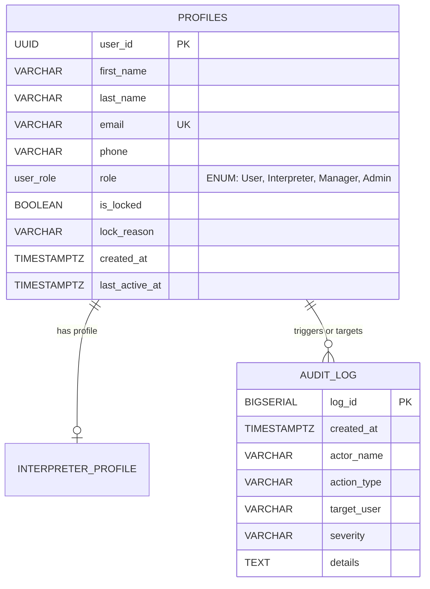

# 📑 ข้อมูลรายละเอียดระบบผู้ดูแลระบบ (Admin Specification & Detail)

เอกสารฉบับนี้จัดทำขึ้นเพื่ออธิบายรายละเอียด ข้อกำหนด กฎทางธุรกิจ การทำงานของหน้าจอ และสถาปัตยกรรมข้อมูลในส่วนของ **Admin (ผู้ดูแลระบบส่วนกลาง)** ของแพลตฟอร์ม **KHVI Helper** โดยเฉพาะ

---

## 1. บทบาทและขอบเขตความรับผิดชอบ (Role & Scope)

ข้อกำหนดปัจจุบันใช้ `profiles` ที่เชื่อมกับ Supabase Auth และแยกชื่อเป็น `first_name` กับ `last_name` โดย Lock/Unlock อยู่ในขอบเขต MVP

ในระบบ KHVI Helper มีการแบ่งบทบาทผู้ใช้หลักออกเป็น 4 ระดับ:
1. `User` (ผู้ขอรับบริการ)
2. `Interpreter` (ล่ามจิตอาสา)
3. `Manager` (ผู้ประสานงาน/ตรวจสอบใบสมัครล่าม)
4. `Admin` (ผู้ดูแลระบบส่วนกลางระดับสูงสุด)

### ความแตกต่างระหว่าง Admin และ Manager
- **Manager:** เน้นด้านการปฏิบัติการประจำวัน ได้แก่ การตรวจข้อมูลสมัครล่ามและอนุมัติ/ปฏิเสธใบสมัคร (`Interpreter Application Queue`) และการตอบกลับหรือประสานงานข้อขัดข้อง (`Support & Help Tickets`)
- **Admin:** เป็นผู้ถือสิทธิ์ระดับสูงสุด มีความสามารถครอบคลุมความสามารถของ Manager ทั้งหมด และมีสิทธิ์สูงสุดในการควบคุมความปลอดภัยและการกำกับดูแลระบบ:
  - กำหนดและเปลี่ยนแปลงบทบาทสิทธิ์ (Role RBAC Transition) ของบัญชีผู้ใช้ทุกคนในระบบ
  - สั่งระงับหรือล็อกบัญชีผู้ใช้ (`Account Lock/Suspension`) ได้ใน MVP พร้อมบังคับระบุเหตุผลเพื่อความปลอดภัย
  - ตรวจสอบดัชนีคุณภาพและคะแนนรีวิวของล่ามอาสา (`Interpreter Quality & Ratings`)
  - ตรวจสอบประวัติการใช้งานและกิจกรรมของผู้ดูแลระบบอย่างละเอียดผ่านระบบบันทึกความปลอดภัยที่ไม่สามารถแก้ไขได้ (`Immutable Audit Trail`)

---

## 2. ฟังก์ชันการทำงานหลักของหน้า Admin Dashboard (`/admin`)

หน้าจอแดชบอร์ดหลักของ Admin ออกแบบโดยอิงโครงสร้างและ Layout มาตรฐานเดียวกับ Manager Console เพื่อให้มีความสอดคล้องด้านประสบการณ์ผู้ใช้ (UX/UI Consistency):

### 2.1 ส่วนหัวระบบ (Admin Header)
- แสดงชื่อแบรนด์ **KHVI Helper** พร้อมคำบรรยายระบบ
- แสดงสถานะระบบส่วนกลาง (`System Status: Normal`)
- แสดงโปรไฟล์และตัวตนของผู้ดูแลระบบด้วย `first_name` และ `last_name` จาก `profiles`
- เมนู Profile Dropdown สำหรับตรวจสอบข้อมูล บันทึก Audit Log และออกจากระบบ (`Sign Out`)

### 2.2 แถบนำทางด้านซ้าย (Left Sidebar & Recent Security Activity)
- เมนูสลับหน้าจอหลัก 3 แท็บ: All Users & Roles, Interpreter Index, Audit Trail
- **Recent Security Activity (ประวัติความปลอดภัยย่อ):** ดึงรายการ Audit Log ล่าสุด 3 รายการขึ้นมาแสดงที่แถบด้านซ้ายแบบ Realtime เพื่อให้ผู้ดูแลระบบมองเห็นกิจกรรมการจัดการสิทธิ์และระงับบัญชีที่เพิ่งเกิดขึ้นได้ทันทีโดยไม่ต้องกดสลับหน้า พร้อมปุ่มกด "View All" เพื่อเปิดหน้า Audit Trail เต็มรูปแบบ

### 2.3 การ์ดสรุปตัวชี้วัดสำคัญ (Key Metric Cards)
1. **Total System Users:** จำนวนผู้ใช้งานทั้งหมดในระบบทุกบทบาท
2. **Approved Interpreters:** จำนวนล่ามจิตอาสาที่ได้รับการอนุมัติ
3. **Suspended / Locked:** จำนวนบัญชีที่ถูกระงับการใช้งานเนื่องจากเหตุผลด้านวินัยหรือความปลอดภัย
4. **Privileged Staff:** จำนวนเจ้าหน้าที่ระดับผู้จัดการ (Manager) และผู้ดูแลระบบ (Admin)

### 2.3 แถบแท็บที่ 1: รายชื่อผู้ใช้และการจัดการสิทธิ์ (All Users & Roles)
- **ระบบค้นหา:** รองรับการค้นหาด้วย `first_name`, `last_name`, อีเมล, เบอร์โทรศัพท์ หรือ User ID
- **ตัวกรองสถานะและบทบาท (Filters):**
  - ตัวกรองบทบาท (All, User, Interpreter, Manager, Admin)
  - ตัวกรองสถานะบัญชี (All, Active, Locked)
  - **ตัวกรองภาษา (Language Multi-Select Filter):** ออกแบบตามสไตล์ Manager Dropdown ให้สามารถติ๊กเลือกภาษาได้หลายภาษาพร้อมกัน เพื่อคัดกรองผู้ใช้หรือล่ามที่พูดภาษานั้นๆ ได้อย่างรวดเร็ว
  - **ตัวกรองหมวดหมู่ความเชี่ยวชาญ (Category Multi-Select Filter):** ออกแบบตามสไตล์ Manager Dropdown ให้สามารถติ๊กเลือกหมวดหมู่ความเชี่ยวชาญ เช่น Medical, Police station, Emergency, Tourist, Legal เพื่อกรองล่ามตามสาขาเฉพาะทางได้อย่างแม่นยำ
- **ตารางข้อมูลผู้ใช้งาน (Users Table List):** แสดงข้อมูลติดต่อ, บทบาท (Role Badge), ภาษาหลัก, ภาษาที่สื่อสารได้, สถานะความปลอดภัย (Active / Locked), และเวลาใช้งานล่าสุด โดยแถวของแต่ละรายการสามารถคลิกเพื่อเปิดหน้าต่างตรวจสอบและจัดการข้อมูลผู้ใช้ (User Management Modal) ได้ทันที

### 2.4 แถบแท็บที่ 2: ดัชนีคุณภาพและผลงานล่าม (Interpreter Index)
- ปรับการแสดงผลเป็น **ตารางรายการ (Table List)** แบบเดียวกับหน้า All Users & Roles เพื่อความสะดวกในการเปรียบเทียบข้อมูล
- จัดเรียงตามคะแนนรีวิว (Rating) จากมากไปน้อย
- แสดงข้อมูลสำคัญในตาราง:
  - อันดับ (`Rank #1, #2, ...`) และชื่อล่าม
  - หมวดหมู่ความเชี่ยวชาญพิเศษ (Specialty Domains) เช่น Medical, Police, Tourism, Legal
  - จำนวนภารกิจที่สำเร็จ (Completed Missions)
  - ความเร็วเฉลี่ยในการออกเดินทางช่วยเหลือ (Avg SOS Dispatch Speed)
  - คะแนนรีวิวเฉลี่ย (★ Average Rating จากรีวิวของผู้ขอความช่วยเหลือ)
- รองรับการคลิกที่แถวรายการเพื่อเปิดหน้าต่างตรวจสอบและจัดการข้อมูลล่ามโดยตรง

### 2.5 แถบแท็บที่ 3: บันทึกความปลอดภัยระบบ (Audit Trail)
- แสดงตารางประวัติกิจกรรมที่เกิดขึ้นในระบบแบบอ่านอย่างเดียว (Read-Only Immutable Log)
- ข้อมูลที่บันทึกประกอบด้วย:
  - วันที่และเวลาที่เกิดเหตุการณ์ (Timestamp)
  - ระดับความรุนแรง (Severity: `info`, `warning`, `danger`)
  - ผู้ดำเนินการ (Actor เช่น Admin หรือระบบอัตโนมัติ)
  - ประเภทการกระทำ (Action เช่น `ROLE_CHANGE`, `ACCOUNT_SUSPEND`, `VOLUNTEER_APPROVE`)
  - บัญชีเป้าหมาย (Target Subject)
  - รายละเอียดเหตุผลและข้อมูลเพิ่มเติม (Details)

### 2.6 หน้าต่างจัดการข้อมูลผู้ใช้แบบเจาะลึก (User Management Modal)
- หน้าต่าง Pop-up แสดงตรงกลางหน้าจอ แบ่งสัดส่วนออกเป็น **30% / 70%**:
  - **ฝั่งซ้าย (30% Profile Summary):** แสดงข้อมูลส่วนตัว, รูปอวตารย่อ, บทบาทปัจจุบัน, ภาษาหลัก, ภาษาที่สื่อสารได้, สถานะบัญชี และสถิติเชิงลึก (กรณีเป็นล่าม)
  - **ฝั่งขวา (70% Detailed Workspace):**
    - **การเปลี่ยน Role (RBAC Assignment):** ปุ่มเลือกสลับบทบาท User, Interpreter, Manager, Admin ได้ทันที
    - **การระงับบัญชี (Account Suspension Toggle):** สวิตช์เปิด-ปิดการล็อกบัญชี หากเลือกเปิดใช้งาน ระบบจะบังคับให้กรอกเหตุผล (`Mandatory Reason`) เพื่อนำไปบันทึกใน Audit Trail
    - **บันทึกประเมินย้อนหลัง (Performance Reviews):** แสดงรีวิวและข้อคิดเห็นจริงที่ล่ามได้รับจากผู้ใช้งาน

---

## 3. กฎทางธุรกิจและความปลอดภัย (Business Rules & Security)

1. **การสืบทอดสิทธิ์ (Privilege Escalation Guard):** เฉพาะผู้ใช้ที่มีบทบาท `Admin` เท่านั้นที่สามารถเข้าถึงเส้นทาง `/admin` และมีสิทธิ์ปรับเปลี่ยน Role ของผู้ใช้อื่นได้
2. **การบังคับระงับบัญชี (Account Lockout Effect):** บัญชีที่มีสถานะ `is_locked = true` จะไม่สามารถล็อกอินเข้าสู่ระบบ ไม่สามารถส่งคำขอ SOS ไม่สามารถกดรับภารกิจล่าม และไม่สามารถเข้าถึงหน้า Dashboard ภายในได้
3. **การบันทึกประวัติที่โปร่งใส (Audit Traceability):** ทุกครั้งที่มีการเปลี่ยนแปลง Role หรือสั่งระงับ/ปลดล็อกบัญชี ระบบจะต้องสร้างรายการบันทึกใน Audit Log โดยอัตโนมัติ พร้อมระบุชื่อผู้ดำเนินการและเหตุผลประกอบ

---

## 4. โครงสร้างข้อมูลที่เกี่ยวข้อง (Data Model Alignment)

