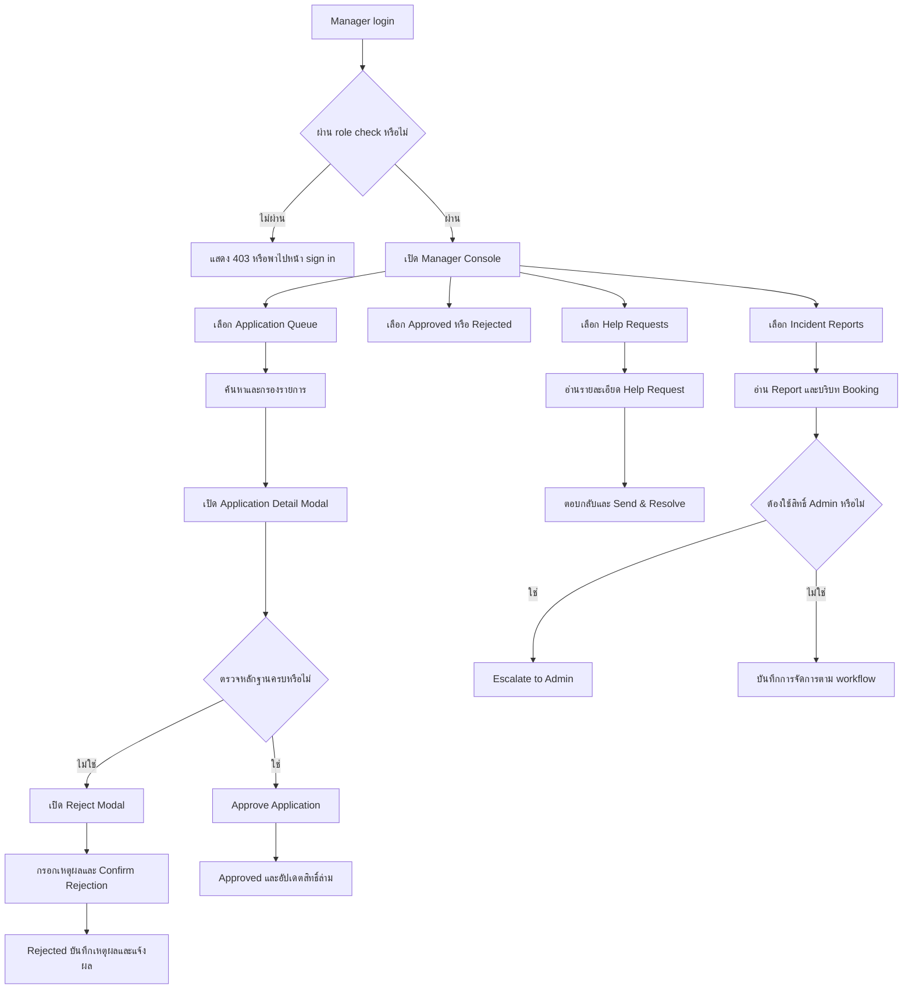

# 📑 รายละเอียดระบบผู้ประสานงานและตรวจสอบ (Manager Specification & Detail)

เอกสารฉบับนี้อธิบายบทบาทของ `Manager` ในแพลตฟอร์ม **KHVI Helper** ตั้งแต่ความต้องการของผู้ใช้ ข้อกำหนดและ Use Case ไปจนถึง User Flow, หน้าจอ, Web Component และเหตุผลของการออกแบบ เอกสารนี้ใช้คู่กับ `docs/requirements.md`, `docs/user-flows.txt`, `docs/design-system.md` และ `docs/route-inventory.md`

## 0. วิธีอ่านเอกสารและสถานะของระบบ

ข้อกำหนดล่าสุดกำหนดให้ Manager ตรวจข้อมูลสมัครล่ามที่ประกอบด้วยภาษา หมวดหมู่ ช่องทางติดต่อ และ `experience_summary` เท่านั้น ยังไม่รวมเอกสารยืนยันตัวตนหรือ background check ใน MVP

ภาพเกณฑ์การประเมินกำหนดสายสัมพันธ์ของหลักฐานไว้ดังนี้:

```text
Requirement → User → Use Case → User Flow → UI → Web Component → Design Rationale
```

เอกสารนี้แยกสถานะสองแบบเพื่อไม่ให้ผู้พัฒนาเข้าใจ mockup เป็น production feature:

| สถานะ | ความหมาย | หลักฐานใน repository |
|---|---|---|
| Implemented mockup | มีหน้าและ interaction จำลองให้ทดลองได้ แต่ยังใช้ข้อมูลใน memory | `/manager`, `app/manager/page.tsx` |
| Planned production behavior | เป็นพฤติกรรมเป้าหมายที่ต้องเชื่อม Auth, database, Server Action และ authorization | `docs/requirements.md`, `detail.md`, `docs/route-inventory.md` |

ปัจจุบัน `/manager` เป็น Static Mockup ที่ใช้ mock data ตาม `route-inventory.md` ส่วน `/manager/verify-volunteers` ยังเป็น route ที่วางแผนไว้ เอกสารนี้จึงใช้ UI ใน `app/manager/page.tsx` เป็นตัวอย่างหน้าจอ และใช้ requirements กับ business rules เป็นเงื่อนไขของระบบจริง

### หลักฐานที่ใช้ตรวจตามเกณฑ์ในภาพ

| เกณฑ์ | สิ่งที่เอกสารนี้ต้องตอบ | ส่วนที่เกี่ยวข้อง |
|---|---|---|
| 1. ระบุกลุ่มผู้ใช้ | ใครทำงานอะไร ต้องเห็นข้อมูลใด และอ้างอิง requirement ใด | หัวข้อ 1 และ 2 |
| 2. วิเคราะห์ลักษณะและข้อจำกัด | ทักษะ บริบท ความเร่งด่วน ข้อมูลอ่อนไหว และความเสี่ยงจากความผิดพลาด | หัวข้อ 2 และ 8 |
| 3. เชื่อม Use Case กับ UI | แต่ละงานของ Manager มี flow และหน้าจอรองรับครบหรือไม่ | หัวข้อ 3 และ 4 |
| 4. สิ่งที่ผู้ใช้ทำได้ในแต่ละหน้า | Action ผลลัพธ์ สิทธิ์ เงื่อนไข และสถานะระบบ | หัวข้อ 5 |
| 5. เลือก Web Component ให้เหมาะกับ Case | Component รับผิดชอบข้อมูลและ action ใด | หัวข้อ 6 |
| 6. เหตุผลของรายละเอียดการออกแบบ | อธิบาย layout ลำดับข้อมูล ตำแหน่งปุ่ม สี ตัวอักษร และ icon | หัวข้อ 7 และ 8 |

---

## 1. บทบาทและขอบเขตความรับผิดชอบ (Role & Scope)

KHVI Helper แบ่งผู้ใช้หลักเป็น 4 บทบาท:

1. `User` ผู้ขอรับบริการภาษา
2. `Interpreter` ล่ามจิตอาสาที่ได้รับอนุมัติ
3. `Manager` ผู้ประสานงานและตรวจสอบความพร้อมของล่าม
4. `Admin` ผู้ดูแลระบบและสิทธิ์ระดับสูง

### 1.1 ผู้ใช้หลัก: Manager

Manager ทำงานหลังบ้านที่เกี่ยวข้องกับความปลอดภัยและความต่อเนื่องของบริการ งานหลักมีสองกลุ่ม:

| กลุ่มงาน | เป้าหมายของ Manager | ข้อกำหนดที่อ้างอิง |
|---|---|---|
| ตรวจสอบใบสมัครล่าม | ตรวจภาษา หมวดหมู่ ช่องทางติดต่อ ประสบการณ์ และตัดสินใจ Approve หรือ Reject | `FR-14–15`, `BR-02`, `NFR-01` |
| ประสานงานและส่งต่อปัญหา | ช่วยแก้ Help Request และคัดกรอง Report ก่อนส่งต่อกรณีที่ Admin ต้องจัดการ | `FR-17–18` |

Manager ไม่ใช่ผู้แก้ Role หรือผู้ล็อกบัญชีในระดับระบบ การเปลี่ยน Role และ Lock/Unlock เป็นขอบเขตของ `Admin` ส่วน Audit Log บันทึก action ของทั้ง Manager และ Admin ตาม `docs/requirements.md` และ `detail.md`

### 1.2 ความสัมพันธ์กับบทบาทอื่น

- `User` หรือ `Interpreter` ส่งใบสมัครหรือเปิด Help Request/Report ให้ Manager ตรวจสอบ
- `Manager` ตรวจข้อมูลสมัครและตัดสินใจเรื่องใบสมัคร หรือช่วยประสานปัญหาของภารกิจ
- เมื่อ Manager อนุมัติใบสมัคร ระบบเปลี่ยนสิทธิ์ของผู้สมัครเป็น `Interpreter` ตาม business rule ที่กำหนด
- เมื่อ Report เกินขอบเขตของ Manager เช่น ต้องล็อกบัญชี Manager ส่งต่อให้ `Admin`
- `Admin` มีขอบเขตกว้างกว่า Manager และเป็นผู้รับผิดชอบการจัดการสิทธิ์หรือมาตรการด้านบัญชี

### 1.3 สิ่งที่อยู่ในขอบเขตและนอกขอบเขต

**อยู่ในขอบเขตของ Manager**

- ดูคิวใบสมัครที่อยู่ใน `Pending`
- ค้นหาด้วยชื่อ, Application ID, ประเทศ, ช่องทางติดต่อ, ภาษา และหมวดหมู่
- กรองภาษาและหมวดหมู่แบบ multi-select โดยใช้เงื่อนไข AND
- เปิดรายละเอียดผู้สมัครและดูภาษา หมวดหมู่ ช่องทางติดต่อ และประสบการณ์
- อนุมัติใบสมัคร
- ปฏิเสธใบสมัครพร้อมเหตุผลที่กรอกแบบบังคับ
- ดูรายการ Approved และ Rejected
- ตอบ Help Request และบันทึกผลเป็น `Resolved`
- ตรวจ Incident Report และส่งต่อให้ Admin เมื่อจำเป็น

**อยู่นอกขอบเขตของ Manager**

- เปลี่ยน Role ของผู้ใช้ทั่วไป
- ล็อกหรือปลดล็อกบัญชี
- แก้ไข Audit Log
- เปิดเผยข้อมูลติดต่อหรือพิกัดภารกิจให้ผู้ที่ไม่มีสิทธิ์
- อนุมัติการรับงานแทน Interpreter

---

## 2. การวิเคราะห์ผู้ใช้และข้อจำกัด (User Analysis)

### 2.1 เป้าหมายและงานที่ต้องทำให้สำเร็จ

Manager ต้องตัดสินใจจากหลักฐานที่ตรวจสอบได้ภายในเวลาที่เหมาะสม โดยเฉพาะใบสมัครที่เกี่ยวข้องกับงานการแพทย์ ตำรวจ กฎหมาย หรือเหตุฉุกเฉิน งานที่หน้าจอต้องสนับสนุนมีดังนี้:

1. เห็นจำนวนงานค้างและเลือกคิวที่ต้องจัดการ
2. ค้นหาผู้สมัครจากข้อมูลที่จำได้ เช่น ชื่อ, ID, ภาษา หรือหมวดหมู่
3. เปรียบเทียบคุณสมบัติในมุมมองเดียวโดยไม่ต้องเปิดหลายหน้า
4. ตรวจภาษา หมวดหมู่ ช่องทางติดต่อ และประสบการณ์ก่อนตัดสินใจ
5. แยก Approve กับ Reject ให้ชัด และขอเหตุผลเมื่อปฏิเสธ
6. ตรวจปัญหาภารกิจและตอบกลับผู้ขอความช่วยเหลือ
7. ส่งต่อกรณีความปลอดภัยให้ Admin โดยไม่ทำเกินสิทธิ์ของตน

### 2.2 ลักษณะของผู้ใช้และบริบทการทำงาน

| ประเด็น | ผลต่อการออกแบบ |
|---|---|
| ความรู้ระบบ | Manager รู้ขั้นตอนตรวจสอบงาน แต่ไม่ควรต้องรู้โครงสร้าง database หรือ status ภายในทั้งหมดเพื่อทำงานพื้นฐาน |
| ปริมาณข้อมูล | คิวอาจมีผู้สมัครจำนวนมาก จึงต้องมี search, filter, count และรายการแบบ table ที่ scan ได้เร็ว |
| บริบทการทำงาน | อาจทำงานจาก laptop, tablet หรือมือถือระหว่างประสานเหตุ จึงต้องมี responsive layout และ mobile drawer |
| ความเร่งด่วน | Help Request อาจเป็นเหตุสด ป้าย urgency และจำนวนคดีค้างต้องเห็นก่อนรายละเอียดรอง |
| ข้อมูลอ่อนไหว | ช่องทางติดต่อ รายละเอียดคำขอ และ Report ต้องอยู่ในพื้นที่ที่เข้าถึงได้ตาม permission ของ Manager/Admin |
| ความเสี่ยงจากการตัดสินใจ | Approve เปิดสิทธิ์รับงาน ส่วน Reject กระทบผู้สมัคร จึงต้องแสดงหลักฐานและบังคับเหตุผลก่อนยืนยัน |
| การเข้าถึง | ปุ่มต้องมีชื่อที่เข้าใจได้, icon ต้องไม่เป็นช่องทางสื่อความหมายเพียงอย่างเดียว, focus state ต้องมองเห็น และข้อความต้องอ่านได้บนจอเล็ก |

### 2.3 หลักการลดความผิดพลาด

- แสดงสถานะด้วยข้อความ เช่น `Pending`, `Approved`, `Rejected` ควบคู่กับสี
- แยกปุ่ม `Approve Application` และ `Reject Application` ด้วยสีและตำแหน่งที่ต่างกัน
- เปิดรายละเอียดก่อนการตัดสินใจ เพื่อให้ Manager เห็นภาษา หมวดหมู่ ช่องทางติดต่อ และประสบการณ์
- ไม่เปิดปุ่ม Reject สำหรับรายการที่ `Approved` เพราะการเพิกถอนสิทธิ์เป็นงานของ Admin
- ปิดปุ่ม `Confirm Rejection` จนกว่าจะมีเหตุผลที่ไม่ใช่ช่องว่าง
- แสดงสถานะ empty เมื่อค้นหาแล้วไม่พบผู้สมัคร เพื่อไม่ให้ Manager เข้าใจว่าระบบไม่มีข้อมูล
- เก็บผลลัพธ์ของการตอบ Ticket และการส่งต่อ Report เป็นสถานะที่อ่านย้อนหลังได้

---

## 3. Requirement, Use Case และสิทธิ์ที่เกี่ยวข้อง

### 3.1 Requirement ที่เชื่อมกับ Manager

| Requirement | รายละเอียดที่ Manager ต้องรองรับ | ผลลัพธ์ที่ผู้ใช้คาดหวัง |
|---|---|---|
| `FR-14–15` | ดูรายชื่อผู้สมัคร ตรวจข้อมูลสมัคร และ Approve/Reject พร้อมเหตุผล | ผู้สมัครมีผลตรวจสอบที่ชัดเจน และผู้ที่ผ่านได้รับสิทธิ์ล่ามตาม workflow |
| `FR-17–18` | รับ Help Request และรับ Report | ผู้ขอหรือล่ามได้รับการประสานงาน และปัญหาที่ต้องใช้สิทธิ์สูงถูกส่งต่อ |
| `BR-02` | อนุมัติล่ามก่อนเปิดให้เห็นงานและรับงาน | ผู้ที่ยังไม่ผ่านการตรวจไม่สามารถทำหน้าที่ Interpreter |
| `BR-08` | รับรู้การยกเลิกหรือการเปิดงานกลับเข้าสู่ pool ตาม flow ภารกิจ | การประสานงานไม่ทำให้ status ภารกิจข้ามลำดับ |
| `BR-09` | รับ Report และ Help Request จาก User/Interpreter | Manager มีจุดคัดกรองปัญหาการใช้งานและพฤติกรรม |
| `NFR-01` | จำกัด route และ action ตาม role | ผู้ไม่มีสิทธิ์ไม่สามารถอ่านหรือแก้ข้อมูลหลังบ้าน |
| Audit | บันทึกการกระทำสำคัญของ Manager และ Admin | event ต้องมี actor, timestamp, target และ reason ตาม scope ที่ทีมยืนยัน |

หมายเหตุ: เอกสารนี้ยึดรหัส FR ใน `docs/requirements.md` ฉบับปัจจุบัน

### 3.2 Use Case ที่ต้องรองรับ

Use-case diagram ใน `docs/requirements.md` ระบุ Use Case หลักของ Manager ไว้สองรายการ:

| Use Case | Actor | Precondition | Main action | Postcondition |
|---|---|---|---|---|
| `UC9 ตรวจอนุมัติใบสมัครล่าม` | Manager | login แล้ว และมี role `Manager` หรือ `Admin` | เปิดคิว, ค้นหา/กรอง, ดูรายละเอียด, Approve หรือ Reject พร้อมเหตุผล | ใบสมัครมี status ใหม่และระบบแจ้งผลตาม flow |
| `UC10 ตอบคำร้องช่วยเหลือและตรวจสอบ Report` | Manager | มี Ticket หรือ Report ที่ส่งเข้ามา | อ่านบริบทภารกิจ, ตอบผู้ร้อง, ทำเครื่องหมาย resolved หรือส่งต่อ Admin | คำร้องมี response/status และ Report มี escalation record เมื่อจำเป็น |

### 3.3 Authorization ที่ต้องเกิดฝั่ง server

หน้าเว็บช่วยซ่อนปุ่มที่ไม่เกี่ยวข้องได้ แต่ไม่ใช่กลไกความปลอดภัยหลัก Server Action หรือ API ต้องตรวจอย่างน้อย:

- ผู้เรียก login แล้ว
- `profile.role` เป็น `Manager` หรือ `Admin` ตาม action
- ผู้สมัครหรือ Ticket/Report มีอยู่จริง
- ใบสมัครอยู่ใน status ที่เปลี่ยนได้
- Reject มีเหตุผลที่ไม่ใช่ค่าว่าง
- การ Approve เปลี่ยนสถานะและ role อย่างเป็นธุรกรรมเดียวกัน
- Manager ไม่สามารถเปลี่ยน Role, lock/unlock หรือแก้ไข/ลบ Audit Log ได้ แต่การกระทำของ Manager ต้องถูกบันทึกใน Audit Log เช่นเดียวกับ Admin

---

## 4. User Flow: จากคิวตรวจสอบไปสู่ผลลัพธ์

### 4.1 ภาพรวม flow ของ Manager



### 4.2 Flow ตรวจใบสมัครล่าม

1. Manager เปิด `/manager` หลังระบบตรวจ role
2. ระบบแสดง `Application Queue` พร้อมจำนวนรายการ `Pending`
3. Manager ใช้ search หรือเปิด Filter เพื่อเลือกภาษากับหมวดหมู่
4. ระบบใช้เงื่อนไข AND ระหว่างภาษาและหมวดหมู่ที่เลือก แล้วอัปเดตจำนวนผลลัพธ์
5. Manager คลิกแถวเพื่อเปิดรายละเอียดแบบ 30% / 70%
6. Manager อ่านข้อมูลผู้สมัคร ภาษา หมวดหมู่ ช่องทางติดต่อ และประสบการณ์
7. ถ้าข้อมูลครบ Manager กด `Approve Application`
8. ถ้าข้อมูลไม่ครบ Manager กด `Reject Application`, ระบุเหตุผล และกด `Confirm Rejection`
9. ระบบอัปเดต status, บันทึก actor/time/reason และแจ้งผลตาม notification flow

### 4.3 Flow ช่วยเหลือภารกิจ

1. User หรือ Interpreter ส่ง Help Request พร้อม `missionId`, category, detail และ urgency
2. Manager เปิด `Help Requests` และเรียงความสนใจจาก Ticket ที่ urgent หรือยังไม่ resolved
3. Manager อ่านรายละเอียดและบริบทภารกิจโดยไม่เปิดเผยข้อมูลเกินสิทธิ์
4. Manager กด `Respond to Requester`, เขียนวิธีแก้หรือผลการประสานงาน
5. Manager กด `Send & Resolve Ticket`
6. ระบบบันทึก response และเปลี่ยน status เป็น `Resolved`

### 4.4 Flow ตรวจ Report และส่งต่อ Admin

1. User หรือ Interpreter ส่ง Report ที่อ้างอิง Booking
2. Manager เปิด `Incident Reports` และตรวจผู้รายงาน ผู้ถูกรายงาน Booking และเหตุผล
3. Manager ตัดสินใจว่ากรณีอยู่ในขอบเขตการประสานงานหรือเกี่ยวข้องกับมาตรการบัญชี
4. ถ้าต้องล็อกบัญชีหรือใช้สิทธิ์สูง Manager กด `Escalate to Admin`
5. ระบบเปลี่ยนสถานะเป็น `Escalated to Admin` และบันทึกเหตุผลการส่งต่อ
6. Admin ตรวจสอบและดำเนินการใน Admin Portal ตามสิทธิ์ของตน

---

## 5. UI และ Action ที่ผู้ใช้ทำได้ในแต่ละหน้า

### 5.1 `/manager` Manager Console

| พื้นที่ | Action | ผลลัพธ์ | สิทธิ์และเงื่อนไข | สถานะที่ต้องรองรับ |
|---|---|---|---|---|
| Header | เปิด Profile Dropdown | เห็น profile/settings และ Sign out | Manager ที่ login แล้ว | menu เปิด/ปิด, sign-out success/error |
| Sidebar | เลือก Queue, Approved, Rejected | เปลี่ยนรายการหลักและ count badge | Manager/Admin | active state, mobile drawer เปิด/ปิด |
| Search | พิมพ์ชื่อ, ID, ประเทศ, ช่องทางติดต่อ, ภาษา หรือ category | ตารางแสดงเฉพาะรายการที่ตรง | อ่านรายการที่ Manager มีสิทธิ์เห็น | loading, no match, clear search |
| Filter | เลือกหลายภาษา/หลายหมวดหมู่ | กรองแบบ AND และแสดงจำนวนผลลัพธ์ | ใช้กับ applicant list | popover เปิด/ปิด, reset, no result |
| Applicant table | คลิกแถวหรือ `Review` | เปิด Application Detail Modal | ผู้สมัครต้องมีอยู่จริง | loading detail, missing record, error |
| Detail Modal | ดูรายละเอียดสมัคร | แสดงภาษา หมวดหมู่ ช่องทางติดต่อ และประสบการณ์ | Manager ที่ผ่าน authorization | loading, unavailable, permission error |
| Detail Modal | `Approve Application` | เปลี่ยนเป็น Approved และส่งต่อ role transition | status ต้องอยู่ในขั้นที่อนุมัติได้ | disabled, success, conflict จากผู้ตรวจคนอื่น |
| Detail Modal | `Reject Application` | เปิด Reject Modal | ต้องไม่ใช่รายการ Approved | modal open/close |
| Reject Modal | กรอกเหตุผลแล้ว Confirm | เปลี่ยนเป็น Rejected, เก็บ reason และแจ้งผล | เหตุผลต้องไม่ว่าง | validation, submit loading, success/error |
| Help Requests | `Respond to Requester` | เปิดช่องตอบกลับ | Ticket ต้องยังไม่ Resolved | draft, cancel, validation |
| Help Requests | `Send & Resolve Ticket` | เก็บ response และเป็น Resolved | response ต้องไม่ว่าง | submit loading, success/error |
| Incident Reports | `Escalate to Admin` | เป็น Escalated to Admin | Manager ส่งต่อได้ แต่ lock account เองไม่ได้ | confirmation, success, duplicate escalation |
| Footer | เปิด policy/support/audit link | ไปยังข้อมูลที่เกี่ยวข้อง | link ต้องไม่พาออกนอกสิทธิ์ | link unavailable, focus state |

### 5.2 สถานะข้อมูลของหน้า

หน้า Manager ต้องกำหนด behavior ให้ครบก่อนเชื่อม database:

| สถานะ | สิ่งที่ผู้ใช้ควรเห็น |
|---|---|
| Loading | skeleton หรือข้อความกำลังโหลดที่คงตำแหน่ง table/card เพื่อไม่ให้ layout กระโดด |
| Empty queue | ข้อความว่าไม่มีใบสมัครรอตรวจ และ action สำหรับล้าง filter ถ้ามี filter ค้าง |
| Empty search | ข้อความว่าไม่พบผู้สมัครตามคำค้น ไม่ใช้ข้อความว่าระบบล่ม |
| Error | ข้อความสั้นที่บอก action ถัดไป เช่น retry และไม่เปิดเผยรายละเอียด server |
| Unauthorized | `403` หรือหน้าแจ้งว่าไม่มีสิทธิ์ พร้อมทางกลับที่เหมาะสม |
| Conflict | แจ้งว่ารายการถูกเปลี่ยนโดยผู้ตรวจคนอื่น และ reload ข้อมูลก่อนตัดสินใจซ้ำ |
| Success | แสดง status ใหม่ใน table, ปรับ count badge และแจ้งผลที่อ่านได้ |

### 5.3 ตาราง state transition ของใบสมัคร

```text
Pending
        ├─ Approve + valid evidence ─► Approved ─► role Interpreter
        └─ Reject + non-empty reason ─► Rejected
```

ใน production ต้องบังคับ transition ฝั่ง server และป้องกันการกด Approve ซ้ำจากหลาย session หน้าจอ mockup เปลี่ยนเฉพาะ state ใน memory จึงยังไม่ใช่ concurrency control จริง

---

## 6. Web Component ที่เหมาะกับแต่ละ Case

### 6.1 Component ที่มีใน mockup ปัจจุบัน

| Component หรือกลุ่ม component | Case ที่รองรับ | เหตุผลด้านความเข้าใจและความสะดวก |
|---|---|---|
| `ManagerHeader` | ระบุตัวตนและเปิด account action | ให้ผู้ใช้รู้ว่าอยู่ใน Operations Console และใช้ profile menu ได้จากทุก section |
| `BrandMark` | แสดงแบรนด์และคำอธิบายระบบ | ทำให้ header สอดคล้องกับหน้าอื่นและช่วยยืนยัน context |
| Responsive Sidebar / Mobile Drawer | เปลี่ยน section | Desktop ใช้ navigation คงที่ ส่วน mobile ใช้ drawer เพื่อเหลือพื้นที่ให้ข้อมูลหลัก |
| Count Badge | บอกงานค้าง | ช่วยจัดลำดับความสนใจโดยไม่ต้องเปิดทุก section |
| Search Input | ค้นหา applicant | รองรับข้อมูลที่ Manager จำได้หลายแบบและลดเวลาสแกน table |
| Multi-select Filter Popover | กรองภาษาและ specialty | แสดงตัวเลือกใกล้บริบทตาราง และเลือกหลายเงื่อนไขโดยไม่เปลี่ยนหน้า |
| Applicant Table | ตรวจคิวและ archive | ตารางเหมาะกับข้อมูลซ้ำหลายแถวและเปรียบเทียบ status, language, domain ได้เร็ว |
| Status Badge | อ่านสถานะ | ใช้ข้อความและสีร่วมกัน ลดการแปลความหมายจากสีเพียงอย่างเดียว |
| Application Detail Modal | ตรวจข้อมูลเชิงลึกและตัดสินใจ | รวมหลักฐานกับ action ไว้ใน task เดียว ลดการสลับ context |
| Experience Summary | ตรวจประสบการณ์ | แสดงรายละเอียดประสบการณ์ในจุดเดียวเพื่อใช้ประกอบการตัดสินใจ |
| Reject Modal | เก็บเหตุผลการปฏิเสธ | ใช้ modal เพราะเป็น action สำคัญที่ต้องหยุดตรวจความครบถ้วนก่อน submit |
| Help Ticket Card | อ่านและตอบ Help Request | card แยกแต่ละเหตุการณ์ พร้อม urgency, status, mission และ response |
| Incident Report Card | คัดกรองและส่งต่อ Report | แสดงผู้รายงาน ผู้ถูกรายงาน Booking และเหตุผลในกลุ่มเดียว |
| `SiteFooter` | policy, support และ audit context | ปิดท้ายด้วยช่องทางสนับสนุนและความรับผิดชอบต่อการบันทึก action |

### 6.2 Component ที่ควรแยกเมื่อเชื่อม production

`docs/team-responsibilities.md` เสนอชื่อ component สำหรับ domain นี้ ได้แก่ `VolunteerVerifyCard`, `ApplicationDetailPanel` และ `HelpRequestList` ส่วนที่ควรเพิ่มให้รองรับ behavior จริงมีดังนี้:

| Component ที่แนะนำ | Input หลัก | ต้องรับผิดชอบ |
|---|---|---|
| `ManagerSidebar` | active section, counts, onSelect | navigation, badge, responsive drawer และ keyboard behavior |
| `ApplicantFilters` | query, languages, categories | query state, AND filtering, reset และ accessible labels |
| `VolunteerVerifyCard` | applicant summary | status, languages, categories และ action ที่สอดคล้องกับ status |
| `ApplicationDetailPanel` | applicant detail | profile, languages, categories, contact, experience และ action bar |
| `RejectReasonDialog` | applicant id, submit handler | required validation, pending state, error และ focus return |
| `HelpRequestList` | tickets, action handlers | urgency, status, response form และ empty/loading/error state |
| `IncidentReportList` | reports, escalation handler | evidence summary, escalation status และ duplicate-action guard |
| `AuditActionNotice` | actor, action, timestamp, reason | แสดงผลการ action และเชื่อมกับ audit record โดยไม่แก้ log จาก client |

การแยก component ไม่ควรสร้าง abstraction เพียงเพื่อแบ่งไฟล์ ต้องแยกเมื่อ component มี state, authorization boundary, loading/error behavior หรือถูกใช้ซ้ำใน `/manager/verify-volunteers` และ `/admin`

---

## 7. Design Rationale: เหตุผลของการออกแบบ

### 7.1 Design direction ตามเกณฑ์ที่ต้องอธิบาย

| หัวข้อ | คำตอบสำหรับ Manager Console |
|---|---|
| Purpose | ช่วย Manager ตรวจใบสมัครและประสานเหตุให้จบด้วยข้อมูลที่ตรวจสอบได้ |
| Audience | Manager ที่ทำงานปฏิบัติการ และ Admin ที่เข้ามาช่วยตรวจหรือรับช่วง |
| Tone | สงบ น่าเชื่อถือ ตรงประเด็น และพร้อมรับเหตุเร่งด่วน |
| Memorable detail | แถบ navigation แบ่งชัดเป็น `Interpreter Verification` กับ `Support & Escalations` ทำให้ผู้ใช้จำ mental model ของงานได้ |
| Constraints | ข้อมูลอ่อนไหว, ต้องมี role check, รองรับ desktop/tablet/mobile, ต้องลดความผิดพลาดจากการตัดสินใจ และต้องไม่ทำให้สีแทนข้อความ |

### 7.2 Layout และลำดับข้อมูล

1. `Header` อยู่ด้านบนเพื่อยืนยันแบรนด์และ identity ของผู้ปฏิบัติงานตลอดเวลา
2. `Sidebar` อยู่ด้านซ้ายบน desktop เพื่อให้ section สำคัญพร้อมใช้และเห็น count ของงานค้าง
3. `Main content` วาง table หรือ case card เป็นศูนย์กลาง เพราะ Manager ต้องอ่านและตัดสินใจจากข้อมูล
4. Search และ Filter อยู่เหนือรายการ เพราะเป็นเครื่องมือเตรียมข้อมูลก่อนอ่านรายละเอียด
5. Application Detail ใช้สัดส่วนประมาณ 30% / 70% ฝั่งซ้ายสรุปตัวตนและสถานะ ฝั่งขวาแสดงหลักฐานกับ action
6. Action bar อยู่ท้ายรายละเอียด เพื่อให้ Manager อ่าน evidence ก่อนกดตัดสินใจ
7. Footer เก็บ policy และ support link ไว้ท้ายหน้า ไม่แย่งความสนใจจากงานค้าง

โครงสร้างนี้เปลี่ยนเมื่ออยู่บนมือถือ: Sidebar กลายเป็น slide-out drawer และ modal เปลี่ยนเป็น column เดียวที่ scroll ได้ เพื่อรักษาลำดับข้อมูลและขนาดเป้าหมายการกด

### 7.3 สีและสถานะ

สีใช้ตาม token ใน `app/design-tokens.css` และ `docs/design-system.md`:

| Token | ใช้กับ | เหตุผล |
|---|---|---|
| `--khvi-navy` | header, strong action, identity surface | สื่อความมั่นคงและแยกพื้นที่ระบบหลังบ้าน |
| `--khvi-teal` | active navigation, link, primary operational action | นำทางสายตาโดยไม่ทำให้หน้าดูเหมือนหน้าการแจ้งเหตุ |
| `--khvi-sage` | approved หรือ community-related accent | สื่อผลลัพธ์ที่ผ่านการตรวจและการช่วยเหลือ |
| `--khvi-sun` | pending, attention, count ที่ต้องติดตาม | ดึงสายตาโดยไม่ใช้เป็น error |
| `--khvi-coral` | reject, urgent, error | สื่อความเสี่ยงหรือ action ที่ต้องระวัง ใช้เฉพาะเมื่อความหมายตรงกัน |
| `--khvi-paper` และ `--khvi-surface` | page background และ card | แยก canvas กับกลุ่มข้อมูล ทำให้ table และ card อ่านง่าย |

Status badge ต้องมีข้อความเสมอ เช่น `Approved` หรือ `Pending Investigation` สีช่วย scan แต่ไม่เป็นข้อมูลเพียงช่องทางเดียว เพราะผู้ใช้บางคนแยกสีได้ยากหรือใช้จอที่ contrast ต่ำ

### 7.4 ตัวอักษรและ icon

- ใช้ `Noto Sans Thai` เป็น primary font และ fallback ตาม design system เพื่อให้ภาษาไทยกับ English label อ่านต่อเนื่อง
- Heading ใช้ลำดับชัดและ sentence case เพื่อให้ Manager scan ได้เร็วโดยไม่รู้สึกเหมือนข้อความแจ้งเตือนทั้งหมด
- ใช้ `InboxStackIcon` กับคิว, `CheckCircleIcon` กับรายการที่ผ่าน, `ArchiveBoxXMarkIcon` กับ archive, `ChatBubbleLeftRightIcon` กับ Help Request และ `ShieldExclamationIcon` กับ Incident Report เพราะรูปทรงช่วยจำประเภทงาน
- ปุ่ม icon-only เช่น close หรือ menu ต้องมี `aria-label` และต้องมี focus state
- `PhoneIcon`, `LanguageIcon`, `IdentificationIcon` และ `BriefcaseIcon` ใช้เป็น visual anchor ให้ผู้ใช้แยกกลุ่มข้อมูลใน detail ได้เร็วขึ้น แต่ label ยังคงเป็นแหล่งข้อมูลหลัก

### 7.5 เหตุผลของ action placement

- `Approve Application` ใช้ primary action เพื่อบอกผลลัพธ์ปกติเมื่อหลักฐานครบ
- `Reject Application` ใช้สี coral แบบรองและเปิด dialog เพื่อเพิ่มจังหวะตรวจเหตุผล ไม่ให้การปฏิเสธเกิดจากการกดพลาด
- ปุ่มที่เกี่ยวกับ Admin เช่น `Escalate to Admin` ใช้ navy เพราะเป็นการส่งต่องาน ไม่ใช่การลงโทษหรือยืนยันความผิด
- `Send & Resolve Ticket` อยู่หลัง textarea เพื่อให้ข้อความที่ส่งและผลลัพธ์ที่เกิดขึ้นอยู่ในบริบทเดียวกัน
- ปุ่มที่ทำไม่ได้ต้อง disabled พร้อมข้อความหรือ status ที่อธิบายสาเหตุ ไม่ซ่อน logic ไว้เฉพาะในโค้ด

---

## 8. ข้อกำหนดด้านความปลอดภัย การเข้าถึง และการพัฒนา

### 8.1 ความปลอดภัยของข้อมูล

- Manager เห็นข้อมูลติดต่อและรายละเอียดคำขอเฉพาะเมื่อ server ยืนยัน permission แล้ว
- ระบบต้องกำหนด audit event สำหรับ action สำคัญของ Manager และ Admin เช่น Approve, Reject, Respond, Escalate และเปลี่ยน role พร้อม actor, timestamp, target และ reason
- Client ห้ามเป็นผู้ตัดสินใจ role transition เพียงลำพัง
- Report ที่เกี่ยวกับความเสี่ยงบัญชีต้องส่งต่อ Admin แทนการจำลอง lock จากหน้า Manager
- production ต้องเพิ่ม RLS และ policy ก่อนเปิดใช้ข้อมูลจริงตามข้อจำกัดใน `detail.md`

### 8.2 Accessibility และ responsive behavior

- ใช้ semantic `header`, `nav`, `main`, `aside`, `table`, `button`, `label` และ dialog semantics ให้ตรงกับหน้าที่
- รักษา visible focus state ของปุ่ม, input, filter option และ link
- ตารางต้อง scroll ในแนวนอนบนจอแคบโดยไม่บีบข้อความสำคัญจนอ่านไม่ได้
- Mobile drawer ต้องปิดได้จากปุ่ม Close และ backdrop พร้อมคืน focus ให้ปุ่มเปิดเมนู
- Modal ต้องปิดด้วย close button และ Escape พร้อมจัด focus ภายใน modal ตามความเหมาะสม
- Error และ success ต้องสื่อด้วยข้อความ ไม่พึ่งสีหรือ icon เพียงอย่างเดียว
- ทดสอบอย่างน้อย mobile, tablet และ desktop รวมถึง keyboard-only navigation

### 8.3 ช่องว่างระหว่าง mockup กับ production

| ประเด็น | ใน mockup ปัจจุบัน | สิ่งที่ production ต้องเพิ่ม |
|---|---|---|
| Data source | array ใน `page.tsx` | Supabase query และ typed data access |
| Approve/Reject | เปลี่ยน React state ใน memory | Server Action, transaction, authorization, notification และ audit |
| Permission | หน้า mockup แสดงข้อมูลตัวอย่าง | production ต้องตรวจ permission ฝั่ง server ก่อนเปิดข้อมูล |
| Help/Report | มี card และ local state | `help_requests`, `reports`, manager action และ Admin handoff |
| Auth | profile เป็นข้อมูลตัวอย่าง | Supabase Auth, role check, unauthorized state และ RLS |
| Document preview | จำลอง `alert` | protected storage URL, access check, loading และ preview error |
| Concurrency | ยังไม่ป้องกันการตัดสินใจซ้ำ | atomic update หรือ optimistic concurrency control |

ข้อสังเกตนี้ทำให้ทีมเห็นขอบเขตงานชัดขึ้น: หน้าจอช่วยอธิบาย interaction และ design rationale ส่วน server ต้องเป็นผู้บังคับ business rule และ privacy rule

---

## 9. Checklist สำหรับตรวจความครบถ้วน

- [ ] ระบุ `Manager` เป็น actor พร้อมเป้าหมายและข้อจำกัด
- [ ] ผูก `FR-14–18`, `BR-02`, `BR-08`, `BR-09` และ `NFR-01` กับ action ในหน้า
- [ ] อธิบาย `UC9` และ `UC10` พร้อม precondition และ postcondition
- [ ] มี flow ตั้งแต่ login, เปิดคิว, ตรวจข้อมูลสมัคร, Approve/Reject ไปจนถึง Help/Report escalation
- [ ] อธิบาย action และผลลัพธ์ของทุก section ใน `/manager`
- [ ] ระบุ loading, empty, error, unauthorized, conflict และ success state
- [ ] แยก component ตามหน้าที่และระบุว่า component ใดมีอยู่จริงหรือเป็นโครงสร้างที่วางแผน
- [ ] ให้เหตุผลของ layout, ลำดับข้อมูล, สี, typography, icon และตำแหน่ง action
- [ ] ระบุความแตกต่างระหว่าง mockup ปัจจุบันกับ production behavior
- [ ] ไม่ตีความ `/manager/verify-volunteers` ว่ามีอยู่แล้วจนกว่าจะพบ route จริง
