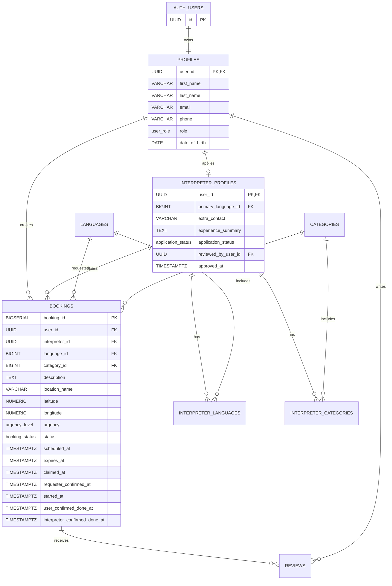

# KHVI Helper: Canonical Requirements

เอกสารนี้เป็นข้อกำหนดฉบับใช้งานปัจจุบันของระบบ Map-based SOS Volunteer Interpreter Platform โดยยึด flow แบบ Job Pool และ Supabase Auth

## 1. เป้าหมายระบบ

ระบบเชื่อมผู้ขอความช่วยเหลือด้านภาษากับล่ามจิตอาสาที่อยู่ใกล้เคียง ผู้ขอสร้างหมุดคำขอ ส่วนล่ามที่มีภาษาและหมวดหมู่ตรงกันเลือกกด Claim จากแผนที่

ระบบไม่ใช่การค้นหาและจองล่ามรายบุคคลแบบ marketplace และไม่มีระบบ Chat ใน MVP

## 2. Role และสิทธิ์

| Role | สิทธิ์หลัก |
|---|---|
| `User` | สร้างคำขอ ดูสถานะ ยืนยันล่าม ยืนยันจบงาน และรีวิวล่าม |
| `Interpreter` | ดูหมุดที่ตรงความสามารถ Claim งาน เริ่มงาน ยืนยันจบงาน และยกเลิกงานตามกฎ |
| `Manager` | ตรวจใบสมัครล่าม ดูแล Help Request/Report และเห็นข้อมูลตาม permission ที่ได้รับ |
| `Admin` | จัดการผู้ใช้ role ข้อมูลระบบ และเห็นข้อมูลทั้งหมดตามสิทธิ์ Admin |

กฎ role:

- ผู้สมัครใหม่มี role เป็น `User`
- ผู้ใช้ที่สมัครล่ามอยู่สถานะ `Pending` และยังรับงานไม่ได้
- เมื่อ Manager/Admin อนุมัติ `application_status` ระบบเปลี่ยน role เป็น `Interpreter`
- Manager ไม่สามารถเปลี่ยน role หรือ Lock/Unlock
- Admin เปลี่ยน role ได้
- Lock/Unlock มีไว้สำหรับ phase หลัง MVP

## 3. Flow หลัก

1. User Login ด้วย Supabase Auth
2. ระบบตรวจ role และพาไปยังหน้าที่ตรงกับ role
3. User เห็นหน้า Welcome
4. User สร้างคำขอ เลือกภาษา 1 ภาษา หมวดหมู่ 1 หมวด ระบุรายละเอียด และตำแหน่ง
5. ระบบสร้างคำขอสถานะ `open`
6. Interpreter ที่ Approved เห็นหมุด `open` ที่ตรงกับภาษา หมวดหมู่ และระยะทางที่เลือก
7. ก่อน Claim แสดงเฉพาะชื่อสถานที่แบบกว้าง ๆ
8. Interpreter กด Claim แบบ atomic
9. ระบบเปลี่ยนสถานะเป็น `claimed` และนำหมุดออกจากรายการของ Interpreter คนอื่น
10. User ดูโปรไฟล์ล่ามและกดยืนยันล่าม
11. หลังยืนยัน ระบบเปิดข้อมูลติดต่อและพิกัดจริงตาม permission
12. Interpreter เริ่มงาน ระบบเปลี่ยนเป็น `in_progress`
13. User และ Interpreter ยืนยันจบงาน
14. ระบบเปลี่ยนเป็น `completed` เมื่อทั้งสองฝ่ายยืนยัน
15. User ส่ง Review หลังงานเป็น `completed`

## 4. ประเภทคำขอและเวลา

### Immediate

- เป็นคำขอเร่งด่วน
- แสดงข้อความระดับความเร่งด่วน เช่น “ต้องการความช่วยเหลือภายใน 15 นาที”
- ข้อความ 15 นาทีใช้สำหรับแสดงระดับความเร่งด่วน ไม่ใช่สถานะหรือเวลาบังคับเริ่มงาน
- หมดอายุ 30 นาทีหลังสร้างถ้ายังไม่มีล่าม Claim

### Scheduled

- แสดงบนแผนที่ทันทีหลังสร้าง
- นัดหมายล่วงหน้าได้ไม่เกิน 1 วัน
- หมดอายุ 24 ชั่วโมงหลังสร้าง
- ต้องแสดงผลแตกต่างจากงาน Immediate

## 5. สถานะและการยกเลิก

```text
open -> claimed -> in_progress -> completed
  |        |             |
  |        |             +-> cancelled เมื่อ Interpreter ยกเลิกหลังเริ่มงาน
  |        +-> open เมื่อ Interpreter ยกเลิกก่อนเริ่มงานและยังไม่หมดอายุ
  +-> expired เมื่อหมดอายุ
  +-> cancelled เมื่อ User ยกเลิกก่อน completed
```

- User ยกเลิกได้ทุกสถานะก่อน `completed`
- Interpreter รับงานได้ครั้งละหนึ่งงาน
- Interpreter ไม่ต้องมีปุ่ม Reject งาน
- การ Claim ต้องป้องกันการรับงานเดียวกันซ้ำ
- งานที่ผู้ใช้สร้างค้างอยู่หลายรายการให้จำกัดเหลือหนึ่งรายการที่ยังไม่จบ (`open`, `claimed` หรือ `in_progress`)

## 6. Functional Requirements

| รหัส | กลุ่ม | Requirement | Actor |
|---|---|---|---|
| FR-01 | Auth | สมัคร Login Logout และใช้ Supabase Auth จริง | ทุก role |
| FR-02 | Profile | แก้ไข `first_name`, `last_name`, phone และข้อมูล profile | ทุก role |
| FR-03 | Role Routing | พาไป UI ตาม role หลัง Login | System |
| FR-04 | Welcome | แสดงข้อมูลบริการและปุ่มไปหน้าสร้างคำขอ | User |
| FR-05 | Create Request | สร้างคำขอพร้อมภาษา หมวดหมู่ รายละเอียด และสถานที่ | User |
| FR-06 | Request Type | รองรับ Immediate และ Scheduled ตามกฎเวลา | User/System |
| FR-07 | Interpreter Map | แสดงเฉพาะหมุดที่ตรงภาษา หมวดหมู่ และระยะทาง | Interpreter |
| FR-08 | Location Privacy | ก่อน Claim แสดงเฉพาะชื่อสถานที่กว้าง ๆ | System |
| FR-09 | Claim | Claim งานแบบ atomic และกำหนดล่ามหนึ่งคนต่องาน | Interpreter/System |
| FR-10 | Requester Confirm | User ยืนยันล่ามหลัง Claim | User |
| FR-11 | Contact | เปิดข้อมูลติดต่อและพิกัดจริงหลังยืนยันตาม permission | System |
| FR-12 | Execution | เริ่มงาน ยืนยันจบงาน และยกเลิกตาม state machine | User/Interpreter |
| FR-13 | Dual Completion | เปลี่ยนเป็น Completed เมื่อทั้งสองฝ่ายยืนยัน | System |
| FR-14 | Interpreter Apply | สมัครล่ามพร้อมภาษา หมวดหมู่ ช่องทางติดต่อ และประสบการณ์ | User |
| FR-15 | Approval | Approve/Reject ใบสมัครพร้อมเหตุผล | Manager/Admin |
| FR-16 | Review | User รีวิว Interpreter หลัง Completed | User |
| FR-17 | Help Request | Manager ดูแลและตอบ Help Request | Manager |
| FR-18 | Report | เริ่มทำหลัง Help Request | Manager/Admin |
| FR-19 | Audit | บันทึก action สำคัญของ Manager และ Admin ใน phase ที่กำหนด | System |
| FR-20 | Admin | Admin จัดการ role และข้อมูลผู้ใช้ | Admin |

## 7. Non-functional Requirements

- ใช้ `auth.users.id` เป็น UUID สำหรับเชื่อมข้อมูลผู้ใช้
- ห้ามเก็บ `password_hash` ในตารางธุรกิจ
- ต้องตรวจ role และ permission ฝั่ง Server
- ใช้ atomic update หรือ RPC สำหรับ Claim
- ช่วงพัฒนาเริ่มจากการดึงข้อมูลจาก Database หรือ refresh หน้าได้ ยังไม่บังคับ Realtime
- ช่วงพัฒนาอาจเลื่อน RLS ได้ แต่ต้องเพิ่ม RLS ก่อนใช้งานจริง
- ต้องปกป้องข้อมูลติดต่อและพิกัดตาม permission
- รองรับ Mobile, Tablet และ Desktop

## 8. Use-case Diagram


## 9. Database Relationship



ตาราง `NOTIFICATIONS`, `REPORTS`, `HELP_REQUESTS` และ `AUDIT_LOGS` เป็นงานตาม phase ที่แยกจาก Core Flow โดยไม่เพิ่มใน MVP แรกจนกว่าจะเริ่มทำ feature นั้น
