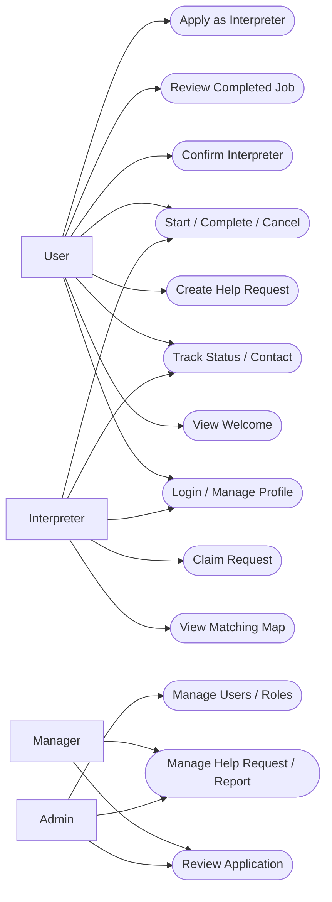
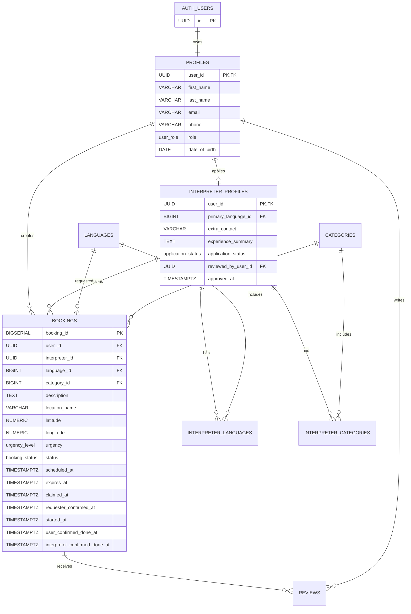

# KHVI Helper: Canonical Requirements

เอกสารนี้เป็นข้อกำหนดฉบับใช้งานปัจจุบันของระบบ Map-based SOS Volunteer Interpreter Platform โดยยึด flow แบบ Job Pool และ Supabase Auth

## 1. เป้าหมายระบบ

ระบบเชื่อมผู้ขอความช่วยเหลือด้านภาษากับล่ามจิตอาสาที่อยู่ใกล้เคียง ผู้ขอสร้างหมุดคำขอ ส่วนล่ามที่มีภาษาและหมวดหมู่ตรงกันเลือกกด Claim จากแผนที่

ระบบไม่ใช่การค้นหาและจองล่ามรายบุคคลแบบ marketplace และไม่มีระบบ Chat ใน MVP

## 2. Role และสิทธิ์

| Role | สิทธิ์หลัก |
|---|---|
| `User` | สร้างคำขอ ดูสถานะ ยืนยันล่าม ยืนยันจบงาน และรีวิวล่าม |
| `Interpreter` | ดูหมุดที่ตรงความสามารถ Claim งาน เริ่มงาน ยืนยันจบงาน และยกเลิกงานตามกฎ |
| `Manager` | ตรวจใบสมัครล่าม ดูแล Help Request/Report และเห็นข้อมูลตาม permission ที่ได้รับ |
| `Admin` | จัดการผู้ใช้ role ข้อมูลระบบ และเห็นข้อมูลทั้งหมดตามสิทธิ์ Admin |

กฎ role:

- ผู้สมัครใหม่มี role เป็น `User`
- ผู้ใช้ที่สมัครล่ามอยู่สถานะ `Pending` และยังรับงานไม่ได้
- เมื่อ Manager/Admin อนุมัติ `application_status` ระบบเปลี่ยน role เป็น `Interpreter`
- Manager ไม่สามารถเปลี่ยน role หรือ Lock/Unlock
- Admin เปลี่ยน role ได้
- Lock/Unlock อยู่ในขอบเขต MVP และต้องมีเหตุผลประกอบพร้อม Audit Log

## 3. Flow หลัก

1. User Login ด้วย Supabase Auth
2. ระบบตรวจ role และพาไปยังหน้าที่ตรงกับ role
3. User เห็นหน้า Welcome
4. User สร้างคำขอ เลือกภาษา 1 ภาษา หมวดหมู่ 1 หมวด ระบุรายละเอียด และตำแหน่ง
5. ระบบสร้างคำขอสถานะ `open`
6. Interpreter ที่ Approved เห็นหมุด `open` ที่ตรงกับภาษา หมวดหมู่ และระยะทางที่เลือก
7. ก่อน Claim แสดงเฉพาะชื่อสถานที่แบบกว้าง ๆ
8. Interpreter กด Claim แบบ atomic
9. ระบบเปลี่ยนสถานะเป็น `claimed` และนำหมุดออกจากรายการของ Interpreter คนอื่น
10. User ดูโปรไฟล์ล่ามและกดยืนยันล่าม
11. หลังยืนยัน ระบบเปิดข้อมูลติดต่อและพิกัดจริงตาม permission
12. Interpreter เริ่มงาน ระบบเปลี่ยนเป็น `in_progress`
13. User และ Interpreter ยืนยันจบงาน
14. ระบบเปลี่ยนเป็น `completed` เมื่อทั้งสองฝ่ายยืนยัน
15. User ส่ง Review หลังงานเป็น `completed`

## 4. ประเภทคำขอและเวลา

### Immediate

- เป็นคำขอเร่งด่วน
- แสดงข้อความระดับความเร่งด่วน เช่น “ต้องการความช่วยเหลือภายใน 15 นาที”
- ข้อความ 15 นาทีใช้สำหรับแสดงระดับความเร่งด่วน ไม่ใช่สถานะหรือเวลาบังคับเริ่มงาน
- หมดอายุ 30 นาทีหลังสร้างถ้ายังไม่มีล่าม Claim

### Scheduled

- แสดงบนแผนที่ทันทีหลังสร้าง
- นัดหมายล่วงหน้าได้ไม่เกิน 1 วัน
- หมดอายุเมื่อถึงเวลานัดหมาย
- ต้องแสดงผลแตกต่างจากงาน Immediate

## 5. สถานะและการยกเลิก

```text
open -> claimed -> in_progress -> completed
  |        |             |
  |        |             +-> cancelled เมื่อ Interpreter ยกเลิกหลังเริ่มงาน
  |        +-> open เมื่อ Interpreter ยกเลิกก่อนเริ่มงานและยังไม่หมดอายุ
  +-> expired เมื่อหมดอายุ
  +-> cancelled เมื่อ User ยกเลิกก่อน completed
```

- User ยกเลิกได้ทุกสถานะก่อน `completed`
- Interpreter รับงานได้ครั้งละหนึ่งงาน
- Interpreter ไม่ต้องมีปุ่ม Reject งาน
- การ Claim ต้องป้องกันการรับงานเดียวกันซ้ำ
- งานที่ผู้ใช้สร้างค้างอยู่หลายรายการให้จำกัดเหลือหนึ่งรายการที่ยังไม่จบ (`open`, `claimed` หรือ `in_progress`)

## 6. Functional Requirements

### 6.1 ตารางสรุป

| รหัส | กลุ่ม | Requirement | Actor |
|---|---|---|---|
| FR-01 | Auth | สมัคร Login Logout และใช้ Supabase Auth จริง | ทุก role |
| FR-02 | Profile | แก้ไข `first_name`, `last_name`, phone และข้อมูล profile | ทุก role |
| FR-03 | Role Routing | พาไป UI ตาม role หลัง Login | System |
| FR-04 | Welcome | แสดงข้อมูลบริการและปุ่มไปหน้าสร้างคำขอ | User |
| FR-05 | Create Request | สร้างคำขอพร้อมภาษา หมวดหมู่ รายละเอียด และสถานที่ | User |
| FR-06 | Request Type | รองรับ Immediate และ Scheduled ตามกฎเวลา | User/System |
| FR-07 | Interpreter Map | แสดงเฉพาะหมุดที่ตรงภาษา หมวดหมู่ และระยะทาง | Interpreter |
| FR-08 | Location Privacy | ก่อน Claim แสดงเฉพาะชื่อสถานที่กว้าง ๆ | System |
| FR-09 | Claim | Claim งานแบบ atomic และกำหนดล่ามหนึ่งคนต่องาน | Interpreter/System |
| FR-10 | Requester Confirm | User ยืนยันล่ามหลัง Claim | User |
| FR-11 | Contact | เปิดข้อมูลติดต่อและพิกัดจริงหลังยืนยันตาม permission | System |
| FR-12 | Execution | เริ่มงาน ยืนยันจบงาน และยกเลิกตาม state machine | User/Interpreter |
| FR-13 | Dual Completion | เปลี่ยนเป็น Completed เมื่อทั้งสองฝ่ายยืนยัน | System |
| FR-14 | Interpreter Apply | สมัครล่ามพร้อมภาษา หมวดหมู่ ช่องทางติดต่อ และประสบการณ์ | User |
| FR-15 | Approval | Approve/Reject ใบสมัครพร้อมเหตุผล | Manager/Admin |
| FR-16 | Review | User รีวิว Interpreter หลัง Completed | User |
| FR-17 | Help Request | Manager ดูแลและตอบ Help Request | Manager |
| FR-18 | Report | เริ่มทำหลัง Help Request | Manager/Admin |
| FR-19 | Audit | บันทึก action สำคัญของ Manager และ Admin ใน phase ที่กำหนด | System |
| FR-20 | Admin | Admin จัดการ role และข้อมูลผู้ใช้ | Admin |

ข้อกำหนดชุดนี้ไม่ใช้ flow ค้นหาและเลือกล่ามรายบุคคลแบบ marketplace, ปุ่ม Reject งานของล่าม, ระบบ Tip หรือการรีวิวสองฝ่าย ระบบใช้ Job Pool ที่ล่ามกด Claim งานเอง และให้ User รีวิว Interpreter ฝ่ายเดียวหลังงาน Completed ส่วนการ Reject ใน FR-15 หมายถึงการปฏิเสธใบสมัครล่ามโดย Manager/Admin พร้อมเหตุผล

### 6.2 รายละเอียด Functional Requirements

#### FR-01: Auth

**Requirement:** ผู้ใช้ทุก role ต้องสมัคร เข้าสู่ระบบ และออกจากระบบผ่าน Supabase Auth จริง

**Actor:** ทุก role

**Preconditions:**

- ผู้สมัครมีอีเมลที่ใช้งานได้และกรอกข้อมูลบังคับครบ
- ผู้ใช้ที่ Login มีบัญชีใน Supabase Auth

**รายละเอียด:**

- ระบบต้องใช้ Supabase Auth เป็นแหล่งจัดการ identity, email, password และ session
- ระบบต้องสร้างบัญชีใหม่ด้วย role เริ่มต้นเป็น `User`
- ระบบต้องตรวจรูปแบบอีเมล ความครบถ้วนของรหัสผ่าน และข้อมูลสมัครก่อนเรียก Auth
- ระบบต้องไม่เก็บ `password_hash` หรือรหัสผ่านใน `profiles` หรือตารางธุรกิจ
- ระบบต้องยกเลิก session เมื่อผู้ใช้ Logout และไม่ให้เข้าถึง private route ด้วย session เดิม
- ข้อผิดพลาดจากการสมัครหรือ Login ต้องไม่เปิดเผยข้อมูลที่ช่วยเดาว่าบัญชีอื่นมีอยู่หรือไม่เกินความจำเป็น

**ผลลัพธ์และเกณฑ์ตรวจรับ:**

- สมัครสำเร็จแล้วมี record ใน Supabase Auth และ `profiles` ที่เชื่อมด้วย UUID เดียวกัน
- Login สำเร็จแล้วระบบสร้าง session ที่ server ตรวจสอบได้
- Logout สำเร็จแล้ว private route พากลับหน้า Login หรือหน้า Public ตาม route policy
- ผู้ใช้ใหม่ได้รับ role `User` เสมอ แม้ client ส่ง role อื่นมา

#### FR-02: Profile

**Requirement:** ผู้ใช้ทุก role ต้องดูและแก้ไขข้อมูล profile ของตนเองได้

**Actor:** ทุก role

**Preconditions:**

- ผู้ใช้ Login แล้ว
- `profiles.user_id` ตรงกับ `auth.users.id` ของ session ปัจจุบัน

**รายละเอียด:**

- ผู้ใช้แก้ไข `first_name`, `last_name`, `phone`, `date_of_birth` และ `preferred_ui_language` ได้
- ระบบต้องแยก `first_name` และ `last_name` ใน data model ไม่ใช้ field `name` เป็นข้อมูลหลักใน production
- ระบบต้อง validate รูปแบบและความยาวของข้อมูลก่อนบันทึก
- ผู้ใช้ทั่วไปห้ามแก้ `role`, `is_locked`, สถานะใบสมัครล่าม หรือข้อมูลกำกับดูแลผ่านหน้า Profile
- Server ต้องตรวจ ownership ก่อนอ่านหรือแก้ profile

**ผลลัพธ์และเกณฑ์ตรวจรับ:**

- ผู้ใช้เห็นข้อมูลล่าสุดของตนหลัง refresh หรือ Login ใหม่
- การแก้ profile ของผู้ใช้อื่นถูกปฏิเสธ แม้ส่ง `user_id` ผ่าน request โดยตรง
- Validation error แสดงที่ field ที่เกี่ยวข้องและไม่ล้างข้อมูลที่ผู้ใช้กรอก

#### FR-03: Role Routing

**Requirement:** ระบบต้องพาผู้ใช้ไปยัง workspace ที่ตรงกับ role หลัง Login

**Actor:** System

**Preconditions:**

- ผู้ใช้ Login สำเร็จและมี profile
- Server อ่าน role ปัจจุบันของผู้ใช้ได้

**รายละเอียด:**

- `User` ไปยังหน้า Welcome สำหรับสร้างและติดตามคำขอ
- `Interpreter` ที่ Approved ไปยัง workspace สำหรับดูงานที่ตรงความสามารถและติดตามงานที่รับ
- `Manager` ไปยัง Manager Console
- `Admin` ไปยัง Admin Dashboard
- ระบบต้องตรวจ role ฝั่ง server ก่อน render ข้อมูล private ไม่พึ่ง client redirect อย่างเดียว
- ผู้ใช้ที่ role ไม่ตรงกับ route ต้องได้รับ redirect หรือ `403` ตาม route policy

**ผลลัพธ์และเกณฑ์ตรวจรับ:**

- ผู้ใช้แต่ละ role ไปถึง workspace ที่ถูกต้องหลัง Login
- การเปิด direct URL ของ role อื่นไม่แสดงข้อมูลก่อน redirect
- ผู้สมัครล่ามที่ยัง Pending หรือ Rejected ยังคงเข้า workspace แบบ `User`

#### FR-04: Welcome

**Requirement:** ระบบต้องแสดงข้อมูลบริการ ขั้นตอนสำคัญ และทางเข้าสู่การสร้างคำขอให้ User

**Actor:** User

**Preconditions:**

- User Login แล้วและผ่าน role check

**รายละเอียด:**

- หน้า Welcome ต้องอธิบายว่า KHVI ใช้ระบบ Job Pool และล่ามที่ตรงเงื่อนไขเป็นผู้ Claim งาน
- หน้า Welcome ต้องมีปุ่มหลักไปหน้าสร้างคำขอ และมีทางไปดูคำขอของ User
- หน้า Welcome ต้องอธิบาย Immediate, Scheduled, ขั้นตอนหลังสร้างคำขอ และข้อควรระวังด้านความเป็นส่วนตัว
- หากมีคำขอเดิม ระบบควรแสดงรายการล่าสุดหรือทางกลับไปติดตามคำขอ
- หน้า Welcome ต้องไม่สื่อว่าระบบเป็นช่องทางฉุกเฉินแทนหน่วยงานฉุกเฉินในพื้นที่

**ผลลัพธ์และเกณฑ์ตรวจรับ:**

- User ไปหน้าสร้างคำขอและหน้ารายการคำขอได้จาก Welcome
- ข้อความเรื่องเวลาและ privacy ตรงกับ FR-06, FR-08 และ FR-11
- Mobile, Tablet และ Desktop แสดง CTA และเนื้อหาหลักได้ครบ

#### FR-05: Create Request

**Requirement:** User ต้องสร้างคำขอความช่วยเหลือพร้อมภาษา หมวดหมู่ รายละเอียด และสถานที่ได้

**Actor:** User

**Preconditions:**

- User Login แล้ว
- User ไม่มีคำขอที่ยังไม่จบในสถานะ `open`, `claimed` หรือ `in_progress`

**รายละเอียด:**

- คำขอหนึ่งรายการเลือก `language_id` ได้หนึ่งภาษาและ `category_id` ได้หนึ่งหมวดหมู่
- User ต้องระบุสถานที่หรือจุดนัดพบ และเลือกส่งพิกัดจากอุปกรณ์ได้เมื่อยินยอม
- User เพิ่มรายละเอียดที่ช่วยให้ล่ามเตรียมตัวได้ โดยระบบต้องจำกัดความยาวและ validate input
- Server ต้องกำหนด `user_id` จาก session ห้ามเชื่อถือ `user_id` จาก client
- คำขอใหม่ต้องเริ่มที่สถานะ `open` และบันทึก `created_at`
- การสร้างคำขอต้องไม่ส่งคำขอไปหาล่ามรายบุคคล

**ผลลัพธ์และเกณฑ์ตรวจรับ:**

- ข้อมูลที่บังคับครบแล้วระบบสร้าง booking หนึ่งรายการ
- User เห็นรหัสคำขอ สถานะ และทางไปหน้าติดตามหลังสร้างสำเร็จ
- ระบบปฏิเสธการสร้างคำขอซ้ำเมื่อ User มีงานที่ยังไม่จบ
- GPS ถูกปฏิเสธแล้ว User ยังสร้างคำขอด้วยคำอธิบายสถานที่ได้ตาม validation ที่กำหนด

#### FR-06: Request Type

**Requirement:** ระบบต้องรองรับคำขอแบบ Immediate และ Scheduled ตามกฎเวลา

**Actor:** User, System

**Preconditions:**

- User อยู่ในขั้นตอนสร้างคำขอ
- Server มีเวลาปัจจุบันที่เชื่อถือได้

**รายละเอียด:**

- `Immediate` ใช้ข้อความระดับความเร่งด่วน เช่น “ต้องการความช่วยเหลือภายใน 15 นาที”
- ข้อความ 15 นาทีเป็นข้อมูลแสดงผล ไม่ใช่ deadline บังคับเริ่มงาน
- คำขอ Immediate ที่ยังไม่มีล่าม Claim ต้องหมดอายุ 30 นาทีหลังสร้าง
- `Scheduled` ต้องกำหนด `scheduled_at` ล่วงหน้าไม่เกิน 1 วัน
- คำขอ Scheduled ต้องแสดงใน Job Pool ทันทีหลังสร้างและมี visual แตกต่างจาก Immediate
- คำขอ Scheduled ที่ยังไม่มีล่าม Claim ต้องหมดอายุเมื่อถึงเวลานัดหมาย
- Server ต้องกำหนดและตรวจ `expires_at` ไม่พึ่ง countdown ใน browser เป็นผู้เปลี่ยนสถานะหลัก

**ผลลัพธ์และเกณฑ์ตรวจรับ:**

- เวลานัดที่เกิน 1 วันหรือไม่อยู่ในอนาคตถูกปฏิเสธ
- Immediate ที่ไม่มี Claim เปลี่ยนเป็น `expired` เมื่อครบ 30 นาที
- Scheduled ที่ไม่มี Claim เปลี่ยนเป็น `expired` เมื่อถึงเวลานัดหมาย
- Timer บน UI ใช้ deadline เดียวกับฐานข้อมูลและยังถูกต้องหลัง refresh

#### FR-07: Interpreter Map

**Requirement:** Interpreter ต้องเห็นเฉพาะหมุด Open ที่ตรงกับภาษา หมวดหมู่ และระยะทางที่เลือก

**Actor:** Interpreter

**Preconditions:**

- ผู้ใช้ Login ด้วย role `Interpreter`
- ใบสมัครล่ามมีสถานะ `approved`
- ระบบอ่านภาษาและหมวดหมู่ใน interpreter profile ได้

**รายละเอียด:**

- Query ต้องคืนเฉพาะ booking สถานะ `open` ที่ยังไม่หมดอายุ
- ภาษาและหมวดหมู่ของ booking ต้องตรงกับความสามารถที่ผ่านการอนุมัติของ Interpreter ทั้งสองเงื่อนไข
- Interpreter เลือกขอบเขตระยะทางที่ต้องการดูได้
- หมุด Immediate และ Scheduled ต้องมีข้อความหรือรูปแบบที่แยกกันได้โดยไม่พึ่งสีอย่างเดียว
- ระบบต้องไม่แสดงหมุดที่ Interpreter สร้างเองในฐานะ User
- หน้า Map ไม่มี flow ค้นหาและเลือกล่ามรายบุคคล

**ผลลัพธ์และเกณฑ์ตรวจรับ:**

- Interpreter ที่ภาษาไม่ตรงหรือหมวดหมู่ไม่ตรงไม่เห็นหมุดนั้น
- Pending หรือ Rejected applicant เปิด Map ไม่ได้
- หมุดที่ถูก Claim หรือ Expired หายจากรายการ Open
- การเปลี่ยนตัวกรองระยะทางอัปเดตรายการและแผนที่ให้ตรงกัน

#### FR-08: Location Privacy

**Requirement:** ระบบต้องซ่อนข้อมูลตำแหน่งละเอียดและข้อมูลติดต่อก่อนผ่านขั้นตอนยืนยันที่กำหนด

**Actor:** System

**Preconditions:**

- Booking ยังเป็น `open` หรือยังไม่ผ่าน privacy gate

**รายละเอียด:**

- ก่อน Claim ระบบแสดงได้เฉพาะภาษา หมวดหมู่ ความเร่งด่วน ชื่อพื้นที่กว้าง และระยะทางโดยประมาณ
- ระบบต้องไม่ส่ง latitude, longitude, สถานที่ละเอียด, phone หรือ extra contact ไปยัง client ที่ยังไม่มีสิทธิ์
- การปัดเศษพิกัดเฉพาะบน UI ไม่ถือว่าเพียงพอ หาก response ยังมีพิกัดจริง
- Server query, view หรือ RPC ต้องคืนข้อมูลตามสิทธิ์และสถานะของ booking

**ผลลัพธ์และเกณฑ์ตรวจรับ:**

- Network response ก่อน privacy gate ไม่มีพิกัดจริงหรือข้อมูลติดต่อ
- ผู้ใช้ที่ไม่ใช่คู่ภารกิจไม่สามารถอ่านข้อมูลละเอียดด้วย direct request
- Map และ request summary แสดงชื่อพื้นที่กว้างโดยไม่เปิดเผยจุดนัดพบเต็ม

#### FR-09: Claim

**Requirement:** Interpreter ต้อง Claim งานแบบ atomic และหนึ่ง booking ต้องมีล่ามที่ Claim สำเร็จได้หนึ่งคน

**Actor:** Interpreter, System

**Preconditions:**

- Booking เป็น `open` และยังไม่หมดอายุ
- Interpreter มีสถานะ Approved และ match ภาษาและหมวดหมู่
- Interpreter ไม่ใช่ผู้สร้าง booking และไม่มีงาน `claimed` หรือ `in_progress` อื่น

**รายละเอียด:**

- Server ต้องทำ Claim ด้วย atomic update, transaction หรือ PostgreSQL RPC
- การ Claim สำเร็จต้องกำหนด `interpreter_id`, `claimed_at` และเปลี่ยน status เป็น `claimed`
- ระบบต้องตรวจเงื่อนไขทั้งหมดใน transaction เดียวกับการ update
- หาก Interpreter หลายคน Claim พร้อมกัน ต้องมีเพียงคนเดียวที่สำเร็จ
- Interpreter ที่ไม่ต้องการงานปล่อยผ่านได้ ระบบไม่มีปุ่มหรือสถานะ Reject งาน

**ผลลัพธ์และเกณฑ์ตรวจรับ:**

- Concurrent Claim ของ booking เดียวกันกำหนด Interpreter ได้หนึ่งคน
- ผู้ที่ Claim ไม่สำเร็จได้รับ conflict response และ UI โหลดสถานะล่าสุด
- Booking ที่ Claim แล้วหายจาก Job Pool ของ Interpreter คนอื่น
- Self-claim และ Claim ขณะมีงานค้างถูกปฏิเสธฝั่ง server

#### FR-10: Requester Confirm

**Requirement:** User ต้องดูโปรไฟล์และยืนยัน Interpreter หลังมีการ Claim

**Actor:** User

**Preconditions:**

- Booking เป็น `claimed`
- Actor เป็นเจ้าของ booking
- Booking มี `interpreter_id`

**รายละเอียด:**

- User ต้องเห็นข้อมูลโปรไฟล์ล่ามที่จำเป็นต่อการตัดสินใจ เช่น ชื่อ ภาษา หมวดหมู่ ประสบการณ์ และคะแนนเมื่อมีข้อมูล
- User ต้องกดยืนยัน Interpreter ก่อนระบบเปิดข้อมูลติดต่อและพิกัดจริง
- Server ต้องบันทึก `requester_confirmed_at`
- ผู้ใช้ที่ไม่ใช่เจ้าของ booking ห้ามยืนยันแทน
- การกดยืนยันซ้ำต้องไม่สร้าง side effect ซ้ำหรือทำให้ state เสียหาย

**ผลลัพธ์และเกณฑ์ตรวจรับ:**

- การยืนยันสำเร็จแล้ว `requester_confirmed_at` มีค่าและหน้า Mission แสดงขั้นตอนถัดไป
- ก่อนยืนยันยังไม่เปิดข้อมูลใน FR-11
- Direct request จากผู้ใช้อื่นถูกปฏิเสธโดยไม่เปิดเผยข้อมูล booking เกินจำเป็น

#### FR-11: Contact

**Requirement:** ระบบต้องเปิดข้อมูลติดต่อและพิกัดจริงหลัง User ยืนยัน Interpreter และเฉพาะผู้มีสิทธิ์

**Actor:** System

**Preconditions:**

- Booking มี `interpreter_id`
- `requester_confirmed_at` มีค่า
- Actor เป็น requester หรือ claimed Interpreter ของ booking

**รายละเอียด:**

- ข้อมูลที่เปิดได้ประกอบด้วยจุดนัดพบเต็ม พิกัดจริง phone และ extra contact ที่จำเป็นต่อภารกิจ
- Server ต้องตรวจ actor และ privacy gate ทุกครั้งที่อ่านข้อมูล
- ระบบต้องไม่เปิดข้อมูลดังกล่าวแก่ Interpreter คนอื่น ผู้ใช้ทั่วไป หรือผู้ที่เดา booking ID ได้
- หน้า Mission ต้องแสดงวิธีติดต่อที่ชัดเจนโดยไม่เพิ่มระบบ Chat ใน MVP

**ผลลัพธ์และเกณฑ์ตรวจรับ:**

- คู่ภารกิจเห็นข้อมูลเดียวกันหลัง User ยืนยันล่าม
- การเปลี่ยน URL หรือเรียก data endpoint โดยผู้ไม่มีสิทธิ์ไม่คืนข้อมูลละเอียด
- ข้อมูลติดต่อไม่ปรากฏใน HTML, serialized props หรือ network response ก่อนผ่าน gate

#### FR-12: Execution

**Requirement:** User และ Interpreter ต้องเริ่มงาน ยืนยันจบงาน และยกเลิกตาม booking state machine

**Actor:** User, Interpreter

**Preconditions:**

- Actor เป็น requester หรือ claimed Interpreter ของ booking
- Booking อยู่ในสถานะที่ action นั้นรองรับ

**รายละเอียด:**

- Interpreter เริ่มงานได้เมื่อ booking เป็น `claimed` และ User ยืนยันล่ามแล้ว
- การเริ่มงานต้องบันทึก `started_at` และเปลี่ยน status เป็น `in_progress`
- User และ Interpreter ยืนยันจบงานได้เมื่อ booking เป็น `in_progress`
- User ยกเลิกได้ทุกสถานะก่อน `completed` และต้องระบุเหตุผล
- Interpreter ยกเลิกใน `claimed` แล้ว booking กลับเป็น `open` หากยังไม่หมดอายุเดิม
- Interpreter ยกเลิกใน `in_progress` แล้ว booking เปลี่ยนเป็น `cancelled`
- ระบบต้องบันทึก `cancelled_by`, `cancel_reason` และเวลาที่เกี่ยวข้อง
- Server ต้องตรวจ current state ก่อน update และห้าม client ระบุ next state ได้เอง

**ผลลัพธ์และเกณฑ์ตรวจรับ:**

- การเริ่มงานจาก `open`, `completed`, `cancelled` หรือ `expired` ถูกปฏิเสธ
- การยืนยันจบก่อนเริ่มงานถูกปฏิเสธ
- การยกเลิกแต่ละสถานะให้ผลตรงกับ state machine
- Timeline แสดง actor เวลา และสถานะล่าสุดหลัง refresh

#### FR-13: Dual Completion

**Requirement:** ระบบต้องเปลี่ยน booking เป็น Completed เมื่อ User และ Interpreter ยืนยันจบงานครบทั้งสองฝ่าย

**Actor:** System

**Preconditions:**

- Booking เป็น `in_progress`
- Actor ที่ยืนยันเป็นคู่ภารกิจที่มีสิทธิ์

**รายละเอียด:**

- การยืนยันของ User บันทึก `user_confirmed_done_at`
- การยืนยันของ Interpreter บันทึก `interpreter_confirmed_done_at`
- เมื่อมี timestamp เพียงฝ่ายเดียว booking ต้องยังเป็น `in_progress`
- เมื่อ timestamp ทั้งสองฝ่ายมีค่า ระบบต้องบันทึก `ended_at` และเปลี่ยน status เป็น `completed`
- การยืนยันซ้ำต้องเป็น idempotent และไม่เปลี่ยนเวลาที่บันทึกครั้งแรกโดยไม่มีเหตุผล

**ผลลัพธ์และเกณฑ์ตรวจรับ:**

- Booking ไม่เป็น `completed` หากขาดการยืนยันฝ่ายใดฝ่ายหนึ่ง
- เมื่อยืนยันครบสองฝ่าย booking เป็น `completed` เพียงครั้งเดียว
- หลัง Completed ระบบปิด action เริ่มงาน ยกเลิก และยืนยันจบซ้ำ

#### FR-14: Interpreter Apply

**Requirement:** User ต้องสมัครเป็น Interpreter พร้อมข้อมูลภาษา หมวดหมู่ ช่องทางติดต่อ และประสบการณ์ได้

**Actor:** User

**Preconditions:**

- User Login แล้ว
- User ยังไม่มีใบสมัครที่อยู่ระหว่าง Pending หรือเป็น Interpreter ที่ Approved แล้ว

**รายละเอียด:**

- ผู้สมัครเลือกภาษาหลักหนึ่งภาษาและภาษาที่ให้บริการได้อย่างน้อยหนึ่งภาษา
- ผู้สมัครเลือกหมวดหมู่ความถนัดได้มากกว่าหนึ่งหมวดตามข้อมูลอ้างอิงของระบบ
- ผู้สมัครกรอก experience summary และเพิ่ม extra contact ได้
- ระบบต้องบันทึกข้อมูลใน `interpreter_profiles`, `interpreter_languages` และ `interpreter_categories`
- ใบสมัครใหม่เริ่มที่ `pending` และผู้สมัครยังมี role `User`
- ผู้สมัคร Pending ยังไม่เห็น Job Pool และ Claim งานไม่ได้

**ผลลัพธ์และเกณฑ์ตรวจรับ:**

- ข้อมูลบังคับครบแล้วระบบสร้างใบสมัครหนึ่งชุดพร้อม skill relations
- หน้าสถานะใบสมัครแสดง Pending, Approved หรือ Rejected และเหตุผลเมื่อถูกปฏิเสธ
- ระบบป้องกันใบสมัคร Pending ซ้ำและป้องกัน Approved Interpreter สมัครซ้ำ

#### FR-15: Approval

**Requirement:** Manager หรือ Admin ต้อง Approve หรือ Reject ใบสมัคร Interpreter พร้อมเหตุผลและการตรวจสิทธิ์ฝั่ง server

**Actor:** Manager, Admin

**Preconditions:**

- Actor Login และมี role `Manager` หรือ `Admin`
- ใบสมัครมีสถานะ `pending`

**รายละเอียด:**

- ผู้ตรวจต้องดูข้อมูลภาษา หมวดหมู่ ช่องทางติดต่อ ประสบการณ์ และหลักฐานที่ระบบกำหนดก่อนตัดสินใจ
- Approve ต้องเปลี่ยน `application_status` เป็น `approved`, บันทึกผู้ตรวจและเวลา และเปลี่ยน role ของผู้สมัครเป็น `Interpreter`
- การ Approve และเปลี่ยน role ต้องเกิดใน transaction เดียวกัน
- Reject ต้องเปลี่ยนสถานะเป็น `rejected` และบันทึกเหตุผลที่ไม่ว่าง โดยผู้สมัครยังมี role `User`
- Reject ในข้อนี้หมายถึง Reject ใบสมัคร ไม่ใช่ Reject งานใน Job Pool
- Server ต้องป้องกันการตัดสินซ้ำเมื่อผู้ตรวจสองคนเปิดใบสมัครเดียวกัน

**ผลลัพธ์และเกณฑ์ตรวจรับ:**

- Approved applicant เข้า Interpreter workspace และ Claim งานได้เมื่อผ่านเงื่อนไขอื่น
- Rejected applicant เห็นเหตุผลและยังเข้า User workspace
- Manager/Admin ที่ไม่มี permission หรือใบสมัครที่ไม่ใช่ Pending เปลี่ยนสถานะไม่ได้
- ระบบสร้าง audit event ตาม FR-19 เมื่อ feature Audit เปิดใช้

#### FR-16: Review

**Requirement:** User ต้องรีวิว Interpreter ได้หลัง booking Completed

**Actor:** User

**Preconditions:**

- Booking เป็น `completed`
- Actor เป็น requester ของ booking
- Booking มี Interpreter และยังไม่มี review ของ User สำหรับ booking นี้

**รายละเอียด:**

- User ให้คะแนน 1 ถึง 5 และเขียน comment เพิ่มเติมได้โดยไม่บังคับ
- Review ต้องอ้างอิง booking, reviewer และ reviewee ที่ server หาได้จาก booking
- Server ต้องไม่เชื่อถือ reviewer_id หรือ reviewee_id ที่ client ส่งมาโดยตรง
- หนึ่ง booking มี review จาก User ได้หนึ่งรายการ
- ระบบต้องคำนวณหรืออัปเดตคะแนนเฉลี่ยและจำนวนรีวิวของ Interpreter จากข้อมูลจริง
- Interpreter ไม่มี flow รีวิว User และระบบไม่มี Tip ใน requirement ปัจจุบัน

**ผลลัพธ์และเกณฑ์ตรวจรับ:**

- งานที่ยังไม่ Completed สร้าง review ไม่ได้
- User ที่ไม่ใช่เจ้าของ booking รีวิวไม่ได้
- คะแนนนอกช่วง 1 ถึง 5 และ review ซ้ำถูกปฏิเสธ
- หลังส่งสำเร็จ User เห็น review แบบ read-only และคะแนนรวมของ Interpreter อัปเดตตามกติกา

#### FR-17: Help Request

**Requirement:** Manager ต้องรับ ดูแล ตอบ และปิด Help Request จาก User หรือ Interpreter

**Actor:** Manager

**Preconditions:**

- Manager Login และผ่าน permission check
- มี Help Request ที่ผู้ใช้สร้างและอ้างอิงข้อมูลที่จำเป็น

**รายละเอียด:**

- Help Request ควรอ้างอิง booking เมื่อปัญหาเกี่ยวข้องกับภารกิจ
- Manager ต้องเห็นผู้ร้อง ประเภทปัญหา รายละเอียด ความเร่งด่วน สถานะ และเวลา
- Manager ตอบผู้ร้องและเปลี่ยนสถานะเป็น `resolved` ได้เมื่อจัดการเสร็จ
- ระบบต้องเก็บ response, ผู้ตอบ และเวลาที่ตอบเพื่ออ่านย้อนหลัง
- Manager เห็นข้อมูลติดต่อหรือข้อมูล mission เฉพาะ permission ที่ได้รับ
- Help Request เป็น feature phase แยกจาก Core Flow และต้องเพิ่มตารางเมื่อเริ่มพัฒนา domain นี้

**ผลลัพธ์และเกณฑ์ตรวจรับ:**

- Manager กรองรายการ Open, In Progress และ Resolved ได้
- การ Resolve ต้องมีข้อความตอบหรือผลการดำเนินการตาม validation
- User หรือ Interpreter เห็นสถานะและคำตอบของ Help Request ที่ตนสร้าง
- ผู้ไม่มีสิทธิ์อ่านหรือแก้ Help Request ของผู้อื่นไม่ได้

#### FR-18: Report

**Requirement:** Manager และ Admin ต้องตรวจ Report และส่งต่อกรณีที่ต้องใช้สิทธิ์สูงกว่า โดยเริ่มพัฒนา feature นี้หลัง Help Request

**Actor:** Manager, Admin

**Preconditions:**

- Actor Login และผ่าน permission check
- มี Report จาก User หรือ Interpreter พร้อมเหตุผลและ booking reference เมื่อเกี่ยวข้อง

**รายละเอียด:**

- คำว่า “เริ่มทำหลัง Help Request” หมายถึงลำดับ phase การพัฒนา ไม่ได้บังคับว่า Report ทุกฉบับต้องสร้างจาก Help Request
- Manager ต้องตรวจผู้รายงาน ผู้ถูกรายงาน booking เหตุผล หลักฐาน และสถานะของ Report
- Manager แก้ปัญหาภายใน permission หรือส่งต่อ Admin เมื่อกรณีต้องเปลี่ยน role, Lock/Unlock หรือดำเนินการระดับระบบ
- Admin ต้องเห็น Report ที่ส่งต่อและบันทึกผลการตัดสินใจได้
- ระบบต้องป้องกันการส่งต่อซ้ำและเก็บประวัติผู้ดำเนินการ เวลา และเหตุผล
- Report เป็น feature phase แยกจาก Core Flow และต้องเพิ่มตารางเมื่อเริ่มพัฒนา domain นี้

**ผลลัพธ์และเกณฑ์ตรวจรับ:**

- Report เปลี่ยนสถานะตาม workflow ที่กำหนดและอ่านประวัติได้
- Manager ไม่สามารถ Lock/Unlock หรือเปลี่ยน role ผ่าน Report
- Report ที่ส่งต่อแสดงในพื้นที่ของ Admin พร้อมบริบทที่จำเป็น
- ผู้ไม่มีสิทธิ์เข้าถึงข้อมูลรายงานหรือหลักฐานไม่ได้

#### FR-19: Audit

**Requirement:** ระบบต้องบันทึก action สำคัญของ Manager และ Admin เมื่อเริ่มใช้ feature Audit ใน phase ที่กำหนด

**Actor:** System

**Preconditions:**

- Manager, Admin หรือระบบกำลังทำ action ที่ถูกกำหนดให้ audit

**รายละเอียด:**

- Event ขั้นต่ำควรรวม Approve/Reject ใบสมัคร, ตอบ Help Request, ส่งต่อหรือปิด Report, เปลี่ยน role และ Lock/Unlock ใน MVP
- Audit record ต้องมี actor, action type, target type, target ID, timestamp, reason และ metadata ที่จำเป็น
- Audit Log ต้องเป็น append-only สำหรับผู้ใช้ระบบทั่วไปและ staff
- การสร้าง audit event ต้องเกิดใน transaction เดียวกับ action สำคัญเมื่อความถูกต้องของข้อมูลต้องสัมพันธ์กัน
- หน้าจอ Audit ต้องเป็น read-only และจำกัดสิทธิ์ตาม role

**ผลลัพธ์และเกณฑ์ตรวจรับ:**

- Action ที่อยู่ในรายการ audit สร้าง log หนึ่งรายการพร้อม actor และ target ถูกต้อง
- Manager/Admin แก้ไขหรือลบ Audit Log ผ่าน UI หรือ API ปกติไม่ได้
- Action ที่ล้มเหลวต้องไม่สร้าง log ว่าสำเร็จ
- Admin ค้นหาและกรอง log ตามเวลา actor action และ target ได้เมื่อ UI พร้อม

#### FR-20: Admin

**Requirement:** Admin ต้องจัดการ role และข้อมูลผู้ใช้ตามสิทธิ์ระดับระบบ

**Actor:** Admin

**Preconditions:**

- Actor Login ด้วย role `Admin`
- Server ตรวจ session และ permission ก่อนอ่านหรือแก้ข้อมูล

**รายละเอียด:**

- Admin ดู ค้นหา และกรองรายชื่อผู้ใช้ตามชื่อ อีเมล role และข้อมูลที่ได้รับอนุญาตได้
- Admin ดูรายละเอียด profile, role, สถานะใบสมัคร และข้อมูลล่ามที่เกี่ยวข้องได้
- Admin เปลี่ยน role ของผู้ใช้อื่นได้ตาม transition rule และต้องระบุเหตุผลเมื่อ policy กำหนด
- Server ต้องป้องกัน privilege escalation จากผู้ที่ไม่ใช่ Admin
- การเปลี่ยน role ต้องสร้าง Audit Log เมื่อ FR-19 เปิดใช้
- Lock/Unlock อยู่ใน MVP โดยต้องตรวจสิทธิ์ฝั่ง server บังคับเหตุผล และสร้าง Audit Log การ Lock/Unlock ทุกครั้ง การมี control ใน mock UI เพียงอย่างเดียวไม่ถือว่า feature เสร็จ
- การลบบัญชีไม่อยู่ใน FR-20 ปัจจุบันจนกว่าจะมี requirement เรื่อง retention, authorization และผลกระทบต่อข้อมูลย้อนหลัง

**ผลลัพธ์และเกณฑ์ตรวจรับ:**

- เฉพาะ Admin ที่ผ่าน server authorization เปลี่ยน role ได้
- Role ใหม่มีผลกับ route และ action หลังบันทึกโดยไม่ต้องพึ่ง client state เดิม
- Manager และ role อื่นเรียก action เดียวกันแล้วถูกปฏิเสธ
- การแก้ข้อมูลไม่ทำลาย booking, review, audit หรือ relation ที่ต้องเก็บย้อนหลัง

## 7. Non-functional Requirements

- ใช้ `auth.users.id` เป็น UUID สำหรับเชื่อมข้อมูลผู้ใช้
- ห้ามเก็บ `password_hash` ในตารางธุรกิจ
- ต้องตรวจ role และ permission ฝั่ง Server
- ใช้ atomic update หรือ RPC สำหรับ Claim
- ช่วงพัฒนาเริ่มจากการดึงข้อมูลจาก Database หรือ refresh หน้าได้ ยังไม่บังคับ Realtime
- ช่วงพัฒนาอาจเลื่อน RLS ได้ แต่ต้องเพิ่ม RLS ก่อนใช้งานจริง
- ต้องปกป้องข้อมูลติดต่อและพิกัดตาม permission
- รองรับ Mobile, Tablet และ Desktop

## 8. Use-case Diagram



## 9. Database Relationship



ตาราง `NOTIFICATIONS`, `REPORTS`, `HELP_REQUESTS` และ `AUDIT_LOGS` เป็นงานตาม phase ที่แยกจาก Core Flow โดยไม่เพิ่มใน MVP แรกจนกว่าจะเริ่มทำ feature นั้น
